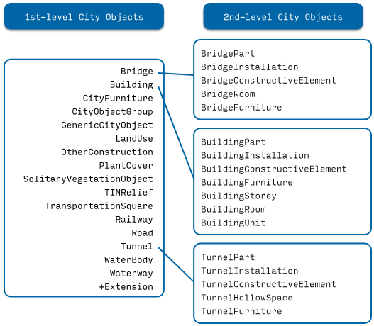

# 2. The different City Objects



There are 2 kinds of City Objects:

- **1st-level**: City Objects that can "exist by themselves" and cannot have a parent.

- **2nd-level**: City Objects that need to have a parent to exist.

This is because the schema of CityGML has been flattened. For example, "BuildingInstallation" instances cannot be present in a dataset without being "children" of a "Building", but a "Building" can be present by itself.

**A City Object (1st or 2nd-level)**:

- must have one member with the name "type". The value is one of the possibilities in the figure above (of type string). If an Extension is used, then the type can be any string starting with a "+", as explained in § 8 Extensions.

    ```json
    "type": "Building"
    ```

- may have one member with the name "geometry". The value is an array containing 0 or more Geometry Objects. More than one Geometry Object is used to represent several different levels-of-detail (LoDs) for the same object. However, the different Geometry Objects of a given City Object do not have to be of different LoDs.

    ```json
    "geometry": [{...}]
    ```

- may have one member with the name "attributes". The value is an object where the attributes of the City Object are listed.

    ```json
    "attributes": { 
        "measuredHeight": 22.3,
        "roofType": "gable",
        "owner": "Elvis Presley"
    }
    ```

- may have one member with the name "geographicalExtent". The value is an array with 6 float values, which represent the axis-aligned bounding box of the City Object: [minx, miny, minz, maxx, maxy, maxz].

    ```json
    "geographicalExtent": [ 84710.1, 446846.0, -5.3, 84757.1, 446944.0, 40.9 ]
    ```

- may have one member with the name "children". 

    - The value is an array of the IDs (of type string) of the City Object’s children.
    - The array references only the City Object’s direct children (2nd-level) but not the grandchildren. 
        - For instance, the "children" array for the object "id-1" below links to a "BuildingPart" ("id-2") but not to the "BuildingInstallation" ("id-3") which is a child of the "BuildingPart". 
    - A City Object can have different types of City Objects as children, eg a "Building" can have both as children "BuildingPart" and "BuildingInstallation". 
    - The order of the children in the array is not relevant.

    ```json
    "children": ["id-2"]
    ```

**Additionally, a 2nd-level City Object:**

- must have one member with the name "parents". The value is an array with the IDs (of type string) of the City Object’s parents. For the City Objects in the CityJSON core module, this array will always be of size 1 (only one parent). New City Objects defined in extensions can have more than one parent.

    ```json
    "parents": ["id-1"]
    ```

```json
"CityObjects": {
    "id-1": {
        "type": "Building",
        "geographicalExtent": [ 84710.1, 446846.0, -5.3, 84757.1, 446944.0, 40.9 ], 
        "attributes": { 
            "measuredHeight": 22.3,
        "roofType": "gable",
        "owner": "Elvis Presley"
        },
        "children": ["id-2"],
        "geometry": [{...}]
    },
    "id-2": {
        "type": "BuildingPart", 
        "parents": ["id-1"],
        "children": ["id-3"],
        ...
    },
    "id-3": {
        "type": "BuildingInstallation", 
        "parents": ["id-2"],
        ...
    },
    "id-4": {
        "type": "LandUse", 
        ...
    }
}
```
An example of a minimal valid City Object is:

```json
{
  "type": "Building"
}
```

The above example is for a "Building" City Object, but any 1st-level City Object can be encoded the same way.

An example of a minimal 2nd-level valid City Object is:

```json
{
  "type": "BuildingPart", 
  "parents": ["id-parent"]
}
```

The above example is for a "BuildingPart", but any 2nd-level City Object can be encoded this way.

