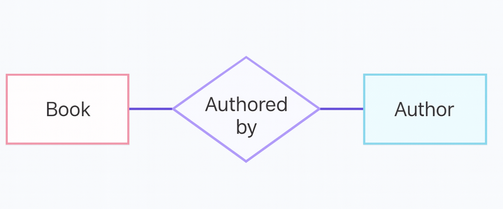
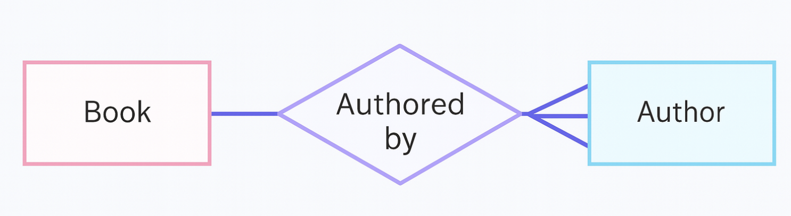
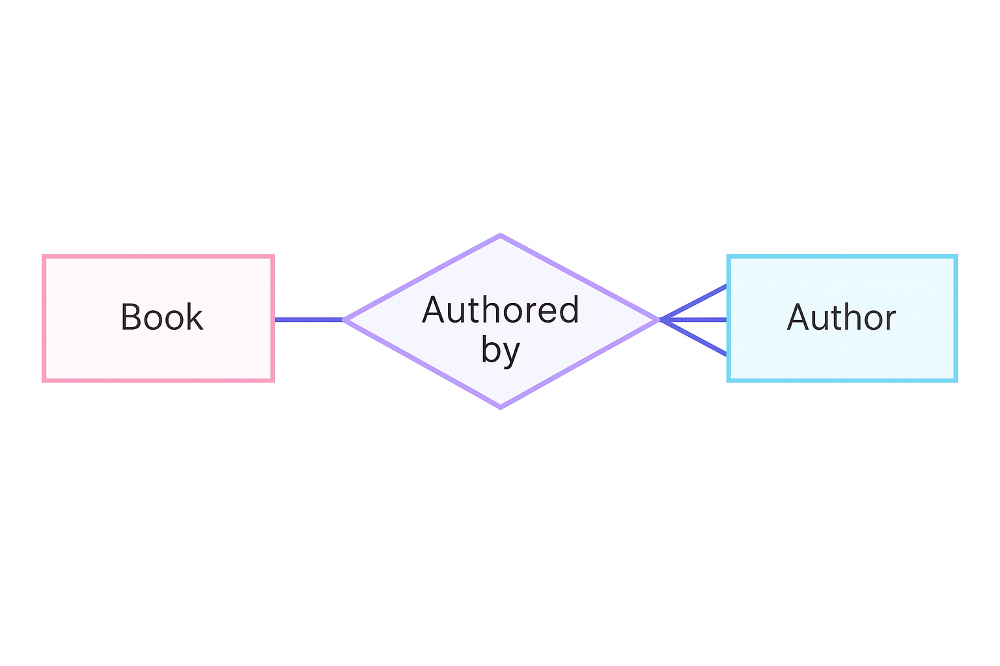

<h1>Introduction to ERDs</h1>

<h2>Table of Contents</h2>

    <ul>
        <li><a href="#core-components-of-erds">Core Components of ERDs</a>
        </li>
        <li><a href="#types-of-relationships">Types of Relationships</a>
        </li>
        <li><a href="#example-book-and-author-relationship">Example: Book and Author Relationship</a>
        </li>
    </ul>

An Entity-Relationship Diagram (ERD) is a graphical representation that outlines the logical structure of a database by depicting entities and the relationships between them. ERDs serve as essential tools in database design, offering a clear visualization of how different data objects interact.

<h2 id="core-components-of-erds">Core Components of ERDs</h2>

ERDs are composed of the following fundamental elements:

### Entities

Entities represent real-world objects, people, or concepts that have data stored about them. In diagrams, entities are shown as rectangles, with their attributes (properties such as name, ID, or date) depicted as ovals connected to the entity.

### Relationship Sets

Relationship sets describe how entities are associated. These are typically shown as diamonds, connected to participating entities via lines.

### Crow’s Foot Notation

This notation system visually conveys the cardinality of relationships (i.e., how many instances of one entity relate to another). Common symbols include:
- A straight line for one
- A “crow’s foot” (three-pronged symbol) for many
- Vertical bars or circles for mandatory or optional participation

<h2 id="types-of-relationships">Types of Relationships</h2>

Understanding cardinality is crucial in database modeling. The main types of relationships include:

### 1. One-to-One (1:1)

Each instance of Entity A is associated with exactly one instance of Entity B, and vice versa. For example, a book authored by a single author.

### 2. One-to-Many (1:N)

An instance of Entity A relates to multiple instances of Entity B, but each instance of B is linked to only one instance of A. For example, one author writing many books.

### 3. Many-to-Many (M:N)

Multiple instances of Entity A are associated with multiple instances of Entity B. For instance, multiple authors can co-author multiple books.

These relationships are illustrated in ERDs using crow’s foot notation, helping designers understand and build accurate relational schemas.

