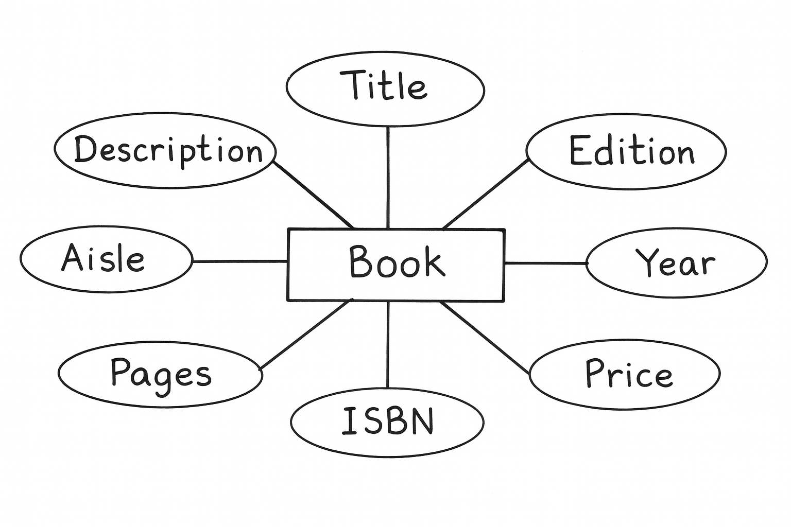

<h1>Mapping Entities to Tables: From Conceptual Modeling to Relational Implementation</h1>

<h2>Table of Contents</h2>

  <ul>
    <li><a href="#preamble">Preamble</a></li>
    <li><a href="#introduction">Introduction to ERDs and Relational Databases</a></li>
    <li><a href="#core-components">Core Components of an ER Diagram</a></li>
    <li><a href="#mapping">Mapping ERD Components to Relational Tables</a></li>
    <li><a href="#best-practices">Best Practices in Relational Database Design</a></li>
  </ul>

<h2 id="introduction">Introduction to ERDs and Relational Databases</h2>

An Entity-Relationship Diagram (ERD) is a graphical representation of the entities within a database system and the relationships that exist among them. It is a widely used modeling technique in conceptual database design, allowing for the visualization of system structure prior to implementation.

A relational database is a structured collection of data organized into tables. The relational model provides a robust and well-defined framework for managing structured data, where relationships between tables are established via common attributes (typically foreign keys).

<h2 id="core-components">Core Components of an ER Diagram</h2>

An ERD is composed of three primary components:

1. Entities

Entities represent real-world objects, concepts, or phenomena that are stored as data within the system. In an ERD, entities are depicted using rectangles.
Example: The Book entity represents books in a library database.

2. Attributes

Attributes define the properties or characteristics associated with an entity. These are illustrated as ovals connected to their corresponding entity rectangles.
Example: For the Book entity, attributes might include ISBN, Title, Author, and PublishedYear.

3. Relationships

Relationships illustrate how entities interact or are associated with one another. In ERDs, relationships are typically shown as lines connecting two entity rectangles.
Example: An Author entity might be connected to a Book entity with a “writes” relationship, indicating that authors write books.

)

<h2 id="mapping">Mapping ERD Components to Relational Tables</h2>

The process of translating an ERD into relational database tables involves a series of methodical steps:

Step 1: Entity-to-Table Transformation

Each entity in the ERD becomes a table in the relational schema. The table name typically mirrors the entity name (e.g., the Book entity becomes the Book table).

Step 2: Attribute-to-Column Translation

Each attribute of the entity is translated into a column of the corresponding table.
Example: The Book table would include columns for ISBN, Title, Author, and PublishedYear.

Step 3: Data Population

Once the table structure is established, data values are inserted into the table.
Example: Rows representing individual books are added to the Book table, populating the defined columns with real data.

This process is repeated for all entities in the ERD (e.g., transforming the Author entity into an Author table), followed by mapping relationships via foreign keys or junction tables depending on cardinality.

<h2 id="best-practices">Best Practices in Relational Database Design</h2>

To ensure that the resulting database system is both efficient and maintainable, it is essential to adhere to several best practices:

1. Primary Key Designation

Every table should include a primary key, which uniquely identifies each row.
Example: The Book table may use BookID as its primary key to ensure data uniqueness.

2. Data Validation

Incorporate validation rules to enforce data integrity. These rules may pertain to:
- Data types (e.g., PublishedYear must be an integer),
- Range checks (e.g., only accepting years between 1500 and the current year),
- Format constraints (e.g., ISBNs must follow a specific pattern).

3. Default Values

Assign default values to specific fields to streamline data entry and maintain completeness.
Example: A default value of "Unknown" can be set for the Author field when that information is unavailable.

4. Use of Views

Create views to simplify complex queries and provide tailored perspectives of the data to users.
Example: A view combining Book and Author tables can display a comprehensive list of books with author names, abstracting the underlying table joins.

5. Concurrency Control

Implement mechanisms to manage simultaneous access to data by multiple users, preventing conflicts and preserving data consistency.
Example: A LastModified timestamp column in the Book table helps track updates and enables optimistic concurrency strategies.

