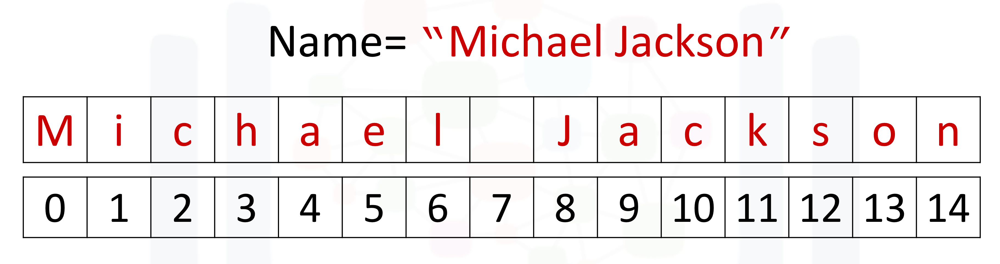
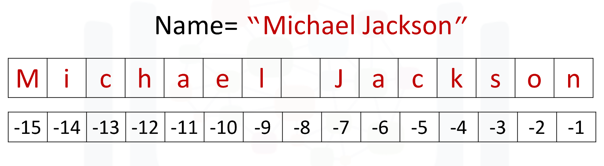

<h2 id="indexing-strings">Indexing Strings</h2>

Strings are **ordered sequences**, and you can access characters using an index.


```python
name = "Leonardo DiCaprio"

print(name[0])      # 'L' → indexing starts at 0
print(name[5])      # 'r'
print(name[10])     # 'D'

# We can also start from the end:
print(name[-1])     # 'o'
print(name[-18])    # 'L'
```



<h2 id="slicing-and-stride">Slicing and Stride</h2>

- Basic slicing: `string[start:stop]`


```python
name = "Leonardo DiCaprio"

print(name[0:8])       # 'Leonardo' — note: index 8 is not included
# If index 8 were included, you'd get "Leonardo " (with a space at the end)
# That’s because character at index 8 is the space: ' '

print(name[:8])        # Same as above — when starting from the beginning, 0 is optional
print(name[9:])        # From index 9 to the end — returns 'DiCaprio'
```

- With stride: `string[start:stop:step]`

```python
name = "Leonardo DiCaprio"

print(name[::2])       # 'LoadoiCpio' — every 2nd character from start to end
print(name[0:6:2])     # 'Loa' — characters from index 0 to 5, skipping every 2nd letter
print(name[::-1])      # 'oripacDi adnoreaL' — reverse the string
```
