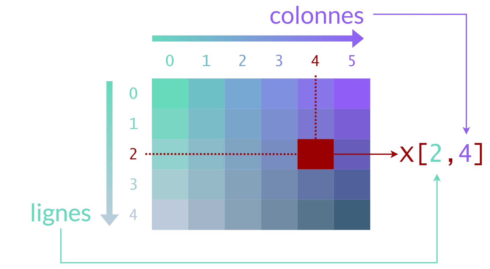

# Indexation

Contrairement aux listes, un array numpy est multidimensionnel.
L'indexation doit se faire en indiquant l'index auquel nous voulons accéder sur chaque dimension :

```python
# Création d'une matrice de dimensions 10x10 remplie de uns
X = np.ones(shape = (10, 10))

# affichage de l'élément à l'index (4, 3)
print(X[4, 3])

# assignation de la valeur -1 à l'élément d'index (1, 5)
X[1, 5] = -1

arr = np.array([10, 20, 30, 40, 50])

print(arr[0])   # 10
print(arr[-1])  # 50
```

Comme pour tous les autres objets indexables de Python, l'index de départ d'un axe est 0.



<h3 id="boolean-indexing">Indexation booléenne</h3>

```python
# Indexation booléenne
arr = np.array([10, 20, 30, 40, 50])
mask = arr > 25
print(mask)        # [False False  True  True  True]
print(arr[mask])   # [30 40 50]


# Création d'un array de dimension 3x3
X = np.array([[-1, 0, 30],
                [-2, 3, -5],
                [5, -5, 10]])
# On assigne à tous les éléments négatifs la valeur 0
X[X<0] = 0
# Affichage de la matrice modifiée
print(X)
```

```
>>> [[ 0  0 30]
>>>  [ 0  3  0]
>>>  [ 5  0 10]]
```

```python
# 2. Indexation avec une liste
X = np.array([3, -7, -10, 3, 6, 5, 2, 9])
y = np.array([0, 1, 1, 1, 0, 1, 0, 0])
print(X[y])  # [3 -7 -10 6 2]
X_2 = X.copy()
X_2[y == 1] = -1
print(X_2)  # [3 -1 -10 6 2]
```

<h3 id="slicing">Découpage (Slicing)</h3>

<h4>Syntaxe générale</h4>

```python
array[start:stop:step]
```


```python
arr_2 = np.array([[1, 2, 3, 4], [4, 5, 6, 7], [7, 8, 9, 10]])
print(arr_2[0, 0])  # 1
print(arr_2[-1, -1])  # 10
print(arr_2[0, -1])  # 4
print(arr_2[0, ::-1])  # [4 3 2 1]


arr_2[0, 0] = 10
print(arr_2)  # [[10 2 3 4] [4 5 6 7] [7 8 9 10]]
print(arr_2[0, 1:3])  # [2 3]
print(arr_2[1:3, 1:3])  # [[5 6] [8 9]]

arr_4 = np.array(
    object=[
        [
            [
                [1, 2, 3], 
                [4, 5, 6]], 
            [
                [7, 8, 9], 
                [10, 11, 12]
            ]
        ]
    ]
)
print(arr_4[0, 0, 0, 0])  # 1
print(arr_4[-1, -1, -1, -1])  # 12
print(arr_4[0, 0, -1, -1])  # 6
print(arr_4[0, -1, -1, -1])  # 12
print(arr_4[0, 0, 0, ::-1])  # [3 2 1]

arr_4[0, 0, 0, 0] = 18
print(arr_4)  # [[[18 2 3] [4 5 6]] [[7 8 9] [10 11 12]]]
print(arr_4[0, 1, 1:4, 1:3])  # [[11 12]]
```

<h4>Slicing avancé</h4>

```python
arr = np.arange(10)
print(arr[::2])    # [0 2 4 6 8]
print(arr[1::2])   # [1 3 5 7 9]
```

<h3 id='copy'>Copie</h3>

- `copy` : Returns a `deep copy` of the array.
  - copy the value of the array to a new array.
    - ids of the new array and its elements are different from the original array.
  - `ndarray.copy()` returns a copy of the array.
    - attribute
    - return : `ndarray`
  - `np.copy(ndarray)` returns a copy of the array.
    - function
      - arg : `ndarray`
      - return : `ndarray`

- `ndarray[:]` : Returns a `view` of the array.
  - different id from the original array, however the elements id are the same.

```python
arr = np.array([1, 2, 3, 4, 5])
arr_2 = arr.copy()
arr_3 = arr[:]

arr_2[0] = 10
arr_3[0] = 20
print(arr)    # [20 2 3 4 5]
print(arr_2)  # [10 2 3 4 5]
print(arr_3)  # [20 2 3 4 5]

print(id(arr))  # 4339060624
print(id(arr_2))  # 4339122416
print(id(arr_3))  # 4349672976

for i in range(arr.shape[0]):
    print(f"first element : id(arr[{i}]) = {id(arr[i])}, id(arr_2[{i}]) = {id(arr_2[i])}, id(arr_3[{i}]) = {id(arr_3[i])}")
    
```
