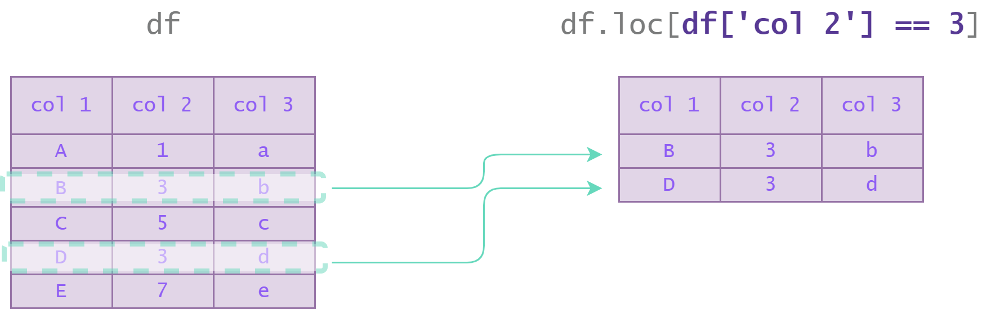

## Methods : 

## 9. Indexation Conditionnelle d'un `DataFrame`

Comme pour les arrays Numpy, nous pouvons utiliser **l'indexation conditionnelle** pour extraire les lignes d'un `Dataframe` qui vérifient une condition donnée.

Dans l'illustration suivante, nous sélectionnons les lignes du `DataFrame` `df` **pour lesquelles la colonne `col 2` vaut 3**.

  


Il existe deux syntaxes pour indexer conditionnellement un `DataFrame` :

```python
# On sélectionne les lignes du DataFrame df pour lesquelles la colonne 'col 2' vaut 3. 
df[df['col 2'] == 3]

df.loc[df['col 2'] == 3]
```

Si nous souhaitons **assigner** une nouvelle valeur à ces entrées, il faut absolument utiliser la méthode **`loc`**.  
En effet, l'indexation avec la syntaxe `df[df['col 2'] == 3]` ne renvoie qu'une **copie** de ces entrées et ne permet pas d'accéder à l'emplacement mémoire où se trouvent les données.
