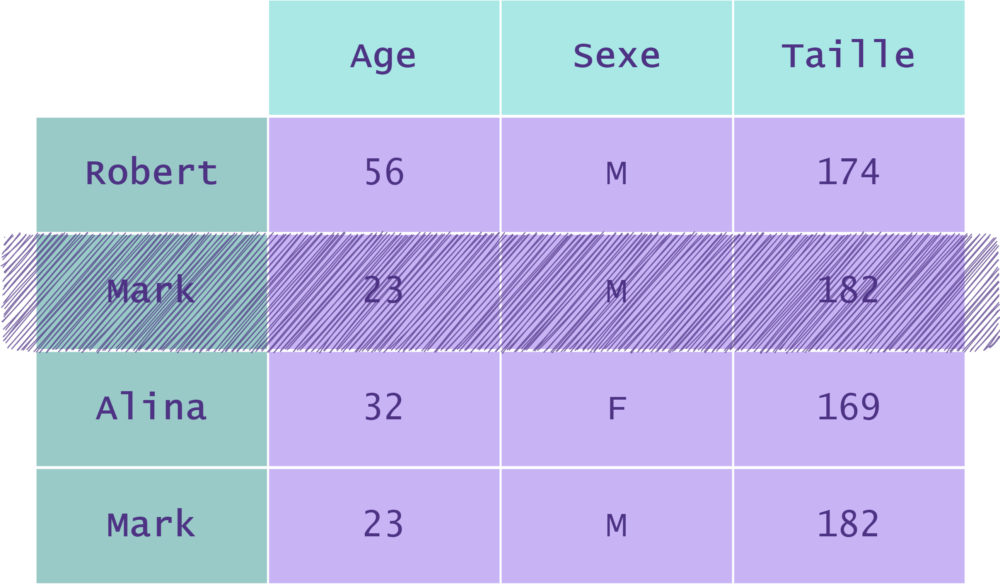

## Methods

- `duplicated`

- `drop_duplicates`

- `sum`


## Gestion des doublons (méthodes `duplicated` et `drop_duplicates`)

Les **doublons** sont des entrées identiques qui apparaissent **plusieurs** fois dans un dataset.

Quand nous découvrons un jeu de données il est très important de vérifier **dès le départ** qu'il n'y ait pas de doublons.  
La présence de doublons va générer des **erreurs** dans les calculs de statistiques ou le traçage de graphiques.

Soit **`df`** le `DataFrame` suivant :

| |Age|Sexe|Taille|
|---|---|---|---|
|**Robert**|56|M|174|
|**Mark**|23|M|182|
|**Alina**|32|F|169|
|**Mark**|23|M|182|

La présence de doublons se vérifie à l'aide de la méthode **`duplicated`** d'un `DataFrame` :

```py
# On repère les lignes contenant des doublons
df.duplicated()

>>> 0  False
    1  False
    2  False
    3  True
```

Cette méthode renvoie un objet de la classe `Series` de `pandas`, équivalente à une colonne d'un `DataFrame`, qui nous dit pour chaque ligne si elle est un doublon.

Dans cet exemple, le résultat de la méthode `duplicated` nous informe que **la ligne d'indice 3 est un doublon**, c'est-à-dire que c'est la **copie exacte** d'une ligne précédente, dans ce cas la ligne 1.

Puisque la méthode `duplicated` nous renvoie un objet de la classe `Series`, nous pouvons lui appliquer la méthode **`sum`** pour compter le nombre de doublons :

```python
# Pour calculer la somme de booléens, on considère que True vaut 1 et False vaut 0.
print(df.duplicated().sum())
>>> 1
```

La méthode d'un `DataFrame` permettant de supprimer les doublons est **`drop_duplicates`**.  
Son en-tête est la suivante :

`drop_duplicates(subset, keep, inplace)`

- Le paramètre `subset` indique la ou les colonnes à considérer pour identifier et supprimer les doublons. Par défaut, **`subset = None`** : on considère **toutes** les colonnes du `DataFrame`.

- Le paramètre `keep` indique quelle entrée doit être gardée :

	- **`'first'`** : On garde la **première** occurrence.
	
	- **`'last'`** : On garde la **dernière** occurrence.
	
	- **`'False'`** : On ne garde **aucune** des occurrences.
	
	- Par défaut, **`keep = 'first'`**.

- Le paramètre **`inplace`** (très courant dans les méthodes de la classe `DataFrame`), précise si l'on modifie **directement** le `DataFrame` (dans ce cas `inplace=True`) ou si la méthode renvoie une **copie** du `DataFrame` (`inplace=False`). Une méthode appliquée avec l'argument `inplace = True` est **irréversible**. Par défaut, `inplace = False`.

Il faut être très prudent avec l'utilisation du paramètre `inplace`. Une bonne pratique est d'oublier ce paramètre et d'affecter le `DataFrame` retourné par la méthode à un **nouveau** `DataFrame`.

Le paramètre `keep` est celui qui est le plus souvent spécifié.  
En effet, une base de données peut avoir des doublons créés à des dates différentes.  
On spécifiera alors la valeur de l'argument `keep` pour ne garder que les entrées les plus récentes, par exemple.

Reprenons `DataFrame` `df` :

|-|Age|Sexe|Taille|
|---|---|---|---|
|Robert|56|M|174|
|Mark|23|M|182|
|Alina|32|F|169|
|Mark|23|M|182|

Nous illustrons `df` avec la figure suivante :

  


Nous illustrons dans les exemples suivants les entrées qui sont **supprimées** par la méthode `drop_duplicates` en fonction de la valeur du paramètre `keep` :

```py
# On ne garde que la première occurrence du doublon
df_first = df.drop_duplicates(keep = 'first')
```

  


```py
# On ne garde que la dernière occurrence du doublon
df_last = df.drop_duplicates(keep = 'last')
```



```py
# On ne garde aucun doublon
df_false = df.drop_duplicates(keep = False)
```

