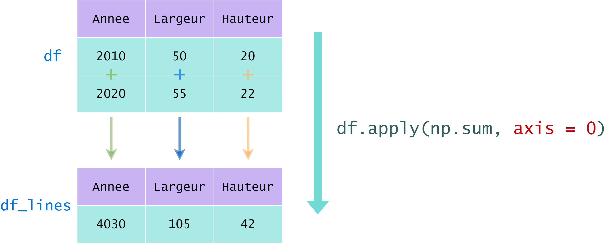
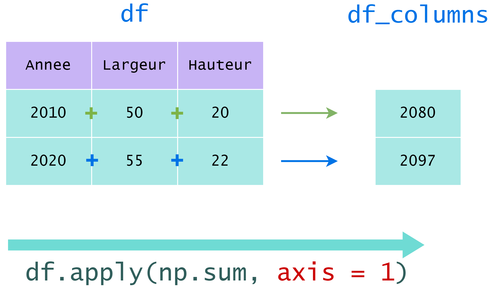

## Methods

- `apply`


## Opérations sur les valeurs d'un `DataFrame` (méthode `apply` et fonctions `lambda`)

Il est souvent intéressant de modifier ou agréger les informations des colonnes d'un `DataFrame` à l'aide d'une opération ou d'une fonction.

Ces opérations peuvent être tout type de fonction **qui prend en argument une colonne**.  
Ainsi, le module **numpy est parfaitement adapté** pour effectuer des opérations sur ce type d'objet.

La méthode permettant d'effectuer une opération sur une colonne est la méthode **`apply`** d'un `DataFrame` dont l'en-tête est :

```python
apply(func, axis, ...)
```

où :

- **`func`** est la fonction à appliquer à la colonne.

- **`axis`** est la dimension sur laquelle l'opération doit s'appliquer.

Exemple : `apply` et `np.sum`

Pour chaque colonne de type numérique, nous voulons calculer la **somme de toutes les lignes**.  
La fonction `sum` de `numpy` effectue cette opération, ce qui nous permet de l'utiliser avec la méthode `apply`.

Puisque nous allons réaliser une opération sur les **lignes**, il faut donc préciser l'argument **`axis = 0`** dans la méthode `apply`.

```python
# Somme des lignes pour chaque COLONNE de df
 df_lines = df.apply(np.sum, axis = 0) 
```

Le résultat est le suivant :



  

Dans un second temps, nous voulons pour chaque ligne calculer la **somme de toutes les colonnes**.

Nous allons réaliser cette opération sur les colonnes, il faut donc préciser l'argument **`axis = 1`** dans la méthode `apply`.

```py
# Somme des colonnes pour chaque LIGNE de df
 df_columns = df.apply(np.sum, axis = 1) 
```

Le résultat est le suivant :



  

Ces exemples illustrent l'utilisation de la méthode `apply`.  
Pour calculer une somme de lignes ou colonnes, il est préférable d'utiliser la méthode **`sum`** d'un `DataFrame` ou d'une `Series`, qui se comporte exactement de la même façon que la méthode `sum` d'un array numpy.

  
La méthode **`apply`** est très puissante lorsqu'elle est associée à une fonction **`lambda`**.

En Python, le mot clé **`lambda`** est utilisé pour définir une fonction **anonyme** : une fonction déclarée sans nom.

Une fonction **`lambda`** peut prendre n'importe quel nombre d'arguments, mais ne peut avoir qu'une seule expression.

Voici sa syntaxe :

```python
lambda arguments: expression
```

Les fonctions `lambda` permettent donc de définir des fonctions avec une syntaxe très courte :

```python
# Exemple 1 
x = lambda a: a + 2
print(x(3))
>>> 5
```

```python
# Exemple 2 
x = lambda a, b : a * b
print(x(2, 3))
>>> 6
```

```python
# Exemple 3 
x = lambda a, b, c : a - b + c
print(x(1, 2, 3))
>>> 2
```

Bien que syntaxiquement elles soient différentes, les fonctions **`lambda`** se comportent de la même manière que les fonctions régulières qui sont déclarées en utilisant le mot-clé **`def`**.

La définition classique d'une fonction se fait avec la clause **`def`** :

```python
def increment(x): 
   return x+1 
```

Il est aussi possible de définir une fonction avec la clause **`lambda`** :

```python
increment = lambda x: x+1
```

La première est très propre mais l'avantage de la seconde est de pouvoir être définie directement **au sein** de la méthode **`apply`**.

Ainsi, l'exercice précédent peut être fait avec une syntaxe très compacte :

```python
transactions['day'] = transactions['tran_date'].apply(lambda date: date.split('-')[0])
```

Ce genre de syntaxe est très pratique et très souvent utilisée pour le nettoyage de bases de données.


La colonne `prod_subcat_code` de `transactions` dépend de la colonne `prod_cat_code` car elle désigne une **sous-catégorie** de produit.  
Il serait plus logique d'avoir la catégorie et sous-catégorie d'un produit dans la même variable.

Pour cela, nous allons fusionner les valeurs de ces deux colonnes :

- Nous allons d'abord convertir les valeurs de ces deux colonnes en chaîne de caractères à l'aide de la méthode **`astype`**.

- Ensuite, nous allons concaténer ces chaînes pour avoir un unique code représentant la catégorie et sous-catégorie. Ceci peut se faire de la façon suivante :

```python
chaine1 = "Je pense"
chaine2 = "donc je suis."

# Concaténation des deux chaînes en les séparant par un espace
print(chaine1 + " " + chaine2)
>>> Je pense donc je suis.
```

Pour appliquer une fonction lambda à toutes les lignes, il faut spécifier l'argument **`axis = 1`** dans la méthode `apply`.  
Dans la fonction elle-même, les colonnes de la ligne peuvent être accédées comme sur un `DataFrame` :

```python
# Calcul du prix unitaire d'un produit
transactions.apply(lambda row: row['total_amt'] / row['qty'], axis = 1)
```
