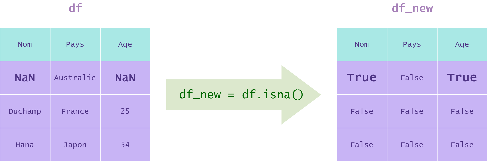

## Methods 

- `isna`

- `any`

- `sum`

- `isnull`

## Détection des valeurs manquantes (méthodes `isna` et `any`)

La méthode **`isna`** d'un `DataFrame` détecte ses valeurs manquantes. Cette méthode ne prend pas d'arguments.

Cette méthode retourne le même `DataFrame` dont les valeurs sont :

- **`True`** si la case du tableau originale est une valeur manquante (`np.nan`).

- **`False`** sinon.

  


Puisque la méthode `isna` renvoie un `DataFrame`, nous pouvons l'utiliser avec d'autres méthodes de la classe `DataFrame` pour avoir des informations plus précises :

- La méthode `any` avec son argument `axis` permet de déterminer **quelles colonnes** (`axis = 0`) ou **quelles lignes** (`axis = 1`) contiennent au moins une valeur manquante.

- La méthode `sum` compte le nombre de valeurs manquantes par colonne ou lignes (en spécifiant l'argument `axis`). Il est possible d'utiliser d'autres méthodes statistiques comme `mean`, `max`, `argmax`, etc...

Voici de nombreux exemples d'utilisation des méthodes `any` et `sum` avec `isna` :

On reprend le `DataFrame` **`df`** de l'illustration précédente :

| |Nom|Pays|Age|
|---|---|---|---|
|0|NaN|Australie|NaN|
|1|Duchamp|France|25|
|2|Hana|Japon|54|

L'instruction `df.isna()` renvoie :

| |Nom|Pays|Age|
|---|---|---|---|
|0|True|False|True|
|1|False|False|False|
|2|False|False|False|

```python
# On détecte les COLONNES contenant au moins une valeur manquante
df.isna().any(axis = 0) 

>>> Nom      True
    Pays     False
    Age      True
```

```python
# On détecte les LIGNES contenant au moins une valeur manquante
df.isna().any(axis = 1) 

>>> 0     True
    1    False
    2    False
```

```python
# On utilise l'indexation conditionnelle pour afficher les entrées
# contenant des valeurs manquantes

df[df.isna().any(axis = 1)]
```

ce qui renvoie le `DataFrame` :

| |Nom|Pays|Age|
|---|---|---|---|
|0|NaN|Australie|NaN|

```python
# On compte le nombre de valeurs manquantes pour chaque COLONNE
df.isnull().sum(axis = 0) #Les fonctions isnull et isna sont strictement équivalentes

>>> Nom     1
    Pays    0
    Age     1
```

```python
# On compte le nombre de valeurs manquantes pour chaque LIGNE
df.isnull().sum(axis = 1) 

>>> 0    2
    1    0
    2    0
```
