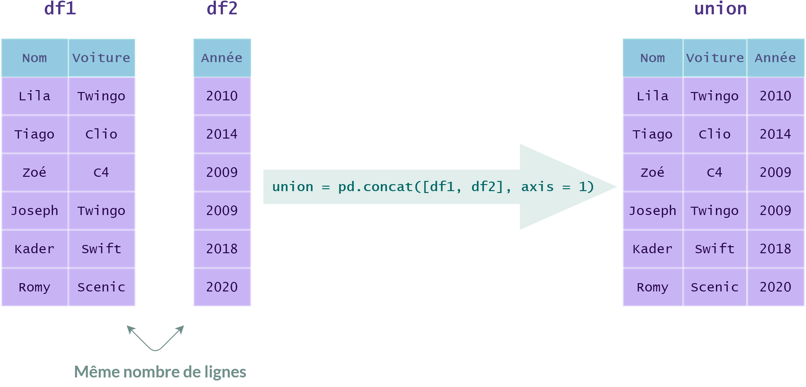
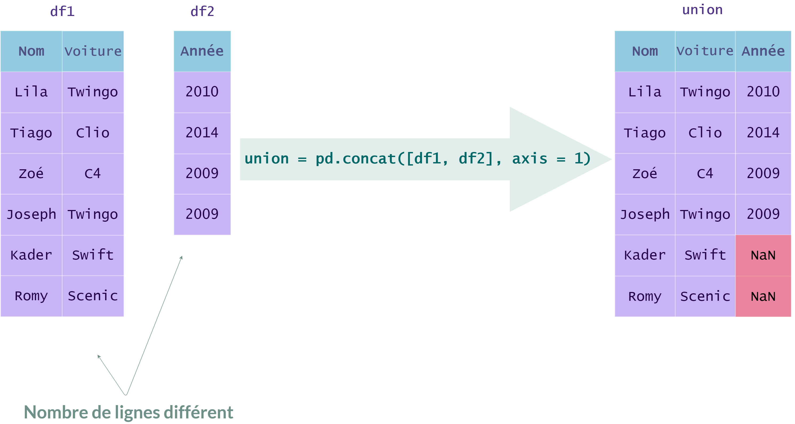

### Union de `DataFrames` avec `concat`

La fonction `concat` du module `pandas` permet de concaténer plusieurs `DataFrames`, c'est-à-dire les juxtaposer horizontalement ou verticalement.

L'en-tête de cette fonction est la suivante : `pandas.concat(objs, axis..)`

- Le paramètre `objs` contient la liste des `DataFrames` à concaténer.

- Le paramètre `axis` précise si l'on doit concaténer verticalement (`axis = 0`) ou horizontalement (`axis = 1`).

Lorsque le nombre de lignes ou de colonnes des `DataFrames` ne concordent pas, la fonction `concat` remplit les cases vides par des `NaN`, comme dans l'illustration ci-dessous.

  

