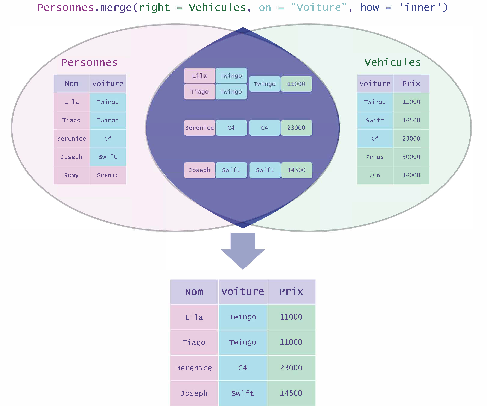
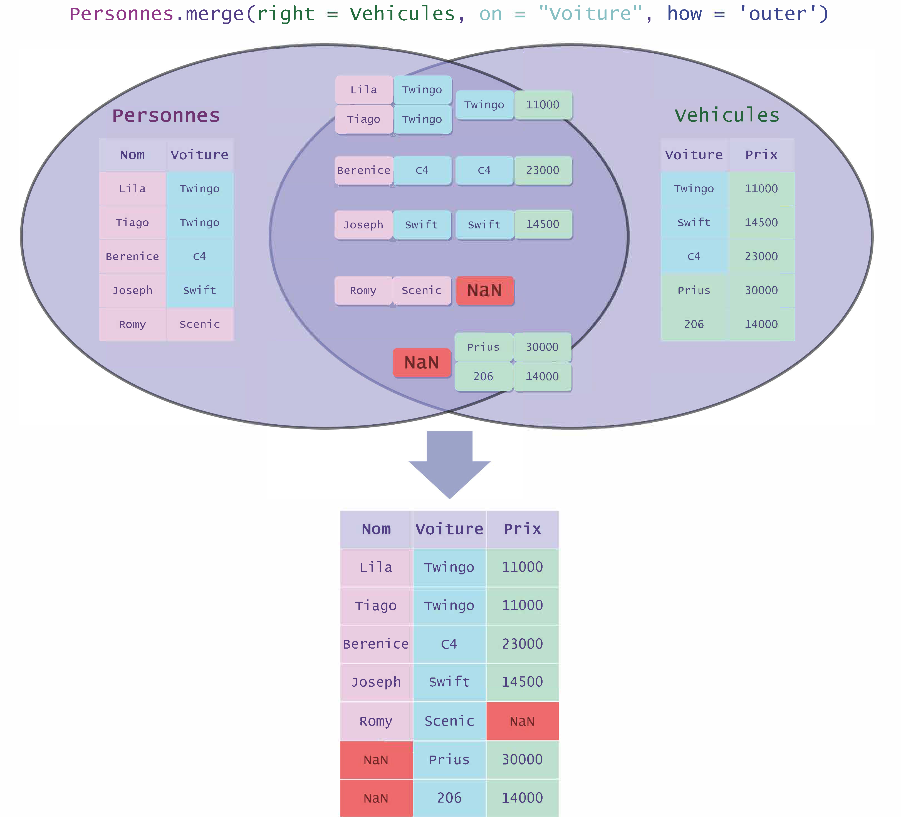
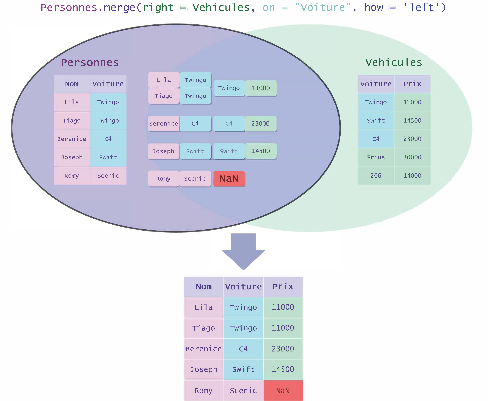
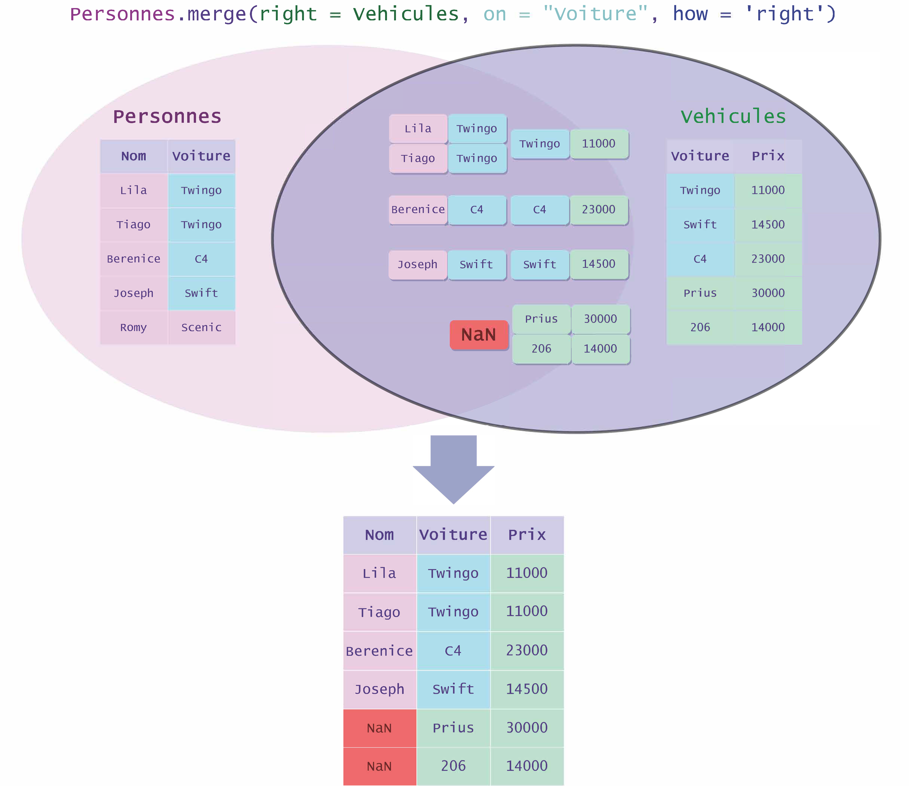

## Fusion de `DataFrames` avec la méthode `merge`

Deux `DataFrames` peuvent être fusionnés s'ils ont une colonne en commun.  
Ceci se fait grâce à la méthode `merge` de la classe `DataFrame` dont l'en-tête est la suivante :

```python
merge(right, on, how, ...)
```

- Le paramètre **`right`** est le `DataFrame` à fusionner avec celui qui appelle la méthode.

- Le paramètre **`on`** est le nom des colonnes des `DataFrame` qui serviront de référence pour la fusion. Elles doivent être **communes** aux deux `DataFrames`.

- Le paramètre **`how`** permet de choisir le **type de jointure** à effectuer pour la fusion des `DataFrames`. Les valeurs de ce paramètre sont basées sur les jointures de la syntaxe SQL.
- 
Le paramètre `how` peut prendre 4 valeurs (`'inner'`, `'outer'`, `'left'`, `'right'`) que nous allons illustrer sur les deux `DataFrames` nommés `Personnes` et `Vehicule` suivants :

|Nom|Voiture|
|---|---|
|Lila|Twingo|
|Tiago|Clio|
|Berenice|C4 Cactus|
|Joseph|Twingo|
|Kader|Swift|
|Romy|Scenic|

|Voiture|Prix|
|---|---|
|Twingo|11000|
|Swift|14500|
|C4 Cactus|23000|
|Clio|16000|
|Prius|30000|

- **`'inner'`** : C'est la **valeur par défaut du paramètre `how`**. La jointure interne retourne les lignes dont les valeurs dans les colonnes communes sont **présentes dans les deux `DataFrames`**. Ce type de jointure est souvent **déconseillé** car il peut amener à la perte de beaucoup d'entrées. Par contre, la jointure interne ne produit **aucun NaN**.

Le résultat de la jointure interne `Personnes.merge(right = Vehicule, on = 'Voiture', how = 'inner')` sera :

  


- **`'outer'`** : La jointure externe fusionne la **totalité** des deux `DataFrames`. Aucune ligne ne sera supprimée. Cette méthode peut générer énormément de NaNs.

Le résultat de la jointure externe `Personnes.merge(right = Vehicule, on = 'Voiture', how = 'outer')` sera :

  


- **`'left'`** : La jointure à gauche retourne **toutes les lignes** du `DataFrame` de **gauche**, et les complète avec les lignes du second `DataFrame` qui coïncident selon les valeurs de la colonne commune.

Le résultat de la jointure à gauche `Personnes.merge(right = Vehicule, on = 'Voiture', how = 'left')` sera :

  


- **`'right'`** : La jointure à droite retourne **toutes les lignes** du `DataFrame` de **droite**, et les complète avec les lignes du `DataFrame` de gauche qui coïncident selon les indices de la colonne commune.

Le résultat de la jointure à droite `Personnes.merge(right = Vehicule, on = 'Voiture', how = 'right')` sera :

  


Faire une jointure à gauche, une jointure à droite ou une jointure externe suivie d'un `dropna(how = 'any')` est équivalent à une jointure interne.

Il est possible de re-définir l'index d'un `DataFrame` à l'aide de la méthode **`set_index`**.

Cette méthode peut prendre en argument :

- Le **nom** d'une colonne à utiliser comme indexation.

- Un `array` Numpy ou `Series` pandas avec le même nombre de lignes que le `DataFrame` appelant la méthode.

Exemple :  

Soit `df` le `DataFrame` suivant :

| |Nom|Voiture|
|---|---|---|
|**0**|Lila|Twingo|
|**1**|Tiago|Clio|
|**2**|Berenice|C4 Cactus|
|**3**|Joseph|Twingo|
|**4**|Kader|Swift|
|**5**|Romy|Scenic|

On peut définir la colonne `'Nom'` comme étant le nouvel index :

```python
df = df.set_index('Nom') 
```

Ceci produira le `DataFrame` suivant :

|**Nom**|Voiture|
|---|---|
|**Lila**|Twingo|
|**Tiago**|Clio|
|**Berenice**|C4 Cactus|
|**Joseph**|Twingo|
|**Kader**|Swift|
|**Romy**|Scenic|

On peut aussi définir l'index à partir d'un array Numpy ou d'une `Series`, etc... :

```python
# Nouvel index à utiliser
new_index = ['10000' + str(i) for i in range(6)]
print(new_index)
>>> ['100000', '100001', '100002', '100003', '100004', '100005']

# Utiliser un array ou une Series est équivalent
index_array = np.array(new_index)
index_series = pd.Series(new_index)


df = df.set_index(index_array)
df = df.set_index(index_series)
```

Ceci produira le `DataFrame` suivant :

| |Nom|Voiture|
|---|---|---|
|**100000**|Lila|Twingo|
|**100001**|Tiago|Clio|
|**100002**|Berenice|C4 Cactus|
|**100003**|Joseph|Twingo|
|**100004**|Kader|Swift|
|**100005**|Romy|Scenic|

Pour revenir à l'indexation numérique par défaut, on utilise la méthode **`reset_index`** du `DataFrame` :

```python
df = df.reset_index()
```

L'index qui était utilisé **n'est pas supprimé**. Une nouvelle colonne sera créée contenant l'ancien index :

| |index|Nom|Voiture|
|---|---|---|---|
|**0**|100000|Lila|Twingo|
|**1**|100001|Tiago|Clio|
|**2**|100002|Berenice|C4 Cactus|
|**3**|100003|Joseph|Twingo|
|**4**|100004|Kader|Swift|
|**5**|100005|Romy|Scenic|


La fusion entre `transactions` et `customer` a supprimé l'index de `transactions`.

L'index d'un `DataFrame` peut être récupéré à l'aide de son attribut `.index`.