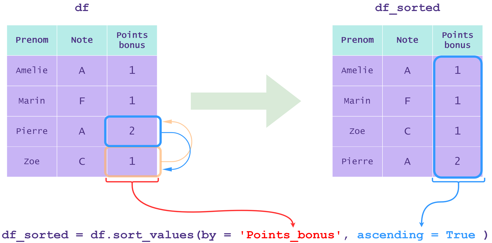
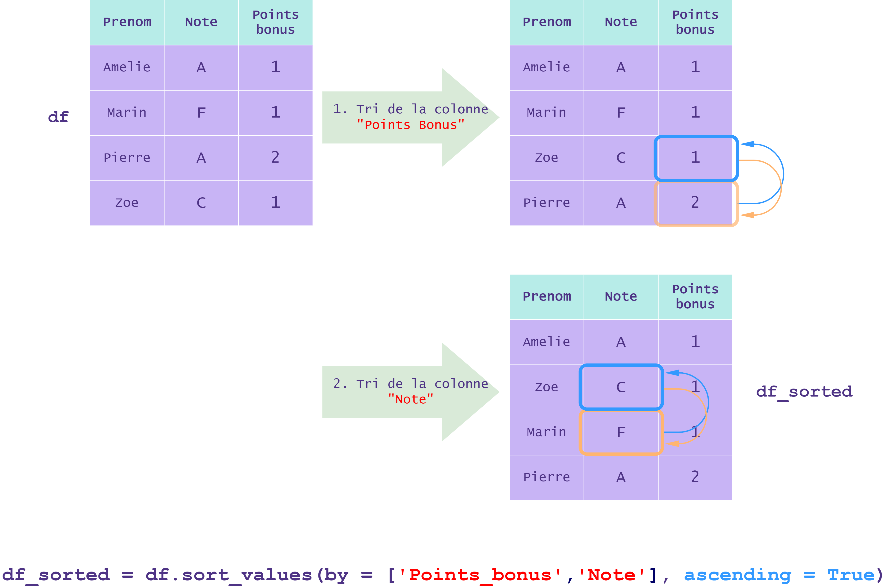

## Méthode 

- `sort_values`

## 3. Trier et ordonner les valeurs d'un `DataFrame` : méthodes `sort_values` et `sort_index`.

La méthode `sort_values` permet de trier les lignes d'un `DataFrame` selon les valeurs d'une ou de plusieurs colonnes.

L'en-tête de cette méthode est la suivante : `sort_values(by, ascending,...)`

- Le paramètre `by` permet de préciser sur quelle(s) colonne(s) le tri est effectué.

- Le paramètre `ascending` est un booléen (`True` ou `False`) déterminant l'ordre croissant/décroissant du tri. Par défaut ce paramètre vaut `True`.

Exemple :  

Considérons le `DataFrame` `df` décrivant des élèves :

|Prenom|Note|Points_bonus|
|---|---|---|
|'Amelie'|A|1|
|'Marin'|F|1|
|'Pierre'|A|2|
|'Zoe'|C|1|

Dans un premier temps, nous allons trier sur une seule colonne, par exemple la colonne `'Points_bonus'` :

```python
# On trie le DataFrame df sur la colonne 'Points_bonus'
df_sorted = df.sort_values(by = 'Points_bonus', ascending = True) 
```

On obtient le résultat suivant :
  


Les lignes du `DataFrame` `df_sorted` sont donc triées par ordre **croissant** de la colonne **`'Points bonus'`**.  
Cependant si l'on regarde la colonne `'Note'`, on constate qu'elle n'est pas triée par ordre alphabétique pour les valeurs communes de `'Points_bonus'`.

On peut y remédier en triant aussi par la colonne `'Note'` :

```python
# On trie le DataFrame df par la colonne 'Points_bonus' puis en cas d'égalité, par la colonne 'Note'.
df_sorted = df.sort_values(by = ['Points_bonus', 'Note'], ascending = True) 
```

On obtient le résultat suivant :
  


La méthode **`sort_index`** permet de trier un `DataFrame` selon son index.  
Dans le cas où l'index est celui par défaut (numérotation), cette méthode n'est pas très intéressante.  
Elle est donc souvent combinée avec la méthode `set_index` de `pandas` que l'on vient de voir.

Exemple :  

```py
# On définit la colonne 'Note' comme l'index de df
df = df.set_index('Note')

# On trie le DataFrame df selon son index
df = df.sort_index()
```

Ceci produit le `DataFrame` suivant :

|**Note**|Prenom|Points_bonus|
|---|---|---|
|**A**|'Amelie'|1|
|**A**|'Pierre'|2|
|**C**|'Zoe'|1|
|**F**|'Marin'|1|

  

Considérons les deux `DataFrames` suivants contenant des données de locations de bateaux.

Voici le `DataFrame` `bateaux` :

| |nom_bateau|couleur|numero_reservation|nombre_reservations|
|---|---|---|---|---|
|**0**|Julia|bleu|2|34|
|**1**|Siren|vert|3|10|
|**2**|Sea Sons|rouge|6|20|
|**3**|Hercules|bleu|1|41|
|**4**|Cesar|jaune|4|12|
|**5**|Minerva|vert|5|16|

Et le `DataFrame` `clients` :

| |id_client|nom_client|id_reservation|
|---|---|---|---|
|**0**|91|Marie|1|
|**1**|154|Anna|2|
|**2**|124|Yann|3|
|**3**|320|Lea|7|
|**4**|87|Marc|9|
|**5**|22|Yassine|10|

Nous voulons déterminer facilement quel client a réservé les bateaux du `DataFrame` `bateaux`.  
Pour cela, il suffit de fusionner les `DataFrames`.
