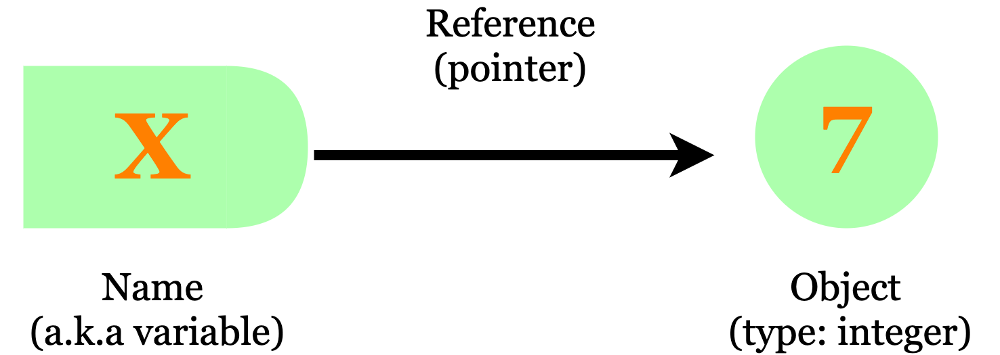
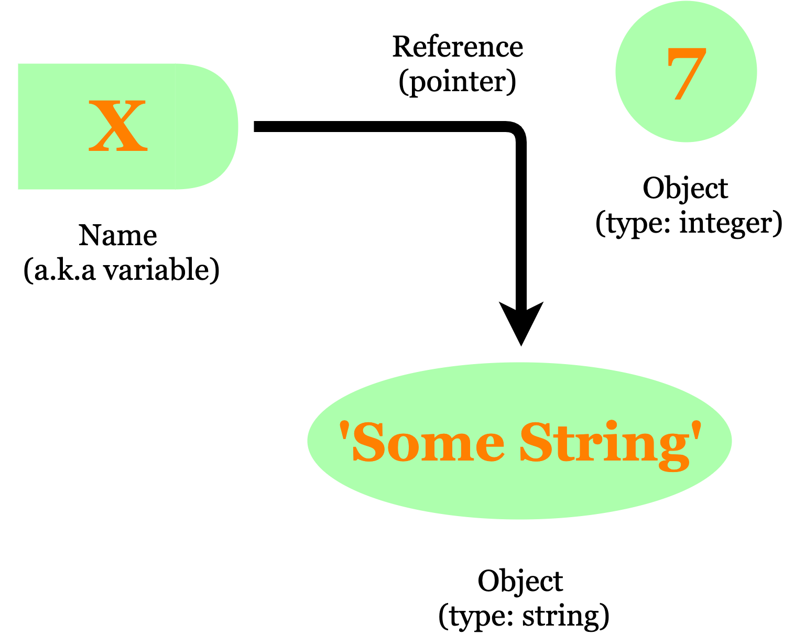

# 1. Introduction - Le typage en programmation

Lorsque l'on apprend à coder en Python, la question du **typage** est une question que l'on ne considère que très rarement alors que celle-ci est incontournable avec un langage comme Java. D'où vient donc cet "oubli" de la part d'un des langages de programmation les plus utilisés du moment ?  
Pour répondre à cette question, il est important de creuser quelques notions de base.

Le **typage en programmation** correspond simplement à la définition de la nature des valeurs que peut prendre les données que l'on manipule. Pour tester le type d'une variable en Python, on fait appel à la fonction `type()` qui retourne, sans surprise, le type de l'objet entré en paramètre de la fonction.  
La fonction s'utilise comme suit :

```python
a = 2 
type_de_a = type(a) 
```

Le type de l'argument s'affiche à l'aide de la fonction `print` sous la forme :

```python
>>> <class 'int'>
```

Dans l'exemple ci-dessus, on teste une variable numérique entière, le type correspondant est `int`. En Python, il existe une multitude de types dits natifs, vous trouverez la liste exhaustive sur le site de la [documentation officielle](https://docs.python.org/fr/3/library/stdtypes.html).

Il existe plusieurs types de typages en programmation. On en distingue principalement deux : le **typage statique** et le **typage dynamique**.

### Typage statique

On appelle un langage à **typage statique**, un langage dans lequel chaque variable doit être assignée à un type précisé par le programmeur. Cette technique est adopté par de nombreux langages de programmation tels que Java, C ou C++.  
Cette approche du code offre quelques avantages dont notamment une certaine rigueur dans l'écriture et la définition des variables : il n'y a pas de doute sur la nature des variables et il devient d'autant plus facile pour l'interpréteur de repérer des erreurs liées au type.

Prenons l'exemple de Java pour la définition d'une variable numérique, la syntaxe est la suivante :

```java
int a = 2;
float b = 3.;
String c = 'Hello World';
```

Pas besoin d'avoir une maîtrise de Java pour comprendre cette syntaxe. Chaque variable **`a`**, **`b`** ou **`c`** est introduite par le **type** de celle-ci et est suivie par la **valeur attribuée**. L'aspect statique du typage apparaît nettement et pour le vérifier, il suffit simplement de voir ce qu'il se passerait si l'on essayait d'assigner une nouvelle valeur à une des variables. Vous pouvez tentez par vous même sur ce [compiler](https://repl.it/languages/java10) en ligne.

Comme dit précédemment, l'un des avantages de ce typage est la **rigueur** qu'il entraîne, mais cela facilite également **la lecture du code** par une personne autre que le programmeur originel, ce qui est extrêmement intéressant dès lors que celui-ci écrit du code pour une entreprise. Par ailleurs, un autre point qu'il est important de mentionner est que la vérification de type est généralement faite lors de la **compilation** du code. Cela veut dire que l'exécution de ce dernier peut se faire à **pleine vitesse** ce qui n'est pas le cas pour un langage typé dynamiquement. En revanche, cette approche rend la programmation nettement plus rigide voire même fastidieuse par moment, ce qui peut en pousser plus d'un à s'orienter vers un langage de programmation à **typage dynamique**.

### Typage dynamique

Contrairement à Java, Python a opté pour un typage dit **dynamique**. Concrètement, cela veut dire qu'à la différence d'un langage statique, le typage n'est réalisé et vérifié qu'après l'exécution du code et pas avant.  
Outre une perte relative de vitesse d'exécution, qu'est-ce que cela implique ?

- Lorsque l'on définit une variable en Python, nous ne sommes pas obligés de préciser le type de celle-ci, il est reconnu par l'interpréteur.

**Exemple** :

```python
variable = 'chaîne de caractère' 
print(type(variable))

--- Exécution ---

>>> <class 'str'> 
```

Une fois une variable définie, il est tout à fait possible de lui assigner une nouvelle valeur, peu importe son type, sans causer d'erreur.

**Exemple** :

```python
variable = 'chaîne de caractère' 
print(type(variable))
variable = 3 
print(type(variable))

--- Exécution ---

>>> <class 'str'>
>>> <class 'int'>
```

Ce mécanisme peut paraître un peu contre-intuitif lorsque l'on est habitué à la rigidité usuelle de l'informatique, mais lorsque l'on sait comment Python gère le stockage en mémoire des variables, cela devient vite assez clair.  
Pour s'en rendre compte, on utilisera la fonction `id` de Python qui renvoie l'identifiant de la localisation en mémoire de l'objet pris en argument.

- (b) Définissez deux variables toutes deux égales à une même valeur numérique.
- (c) À l'aide de la fonction `id`, affichez les localisations des deux variables crées, ainsi que celle de la valeur numérique choisie.
- (d) Commentez.

```python
variable_1 = 5
variable_2 = 5

print(id(5))
print(id(variable_1))
print(id(variable_2))
```

```
139970896714160
139970896714160
139970896714160
```

On constate que les identifiants sont les mêmes, autrement dit, tous ces objets sont stockés au **même endroit**. Informatiquement, sont-ils donc parfaitement égaux ? Pas tout à fait. En réalité Python alloue de la place en mémoire à des objets tels que des valeurs numériques, des chaînes de caractères... et la variable n'est qu'un _raccourci_ qui permet de pointer vers cet objet.





On comprend donc déjà mieux comment le typage dynamique fonctionne en Python, pour réattribuer une valeur à une variable, il s'agit donc simplement de **rediriger** le pointeur de cette variable vers le nouvel objet que l'on décide de lui assigner.


