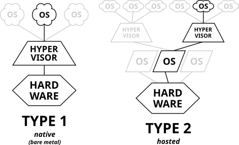
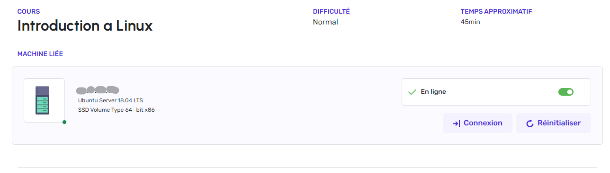
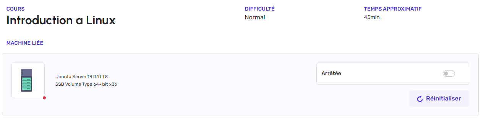
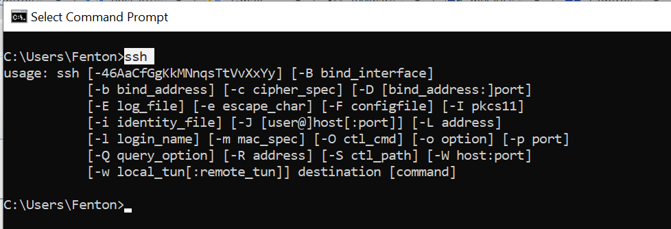
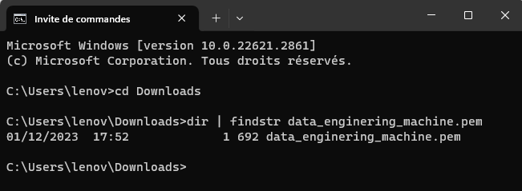
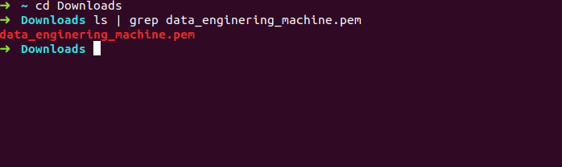
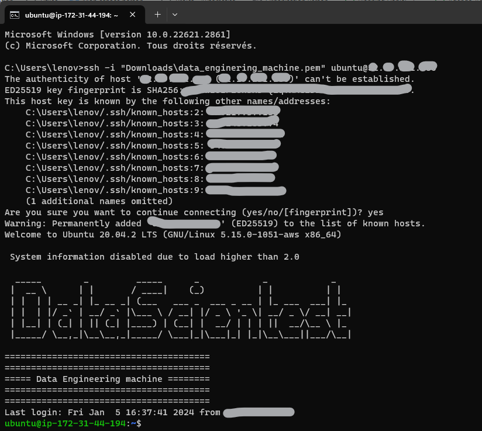
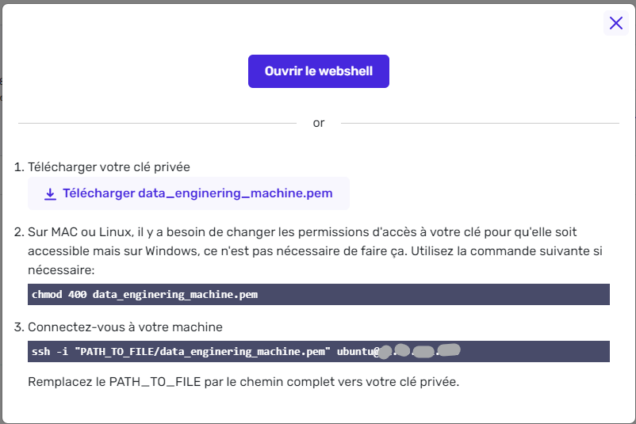

# Introduction à la Machine Virtuelle et Première Connexion

---

# Introduction

Avant de nous connecter à la machine virtuelle, prenons le temps de comprendre ce qu'est une machine virtuelle et comment elle fonctionne. Cette introduction posera les bases nécessaires pour une utilisation optimale. Les points clés abordés sont les suivants :

- **Qu'est-ce qu'une machine virtuelle ?**
    
    - Comprendre le concept
    - Comprendre l'utilité
    - Comprendre le rôle des machines virtuelles dans la Data Science
    - Bonus : Comprendre le fonctionnement en profondeur
- **Comment utiliser la VM DataScientest ?**
    
    - Comprendre l'arborescence des fichiers
    - Comprendre ce qu'est une connexion SSH
    - Comprendre à quoi sert une clé d'authentification
    - Comprendre le fonctionnement des adresses IPs
    - Comprendre comment suivre l'état de la machine
    - Comprendre les limites d'utilisation
- **Première connexion : Comment se connecter à la machine virtuelle DataScientest ?**
    
    - Tutoriel pour comprendre pas à pas comment se connecter pour la première fois à la VM

# Qu'est-ce qu'une machine virtuelle ?

### Comprendre le concept : Définition

Une **machine virtuelle** (abrégée **_VM_**) est une version virtuelle d'un ordinateur. Elle partage avec lui ses ressources et possède ainsi : un processeur, de la mémoire, des disques pour stocker des fichiers et même de quoi se connecter à internet si nécessaire. Alors que tous les éléments qui constituent un ordinateur sont physiques et tangibles, les machines virtuelles sont considérées comme des ordinateurs virtuels parce qu'elles n'existent qu'en tant que code.

Une machine virtuelle est donc **un programme** qui crée un environnement informatique virtuel. Elle emprunte des ressources à l'ordinateur hôte où elle est installée, et comme elle est partitionnée et isolée du reste du système, aucun logiciel qui y est installé ne peut interférer avec le système d'exploitation principal de l'ordinateur hôte. Elle permet ainsi d'exécuter un système d'exploitation différent et d'y exécuter des programmes comme s'ils fonctionnaient sur une véritable machine physique.

Les machines virtuelles sont en réalité des fichiers informatiques dans lesquels plusieurs informations sont stockées, comme la configuration choisie, les paramètres de ses composants et les instructions de son comportement.

Comme il ne s'agit que de fichiers informatiques, plusieurs machines virtuelles avec des systèmes d'exploitation différents peuvent coexister sur un même ordinateur physique.

**_Quelques mots sur l'hyperviseur..._**

L'**hyperviseur** permet de créer et de gérer des machines virtuelles. Il s'occupe de la répartition des ressources physiques entre les différentes machines virtuelles à l'aide d'un logiciel installé sur la machine hôte. Il permet ainsi l'exécution simultanée de plusieurs systèmes d'exploitation sur une même machine physique.

L'hyperviseur est généralement hébergé dans un [cloud public](https://www.oracle.com/fr/cloud/definition-cloud-public/), [privé](https://www.oracle.com/fr/cloud/definition-cloud-prive/) ou [hybride](https://www.oracle.com/fr/cloud/definition-cloud-hybride/).

  

### Comprendre l'utilité : À quoi sert une VM ?

Les machines virtuelles peuvent être utilisées pour différentes raisons, notamment :

- **Pour exécuter plusieurs systèmes d'exploitation sur un même ordinateur.** Elle permet l'utilisation d'applications non compatibles avec le système d'exploitation natif. _Par exemple, **PowerBI** de Microsoft, incompatible avec MacOS, [peut être utilisé sur un MacBook en simulant une machine Windows grâce à la virtualisation !](https://datascientest.com/power-bi-sur-mac)_
    
- **Pour créer un environnement isolé et sécurisé pour tester des logiciels ou des applications.** _Par exemple, vous pouvez utiliser une machine virtuelle pour tester un nouveau logiciel sans risquer d'endommager votre ordinateur._
    
- **Pour créer un environnement portable pour le développement ou le déploiement d'applications.** _Par exemple, vous pouvez créer une machine virtuelle avec toutes les dépendances nécessaires pour votre application, puis la déployer sur n'importe quel ordinateur._
    

  

### Le rôle des machines virtuelles dans la Data Science

Dans le cadre d'un projet de Data Science, les machines virtuelles peuvent être utilisées pour les raisons suivantes :

- **Isolation et sécurité** - La virtualisation renforce la sécurité en segmentant votre espace de travail. Chaque application, ou groupe d'applications, isolée dans sa propre machine virtuelle (VM), assure la pérennité du projet. Cette approche protège les données sensibles et minimise les risques de contamination par des virus. Les erreurs opérantes dans une VM restent isolées, sans impact sur les autres applications et votre ordinateur, grâce à l'absence de communication. Ainsi, l'ensemble des VMs peut être exécuté sur la même machine physique, préservant cette isolation cruciale.
    
- **Sandboxing** - Cela rejoint le point précédent ; une VM peut être utilisée en tant qu'environnement "_bac à sable_", pour tester différents paramètres de son projet. Que ce soit les librairies à installer, les données à modifier ou encore la mémoire à allouer, cela n'affectera aucunement l'environnement principal. Les VM disposent également d'un système de _snapshot_, une sorte de sauvegarde de la machine virtuelle à un moment précis, et de _rollback_, permettant de revenir en arrière, en fonction du besoin, lors des tests.
    
- **Reproductibilité et mobilité** - Cloner une VM pour créer une copie exacte est simple et efficace. De surcroît, la migration d'une VM d'un serveur physique à un autre s'effectue sans interruption, préservant son fonctionnement. Cette facilité de déplacement favorise la collaboration et le partage des données. Partager une VM permet alors de garantir que tout le monde travaille dans le même environnement, simplifiant ainsi la reproductibilité des résultats.
    

  

### Bonus : Comprendre le fonctionnement en profondeur

**_Pour aller un peu plus loin, quelques mots sur les différents types de VM..._**

On distingue deux types d'hyperviseurs :

- **Type 1** ou **bare metal** ("_métal nu_" en français), et
- **Type 2** ou **hosted** ("_hébergé_" en français).

La catégorisation dépend du niveau d'intervention de l'hyperviseur dans la virtualisation.  


  

L'approfondissement de ces notions dépasse le cadre du cours, mais il convient de noter que selon l'utilisation souhaitée, les solutions peuvent varier.

Typiquement, un hyperviseur de type 2 peut être préférable pour un usage à petite échelle, et profite de coûts moins élevés au détriment de performances également moindres.

Si vous souhaitez aller plus loin sur ce sujet pour comprendre ce que c'est un hyperviseur et approfondir les différents types de VM, nous vous invitons à lire ces deux articles :

1. [Machine Virtuelle : Définition, utilisation, et avantages](https://datascientest.com/machines-virtuelles-tout-savoir)
2. [Virtualisation : Qu’est-ce que c’est ? À quoi ça sert ?](https://datascientest.com/virtualisation-tout-savoir)

  

# Comment utiliser la VM DataScientest ?

### Arborescence : le système de fichiers

Avant de nous y connecter, il est important de faire un point sur l'arborescence. Il s'agit de la représentation des fichiers dans les systèmes de type UNIX tels que GNU/Linux ou MacOS.


  

Vous pouvez noter la ressemblance à un arbre, d'où l'emploi du terme "_arborescence_". On appelle **racine** la base de l'arbre et on la représente par un **`/`**.

Pour indiquer la position d'un fichier dans l'arborescence on peut passer par deux options :

- **Le chemin absolu** : Le chemin complet spécifiant l'emplacement d'un fichier ou d'un dossier depuis la **racine du système**. C'est comme donner l'adresse complète d'une maison, indépendamment de l'endroit où vous êtes. _Par exemple, pour le fichier `photo_1.jpg`, le chemin absolu est `/home/max/images/photos_vac/photo_1.jpg`._
    
- **Le chemin relatif** : Le chemin d'accès à un fichier ou dossier par rapport à votre position actuelle, le répertoire courant. C'est comme indiquer des directions pour atteindre un endroit dans une ville en utilisant des repères locaux, comme "_tournez à droite après la librairie_" ou "_continuez tout droit après le parc_". Cela dépend de votre position actuelle plutôt que de donner une adresse précise depuis le point de départ. _Par exemple, depuis le répertoire `max`, le chemin relatif vers `photo_1.jpg` est `images/photos_vac/photo_1.jpg` (dans ce cas on ne met pas de `/` au début du chemin)._ _Si l'on souhaite indiquer le chemin relatif pour accéder au fichier `gdbd_3.jpg` depuis le répertoire `photos_vac` il suffit de remonter dans l'arborescence d'un niveau en utilisant `..` de sorte qu'on aurait pour chemin `../ski/gdbd_3.jpg`._
    
    **Remarque :** Vous pouvez remonter plusieurs niveaux en utilisant `..` autant de fois que nécessaire pour atteindre le niveau désiré. N'oubliez pas de les séparer par `/`.  
      
    _Exemple : pour passer du dossier `images` à `elsa`, le chemin serait `../../elsa`._
    

  

### Comprendre la nécessité de la connexion SSH

Une machine virtuelle et personnelle DataScientest vous est attribuée. Elle est gérée par notre fournisseur cloud **Amazon Web Services** (abrégé _AWS_). Pour accéder et utiliser cette machine, il est nécessaire de se connecter, et c'est là que le protocole SSH, imposé par AWS, entre en jeu.

En termes simples, la **connexion SSH** établit une communication sécurisée entre votre machine locale et la machine virtuelle distante (VM).

  

### Le rôle de la clé d'authentification `.pem`

Pour renforcer la sécurité de la connexion, l'utilisation d'une clé d'authentification est nécessaire. Cette clé, représentée par un fichier au format `.pem`, doit être présente sur la machine locale pour autoriser la liaison ainsi sécurisée.

Celle qui permet cette liaison avec la machine virtuelle DataScientest qui vous est attribuée est "`data_enginering_machine.pem`".

  

### Comprendre le fonctionnement des adresses IP

**_Qu'est-ce qu'une adresse IP ?_**

Une adresse IP, ou adresse Internet Protocol, est un peu comme un numéro de téléphone : elle comporte un numéro unique qui permet d'identifier un appareil sur un réseau informatique. Elle se compose de quatre nombres, chacun variant de 0 à 255 et séparés par des points. _Par exemple, l'adresse IP 192.168.1.1 pourrait être comparée à l'adresse d'une maison, mais est dédiée aux appareils connectés à Internet._

Une adresse IP a deux caractéristiques essentielles : son **accessibilité** et sa **variabilité**.

1. Au niveau de l'**accessibilité**, on distingue :
    
    - **Adresses IP publiques** : Comme une adresse postale visible sur une enveloppe, les adresses IP publiques sont utilisées sur l'Internet et dans les réseaux pour que les appareils puissent être "trouvés" depuis d'autres endroits, comme une maison est repérée par son adresse sur une carte.
        
    - **Adresses IP privées** : Comme des numéros de chambre à l'intérieur d'un hôtel, ces adresses IP sont réservées au trafic interne d'un réseau local et ne sont généralement pas visibles depuis l'Internet. Elles facilitent la communication entre les appareils dans un même lieu, sans que tout le monde à l'extérieur puisse les voir.
        
2. De l'autre côté, concernant la **variabilité** des adresses IP, on distingue :
    
    - **Adresses IP dynamiques** : Ce type d'adresse change à chaque connexion d'un appareil au réseau. Par exemple, les instances AWS sont attribuées avec une adresse IP dynamique par défaut. Cela offre une flexibilité en permettant aux appareils d'obtenir des adresses différentes à chaque connexion.
        
    - **Adresses IP statiques** : Contrairement aux adresses IP dynamiques, une adresse IP statique est fixe et ne change pas automatiquement. Elle reste constante dans le temps, sauf si elle est reconfigurée manuellement. Les adresses IP statiques sont souvent utilisées pour les serveurs, les équipements réseau, et d'autres appareils nécessitant une identification constante.
        

**Important :** L'adresse IP de la VM DataScientest est publique et dynamique. Elle sera donc différente à chaque fois que vous allumerez la VM. Pensez à mettre à jour cette information lorsque c'est nécessaire.

  

### Suivre l'état de la machine virtuelle

L'état de la machine virtuelle est indiqué dans l'encadré "**Machine Liée**" en haut à droite de la page de cours :





On peut aisément vérifier si elle est actuellement en arrêt ou en fonctionnement, puis ajuster cet état en utilisant le curseur.

On distingue également 2 boutons :

- **`Connexion`** : pour afficher des informations sur la connexion de la machine distante.
- **`Réinitialiser`** : pour réinitialiser la machine à la fin d'un cours. **Attention, cette opération supprime tous les fichiers que vous avez ajoutés sur la machine !**

  

### Les limites d'utilisation des VMs

Pour indication, **vos VM s'arrêtent automatiquement après 15 minutes d'inactivité.**

La machine virtuelle qui vous est donnée possède des capacités limitées mais suffisantes pour suivre les modules. Il faudra en prendre soin !

**Attention !**  
Nous tenons à rappeler que la machine virtuelle n'est pas conçue pour une persistance à long terme, et l'utilisation personnelle de celle-ci est fortement déconseillée. En effet, il est possible que, pour diverses raisons, vous deviez la réinitialiser en utilisant le bouton "Réinitialiser", entraînant la perte totale de son contenu.

**Important !**  
Pensez à sauvegarder votre travail régulièrement sur votre propre ordinateur ou sur un dépôt git/github.

Vous verrez plus loin dans ce cours comment récupérer des fichiers de la machine virtuelle sur votre machine personnelle. Vous aurez également un cours pour vous apprendre à utiliser _git/github_ et créer un "_repository_".

  

---

# Première connexion : Comment se connecter à la machine virtuelle DataScientest ?

Maintenant que nous avons vu toutes les informations essentielles à connaître pour utiliser et profiter de la machine virtuelle, nous allons effectuer notre première connexion.

Comprenez que la première connexion comporte certaines étapes supplémentaires comparées à la reconnexion à la VM.

Dans cette section, vous suivrez un tutoriel de première connexion et dans le cours suivant, vous verrez les bonnes pratiques pour vos prochaines reconnexions.

  

## Première connexion à la machine virtuelle

Vous pouvez vous connecter à la machine virtuelle par 2 différents moyens :

- Via le **Webshell**, une fonctionnalité directement disponible depuis la plateforme d'apprentissage
- Via une **invite de commande** sur votre ordinateur

  

**La première étape** quelle que soit votre méthode de connexion, **est d'allumer votre machine virtuelle**.

Pour cela :

1. Rendez-vous sur la plateforme et ouvrez un cours qui utilise la machine virtuelle. Vous les reconnaîtrez parce qu'ils ne comportent pas les boutons habituels des notebooks et qu'ils comportent un encadré avec les informations et commandes dédiées à la machine. _Par exemple, ce cours "Premiers pas sur la machine virtuelle" ou le cours "Linux & Bash"._

  

2. Dans l'encadré, cliquez sur le curseur à côté de "_Arrêtée_", votre machine virtuelle passera de l'état "_Arêtée_" à "_En ligne_". Une fois en ligne, cela signifie que la machine virtuelle est allumée, et que vous pouvez vous y connecter.

Une fois que la machine virtuelle est allumée, vous pouvez vous y connecter. Il faudra choisir entre l'une des deux méthodes citées précédemment.

  

### A. Connexion Via Webshell

La connexion via le Webshell est la plus simple.

**Important :** Cette méthode est à privilégier si vous travaillez sur un ordinateur professionnel ou sur un réseau professionnel qui possède des restrictions de sécurité et ne vous permet pas de bénéficier des autres moyens de connexion.

  

Pour vous connecter via le Webshell, suivez ces étapes :

1. Lorsque vous allumez la machine virtuelle, attendez 2/3 min avant de cliquer sur le bouton "`Connexion`".

  

2. Après avoir appuyé sur le bouton "`Connexion`", une fenêtre apparaît. Elle contient diverse informations de connexion, et un bouton tout en haut "`Ouvrir le Webshell`". Cliquez dessus.

  

3. Patientez quelques instants, puis, vous verrez apparaître un message. Lorsque vous voyez écrit en grand "`DataScientest - Data Enginering Machine`", **c'est que vous êtes connectés à la VM.**

  

**Quelques mots sur le Webshell...**  
Le Webshell est une interface textuelle directement disponible depuis la plateforme d’apprentissage DataScientest, dans lequel vous pourrez, comme pour une invite de commande, saisir des commandes pour exécuter des actions spécifiques sur la VM.

Une fois connecté à la VM, vous pouvez commencer à travailler.  

Lorsque vous avez fini de travailler sur la VM, **pensez à l'éteindre.**

  

### B. Connexion via l'invite de commande

Cette connexion est intéressante car elle vous fait travailler avec "_l'invite de commande_" de votre ordinateur, aussi appelé "_Terminal de commande_" ou "_Shell_".

En informatique, il est important de savoir se servir de cet outil, car il vous permet d'interagir directement avec votre ordinateur en utilisant des commandes textuelles. Cela peut sembler intimidant au début, mais comprendre les bases du Terminal vous offre un contrôle plus précis sur votre machine et facilite l'exécution de certaines tâches, notamment lors de l'installation de logiciels, la gestion de fichiers, ou la résolution de problèmes techniques.

**Important :** Lorsque c'est possible, nous vous recommandons de vous connecter via cette méthode.

Pour vous connecter via l'invite de commande, veuillez suivre les étapes suivantes.

  

#### 1. Téléchargement de la clé privée

Après avoir allumé la machine virtuelle, nous allons avoir besoin d'une clé privée pour nous authentifier lors de la connexion. Vous pouvez télécharger cette clé sur la plateforme.

- Aller sur la plateforme,
- Dans l'encadré dédié à la VM, cliquez sur le bouton `Télécharger data_enginering_machine.pem`.

  

#### 2. Changer les droits de la clé SSH `data_enginering_machine.pem`

Une fois que vous avez téléchargé la clé SSH, vous devez modifier les droits sur cette clé. **Il s'agit d'une étape importante pour sécuriser l'accès à la VM.** En effet, si vous essayez de vous connecter sans modifier les droits du fichier `data_enginering_machine.pem`, vous recevrez l'erreur suivante :

```shell
Permission denied (publickey,gssapi-keyex,gssapi-with-mic).
```

  

Pour résoudre ce problème, vous devez restreindre les autorisations du fichier à la lecture uniquement, au propriétaire du fichier uniquement (vous).

La gestion des droits de fichiers et des permissions diffère entre les systèmes d'exploitation Windows et MacOS/Linux. Veuillez suivre la procédure adaptée à votre système d'exploitation respectif.

  

###### Sur Windows

Sur Windows, les permissions de la clé SSH sont définies par défaut pour être en lecture seule pour le propriétaire du fichier. **Il n'est donc pas nécessaire de modifier les droits de la clé.** **Cependant, il est essentiel que votre clé soit stockée dans un dossier d'utilisateur du système d'exploitation.** Cela signifie qu'elle doit être stockée dans un dossier qui appartient à votre compte d'utilisateur, comme le dossier `Documents` ou le dossier `Téléchargements`.

Si vous n'avez pas déplacé votre clé après son téléchargement, elle sera automatiquement située dans le dossier de `Téléchargements` de votre session utilisateur. Nous vous recommandons de la laisser dans ce dossier pour simplifier la première connexion. Les exemples présentés ci-après supposeront que vous avez conservé la clé dans le dossier de `Téléchargements`.

Si vous choisissez de la déplacer, assurez-vous de la placer dans un dossier de votre session utilisateur. Évitez de la mettre dans un dossier avec un chemin comportant trop de sous-dossiers, car cela pourrait compromettre la connexion.

Avant de passer à l'étape suivante, vous devez également vérifier que le client OpenSSH est bien installé sur votre ordinateur, ce qui est le cas si vous utilisez une version récente de Windows (Windows 10 +).

Pour ce faire, vous pouvez suivre les étapes suivantes :

- Ouvrez un terminal.
- Tapez la commande suivante :

```shell
ssh
```

  

- Si le client OpenSSH est installé, vous devriez voir une réponse similaire à celle-ci :



Si vous voyez la réponse "`open ssh not found`", il est probable que le client OpenSSH ne soit pas installé. Dans ce cas, vous pouvez le télécharger et l'installer à partir du site Web de Microsoft.

_Astuce supplémentaire sur Windows : Vérifier où se trouve la clé SSH_

- Une fois la clé téléchargée, ouvrez un terminal en cherchant `cmd` dans le menu `Démarrer`.
- Vous pourrez ensuite, depuis le terminal, utiliser la commande `cd` pour se déplacer dans les dossiers.

Par exemple, pour se déplacer dans le dossier `C:\Users\Username\Downloads`, on pourra utiliser la commande :

```shell
cd C:\Users\[votre nom d'utilisateur]\Downloads
```

**Important :** Faites attention à remplacer `[votre nom d'utilisateur]` par votre nom d'utilisateur.

  
- Si vous souhaitez vérifier que la clé est bien présente, on pourra utiliser la commande :

```shell
dir | findstr data_enginering_machine.pem
```

_Sortie attendue :_


  

###### Sur Mac OS / Linux

Sur Mac OS/Linux, les permissions de la clé SSH sont définies par défaut pour être en lecture et écriture pour le propriétaire du fichier et le groupe du propriétaire. Il est donc nécessaire de modifier les droits de la clé pour qu'elle soit en lecture seule pour le propriétaire du fichier uniquement.

Pour ce faire, vous devez ouvrir un terminal et vous déplacer dans le dossier contenant la clé.

  
- _Ouvrir un terminal_

Sur Mac OS, vous pouvez ouvrir un terminal en utilisant le raccourci `clavier ⌘ + Espace` pour ouvrir Spotlight, puis en saisissant "_terminal_" et en appuyant sur la touche Entrée. Sur Linux, vous pouvez ouvrir un terminal en utilisant le raccourci clavier `Ctrl + Alt + T`.

  
- _Se déplacer dans le dossier contenant la clé_

Une fois que vous avez ouvert un terminal, vous pouvez utiliser la commande `cd` pour vous déplacer dans le dossier contenant la clé.

_Par exemple, si la clé est stockée dans le dossier `/home/[votre nom d'utilisateur]/Téléchargements`, vous pouvez utiliser la commande suivante :_

```shell
cd /home/[votre nom d'utilisateur]/Téléchargements
```

**Important :** Faites attention à remplacer "`[votre nom d'utilisateur]`" par votre nom d'utilisateur.

**A noter :** En règle générale, même sur un système d'exploitation dans une autre langue, vous pouvez utiliser le nom "Downloads". Le système de fichiers comprendra qu'il s'agit du dossier de téléchargement. Les dossiers natifs du système fonctionnent avec leur nom traduit, mais souvent, leur nom anglais est également reconnu.

Une fois dans le dossier, on peut vérifier que la clé est bien présente en utilisant la commande suivante :

```shell
ls | grep data_enginering_machine.pem
```

_Sortie attendue :_


  
- _Modifier les permissions de la clé_

Pour modifier les permissions de la clé, vous pouvez utiliser la commande `chmod`. La commande suivante modifiera les permissions de la clé en lecture seule pour le propriétaire du fichier :

```shell
chmod 400 data_enginering_machine.pem
```

  

#### 3. Connexion à la machine

**Une fois dans le dossier qui contient la clé privée**, on peut se connecter en SSH à la machine virtuelle en utilisant la commande suivante :

```shell
ssh -i "data_enginering_machine.pem" ubuntu@X.X.X.X 
```

**Attention :** Remplacez X.X.X.X par l'adresse IP publique de votre machine virtuelle !

On devra faire attention à bien préciser l'adresse IP de sa machine, affichée dans l'encadré "_Machine Liée_".

Ici, l'argument `-i` permet de spécifier le nom du fichier de la clé privée. L'utilisateur qu'on choisit ici est celui par défaut : `ubuntu`. Il n'y a pas de mot de passe pour se connecter avec cet utilisateur.

**A retenir :** On pourra ouvrir plusieurs connexions en ouvrant différents terminaux.

Une fois que vous avez rentrez la commande ssh, vous pouvez cliquer sur `yes`.

Vous devriez obtenir ce résultat : 



**Félicitations, vous avez effectué votre première connexion à la machine virtuelle de DataScientest !**

  

_Autres possibiltés pour la commande ssh :_

Vous pouvez vous connecter directement dès l'ouverture de votre invite de commande. Dans ce cas, il faudra préciser grâce à l'argument `-i` le chemin entier du fichier `data_enginering_machine.pem`.

_Par exemple :_

- _Si vous êtes sur Windows_ et que votre fichier se trouve dans votre dossier `Téléchargements` :

```shell
ssh -i "Downloads\data_enginering_machine.pem" ubuntu@X.X.X.X  
```

  
- _Si vous êtes sur Mac OS ou Linux_ et que votre fichier se trouve dans votre dossier `Téléchargements` :

```shell
ssh -i "Downloads/data_enginering_machine.pem" ubuntu@X.X.X.X  
```

**A retenir :** La déclaration du chemin d'un fichier est séparée par un `\` sur Windows alors que c'est un `/` sur Mac OS ou Linux.

  

#### 4. Se déconnecter et éteindre la machine virtuelle

Pour vous déconnecter de la machine virtuelle, vous pouvez entrer la commande suivante :

```shell
exit
```

La connexion SSH sera fermée et vous serez ramené à votre terminal local, **mais la machine virtuelle ne sera pas éteinte pour autant.**

Pour éteindre la machine virtuelle :

- Allez sur la plateforme
- Cliquez sur le curseur à côté de "En ligne"

La machine virtuelle s'éteindra et vous verrez "_En ligne_" se changer en "_Arrêtée_".

  

##### Bonus : Rappel des étapes de connexion sur la plateforme d'apprentissage

En cliquant sur le bouton `Connexion`, vous aurez accès aux instructions de connexion à la machine.



  

# Conclusion

Vous avez réussi à vous connecter à la machine virtuelle de DataScientest pour la première fois.

Dans les sections suivantes de ce cours, il n'est pas nécessaire d'effectuer des exercices spécifiques. Nous avons regroupé un ensemble d'informations qui vous seront utiles tout au long de votre formation et dans votre expérience avec la machine virtuelle.

Nous présentons des concepts et des conseils sur son utilisation qui vous accompagneront tout au long de votre formation ainsi que dans votre projet.

N'hésitez pas à revenir sur les différentes parties de ce cours plus tard dans votre formation, en particulier si vous n'avez pas bien saisi les concepts abordés. Cela servira de ressource précieuse pour renforcer vos connaissances et vous orienter dans l'utilisation optimale de la machine virtuelle.