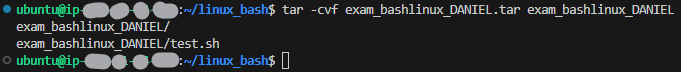
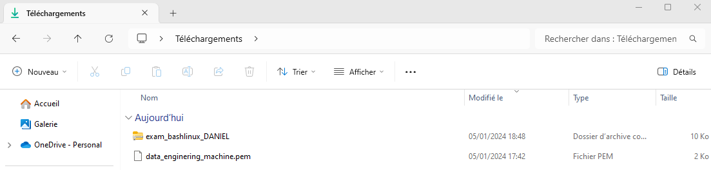
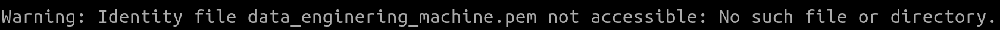
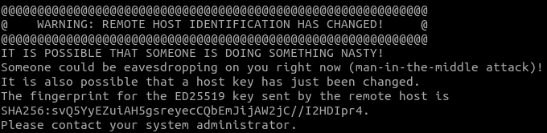
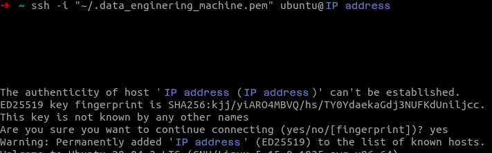
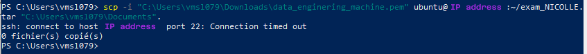
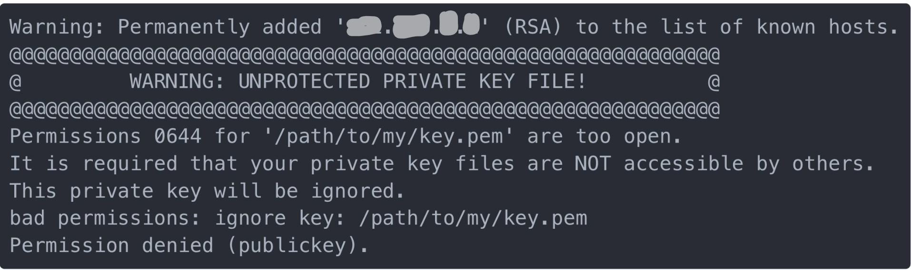
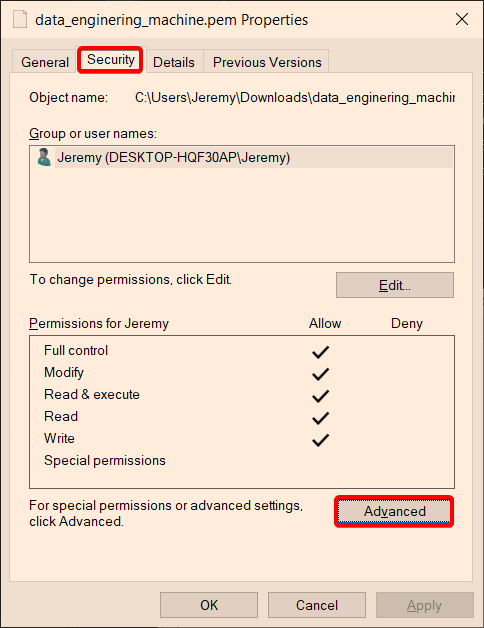
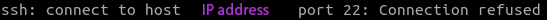

# Les bonnes pratiques et erreurs

---

# Introduction

Dans cette section du cours, nous allons vous présenter plusieurs bonnes pratiques pour l'utilisation des machines virtuelles. Nous avons également compilé des informations sur les erreurs susceptibles de survenir lors de leur utilisation, ainsi que les étapes à suivre pour les résoudre.

Il est important de noter que dans cette partie du cours, vous n'aurez pas d'exercices spécifiques à réaliser. Il s'agit plutôt d'une section conçue pour vous accompagner tout au long de votre expérience avec la machine virtuelle. N'hésitez pas à vous y référer régulièrement en cas de problème. Ces informations sont cruciales et résoudront la majorité des difficultés que vous pourriez rencontrer.

Vous retrouverez donc :

1. **Les bonnes pratiques**
    
    - Reconnexion via l'invite de commande
    - Connexion avec un Tunnel SSH
    - Sauvegarder ses dossiers et fichiers grâce à GitHub
    - Comment rendre ses travaux pratiques (Practical Assignment)
2. **Les erreurs fréquentes**
    
    - Erreur 1. `Warning: Identity file data_enginering_machine.pem not accessible: No such file or directory.`
    - Erreur 2. `Warning: Remote host identification has changed!`
    - Erreur 3. `ssh: connect to host <IP_address> port 22: Connection timed out`
    - Erreur 4. `Warning: Unprotected private key file!`
    - Erreur 5. `ssh: connect to host <IP_address> port 22: Connection refused`

  

### Point plus spécifique pour les Data Engineer

Certains cours vous feront lancer un conteneur Docker. Pensez à supprimer régulièrement les instances qui ne vous sont plus utiles.

Ne tenez compte de cette pratique que si vous êtes déjà familiarisé avec le concept de conteneurisation.

**Une partie du cours est consacrée à une brève introduction de docker pour expliquer son utilisation dans certains cours. Cette technologie et le concept de conteneurisation seront bien plus approfondis dans le module dédié.**

  

# Les bonnes pratiques

### Reconnexion via l'invite de commande

Voici quelques conseils et notions à comprendre lors de votre reconnexion :

- Commencez toujours par **allumer votre VM** à partir d'un cours qui en comporte une sur la plateforme d'apprentissage.
    
    **Important :** Il n'est pas nécessaire de télécharger à nouveau le fichier `data_enginering.pem` du moment où vous possédez toujours la clé.
    
- Comme expliqué dans le cours précédent, votre machine virtuelle a une adresse IP publique dynamique. Elle change à chaque fois que vous allumez la machine virtuelle. **N'oubliez pas de mettre la bonne adresse IP dans votre commande SSH.**
    
- En appuyant sur le bouton `Connexion` dans l'encadré dédié sur la plateforme d'apprentissage DataScientest, vous accéderez à une fenêtre qui vous résume les étapes de première connexion. Vous trouverez également un modèle pour la commande de connexion SSH. Vous pouvez la copier, mais **pensez à le modifier en renseignant les bonnes informations pour le chemin vers la clé.**
    

  

### Connexion avec un Tunnel SSH

Dans certains cours, il sera nécessaire d'utiliser _SSH_ pour rediriger un processus en cours d'exécution sur une machine distante vers la machine locale. L'argument `-L` permet de créer ce tunnel SSH, qui permet de rediriger un port local vers un port distant.

_Par exemple, on peut faire suivre un processus actuellement sur le port `1234` de la machine locale vers le port `4321` de la machine distante en utilisant la commande suivante :_

```shell
ssh -i "data_enginering_machine.pem" -L 1234:localhost:4321 ubuntu@X.X.X.X
```

Cette commande va créer un tunnel SSH sur le port 1234 de la machine locale. Les données envoyées sur ce port seront redirigées vers le port 4321 de la machine distante.

**Note:** Un [port](https://en.wikipedia.org/wiki/Port_\(computer_networking\)) est un numéro utilisé pour identifier de manière unique un point de connexion et pour diriger les données vers un service spécifique de votre machine.

  

### Sauvegarder ses dossiers et fichiers grâce à GitHub

Il est recommandé de créer un répertoire GitHub dédié à chaque module et d'y organiser l'ensemble de vos travaux. Cette pratique vise à éviter la saturation de votre machine.

GitHub est un service de gestion de versions qui permet de sauvegarder et de partager des fichiers. Il est utilisé par de nombreux développeurs et ingénieurs pour suivre les changements dans leurs projets.

**Pour en savoir plus sur le fonctionnement de Git/GitHub, veuillez compléter le module du même nom.** Ce module vous enseignera comment créer un dépôt et y ajouter vos fichiers afin de les sauvegarder de manière efficace.

Une fois que vous avez effectué le push de vos fichiers dans le répertoire, vous pouvez en toute sécurité supprimer les fichiers du module, libérant ainsi de l'espace sur votre machine virtuelle.

  

### Comment rendre les nouvelles évaluations : les Travaux Dirigés

Sur certains modules, **les évaluations adoptent un format différent**, excluant les exercices chronométrés en ligne **au profit d'un "Travail Dirigé" à soumettre à la fin du cours.** Cela s'applique particulièrement aux modules liés à la machine virtuelle (VM). Ce tutoriel détaille le processus pour archiver et soumettre ces "Travaux Dirigés".

Pour cela, vous devez procéder en 3 étapes :

1. Archiver votre dossier de travail
2. Le récupérer sur votre ordinateur
3. Envoyer votre travail à nos correcteurs

  

###### 1. Archiver votre dossier de travail :

Les étapes ci-dessous vous expliqueront comment archiver votre travail :

- _Créer le dossier d'Examen sur la Machine Virtuelle :_
    
    - Sur votre machine virtuelle, créez un dossier nommé _`exam_nomExamen_NOM`_. Remplacez _`nomExamen`_ par le nom du module évalué et _`NOM`_ par votre nom.
    - Ajoutez tous les fichiers requis pour l'examen. Vous pouvez également inclure un fichier texte avec des informations complémentaires pour le correcteur. Évitez d'ajouter des fichiers parasites.
- _Archiver le Dossier :_
    
    - Dans le dossier parent du dossier _`exam_nomExamen_NOM`_, créez une archive avec l'extension _`.tar`_ à l'aide de la commande :

```shell
tar -cvf exam_nomExamen_NOM.tar exam_nomExamen_NOM
```



Vous retrouverez dans votre dossier un fichier _`exam_nomExamen_NOM.tar`_.

  

###### 2. Récupérer l'archive sur la machine locale :

- Ouvrez un nouveau terminal **sur votre machine**, **sans vous connecter à la VM**.
    
- Déplacez-vous **dans le dossier où votre fichier clé** _`data_enginering_machine.pem`_ est stockée, grâce à la commande `cd`.
    
- Téléchargez le fichier _`exam_nomExamen_NOM.tar`_ qui se trouve sur votre machine virtuelle avec la commande suivante :
    

```shell
scp -i "data_enginering_machine.pem" ubuntu@IP_VM:"<chemin_du_dossier_parent_à_l'archive>/exam_NOM.tar" .
```

Voici quelques précisions sur cette commande :

- `scp` : est une commande appelant le service `scp` qui permet de transférer de manière sécurisée un fichier ou une archive (les dossiers ne sont pas transférables) via une connexion SSH.
- `-i` : permet de renseigner le chemin de la clé SSH nécessaire pour passer l'authentification.
- `ubuntu@IP_VM` : adresse IP de votre Machine Virtuelle. Elle est suivie du chemin du fichier à télécharger.

**Attention :** Vous retrouverez l'adresse IP actuelle de votre VM dans l'encadré des commandes dédiées sur la plateforme d'apprentissage DataScientest.

- `.` : représente le dossier courant de votre machine locale où le fichier sera téléchargé.

**Attention :** N'oubliez pas le point `.` à la fin de la commande, sinon ça ne fonctionnera pas.

  

_Exemple pratique :_

- **_Sur la machine virtuelle :_** _création de l'archive_

a. J'ai créé un dossier `bashlinux` dans le dossier de base de ma session utilisateur `ubuntu` (pour rappel le chemin d'accès : `/home/ubuntu`). C'est le dossier de mon cours sur Bash et Linux. Dedans j'ai aussi créé un dossier pour mon examen :`exam_bashlinux_DANIEL`.

b. Je me place **dans le dossier parent** où est stocké mon dossier d'examen `exam_bashlinux_DANIEL`. Il s'agit donc du dossier `bashlinux`.

```shell
cd bashlinux
```

Pour rappel, si vous êtes dans le dossier de l'examen, accédez facilement au dossier parent en faisant la commande : `cd ..`.

c. Je crée l'archive avec la commande suivante :

```shell
tar -cvf exam_bashlinux_DANIEL.tar exam_bashlinux_DANIEL
```


  
  
- **_Sur ma machine personnelle :_** _téléchargement de l'archive de l'examen_

a. Je me place dans le dossier `Téléchargements`, là où est stockée ma clé `data_enginering_machine.pem` :

```shell
cd Downloads
```

b. Je télécharge l'archive avec la commande :

```shell
scp -i "data_enginering_machine.pem" ubuntu@12.34.56.78:"exam_bashlinux_DANIEL.tar" .
```



Mon dossier archivé de l'examen se retrouve dans mon dossier `Téléchargement` sur mon ordinateur.

  

###### 3. Soumettre son examen sur la plateforme

- Aller sur la plateforme d'apprentissage DataScientest.
- Validez tous les cours du module : **Une fois toutes les parties du cours validées,** vous verrez une évaluation apparaître dans l'onglet "Mes Examens".
- Allez dans l'onglet "Mes Examens" et cliquez sur l'évaluation du cours que vous venez de débloquer.
- Vous verrez sur la page de l'examen les instructions pour envoyer votre travail.
    
    **Attention :** Une fois votre travail envoyé vous ne pourrez plus y accéder et envoyer une autre version avant qu'il soit corrigé. **Prenez le temps de bien vérifier ce que vous envoyez.**
    
- Vous recevrez un mail de confirmation.
    
    **Information :** Si vous rencontrez un souci lors de l'envoi de l'examen, n'hésitez pas à contacter le support à l'adresse mail : [help@datascientest.com](https://learn.datascientest.com/lesson/303/help@datascientest.com).
    

  

### Vérifier la santé de votre machine virtuelle

Il est essentiel de surveiller régulièrement l'état de votre machine virtuelle pour garantir un fonctionnement optimal.

Pour vérifier **l'espace de stockage disponible**, utilisez la commande :

```shell
df
```

Pour examiner **l'utilisation des ressources** :

```shell
htop
```

Il est à noter qu'une saturation de la mémoire RAM peut entraîner l'arrêt de votre machine virtuelle. Soyez attentif à ces indicateurs cruciaux pour prévenir tout dysfonctionnement et assurer une performance constante de votre environnement virtuel.

**Important :** Si vous recevez un message d'erreur lors de la connexion à la machine, indiquant une absence d'espace disponible sur la machine virtuelle, la seule solution pourrait être de la réinitialiser pour permettre une nouvelle connexion. Cependant, il est important de noter que cette action entraînera la perte de toute la progression effectuée sur la machine.  
  
Afin d'éviter toute perte de données et de temps, veuillez suivre attentivement nos recommandations concernant la sauvegarde régulière des fichiers. De plus, prenez le temps, à la fin de chaque session de travail, d'éteindre les services qui ont été démarrés. Cette pratique contribue à maintenir l'intégrité de vos données et à garantir une utilisation efficace de la machine virtuelle.

  

# Erreurs fréquentes

Voici une liste de messages d'erreur susceptibles de se manifester sur la machine virtuelle, accompagnée de suggestions pour résoudre ces problèmes :

  

### Erreur 1. `Warning: Identity file data_enginering_machine.pem not accessible: No such file or directory.`



Ce message indique que la VM ne trouve pas le fichier `data_enginering_machine.pem`, et que le chemin pour le trouver est mal renseigné. Il va falloir lui indiquer un chemin qui lui permette de retrouver le fichier.

**_Solutions :_**

- _Solution 1 :_ À l’aide de la commande `cd`, naviguez jusqu'au dossier qui contient votre clé `data_enginering_machine.pem`, et entrez la commande sans décrire le chemin vers le fichier (dans ce cas son nom suffit puisse qu'on sera déjà dans le bon dossier).
- _Solution 2 :_ Décrivez le chemin relatif ou absolu correct jusqu'au fichier `data_enginering_machine.pem`.

**Information :** N'hésitez pas à relire les informations sur le chemin relatif/absolu pour pouvoir renseigner correctement le chemin vers votre fichier `data_enginering_machine.pem`.

  

### Erreur 2. `Warning: Remote host identification has changed!`



Cette erreur indique que la clé liée à votre adresse IP a changée.

Lorsque vous vous connectez pour la première fois à un serveur (ici une machine virtuelle), ce message apparaît :



Ce message vous informe que l'hôte (à l'adresse IP) avec lequel vous essayez de vous connecter n'est pas connu. Votre ordinateur vous demande alors si vous souhaitez l'ajouter à la liste des hôtes connus. En répondant **yes** vous ajoutez l'hôte et la clé ssh associée au fichier `known_hosts` qui se trouve dans le dossier `~/.ssh/`.

Plus tard, si vous vous connectez à l'aide d'un hôte déjà référencé dans le fichier `known_hosts` mais avec une clé différente, vous recevrez le message ci-dessus.

**Solution :**

Vous pouvez exécuter la commande ci-dessous afin de réparer la correspondance entre la clé et l'hôte.

```shell
ssh-keygen -R <adresse_IP_VM>
```

**Information :** Vous retrouvez plus de détails sur le fonctionnement de cette commande [ici](https://man.openbsd.org/OpenBSD-current/man1/ssh-keygen.1).

  

### Erreur 3. `ssh: connect to host <IP_address> port 22: Connection timed out`



Cette erreur se produit lorsque votre machine virtuelle n'est pas démarrée.

**Solution :**

Démarrez votre machine virtuelle sur la plateforme d'apprentissage de Datascientest (via un cours qui utilise la VM).

Si vous voyez la VM dans l'état _"`En Ligne`"_ et que l'erreur persiste, il se peut que l'état de la VM ne soit correctement affiché sur la page web. En effet, en cas d'inactivité prolongée sur la VM, celle-ci peut s'éteindre automatiquement sans que le statut correct soit affiché sur la page web de la plateforme (qui n’est pas automatiquement rafraîchie).

Dans ce cas, rafraîchissez la page web sur la plateforme en appuyant sur les touches : `CTRL + Shift + R` sur Windows et clavier `⌘ + Espace` sur Mac OS.

Une fois la page actualisée, vous pourrez voir l'état actuel de la machine virtuelle et la redémarrer si elle s'est éteinte.

  

### Erreur 4. `Warning: Unprotected private key file!`



Cette erreur apparaît pour lorsque les droits sur le fichier sont trop ouverts.

En effet, comme expliqué dans la partie précédente de ce cours, il est impératif d'avoir restreint les autorisations du fichier à la lecture uniquement et au propriétaire du fichier uniquement (vous).

Pour changer les droits du fichier `data_engineering_machine.pem`, la procédure diffère selon votre système d'exploitation.

**Solution :**

- **Sur Windows :**
    1. Ouvrez l'Explorateur de fichiers, en appuyant sur la touche `Windows + E` ou en cliquant sur l'icône du dossier dans la barre des tâches.
    2. Trouvez le fichier `data_engineering_machine.pem`.
    3. Faites un clic droit sur le fichier `data_engineering_machine.pem` et sélectionnez "_Propriétés_" dans le menu contextuel.
    4. Allez dans l'onglet "_Sécurité_"
    5. Cliquez sur le bouton "Modifier" pour modifier les autorisations du fichier.
    6. Dans la fenêtre des autorisations, cliquez sur "_Avancé_" et ensuite sur "_Rechercher maintenant_".
    7. Sélectionnez votre nom d'utilisateur dans la liste et cliquez sur "_OK_".
    8. Cochez la case "_Contrôle total_" sous la colonne "_Autoriser_".
    9. Dans la fenêtre des autorisations, sélectionnez votre nom d'utilisateur dans la liste et cliquez sur "_Modifier_".
    10. Décochez toutes les cases sauf celle correspondant à "_Lire_".
    11. Cliquez sur "_OK_" pour valider les modifications.
    12. Appliquez les changements, en cliquant sur "OK" dans la fenêtre des autorisations puis dans la fenêtre des propriétés pour fermer celle-ci.



  
- **Sur Mac\Linux :**

Pour modifier les permissions de la clé, vous pouvez utiliser la commande `chmod` **dans le dossier où la clé est stockée** _(naviguez avec la commande `cd` pour vous y rendre, ou, renseignez le chemin complet vers la clé)_.

La commande suivante modifiera les permissions de la clé en lecture seule pour le propriétaire du fichier :

```shell
chmod 400 data_engineering_machine.pem
```

  

### Erreur 5. `ssh: connect to host <IP_address> port 22: Connection refused`



Cette erreur indique généralement qu'il y a un problème de connexion SSH vers l'adresse IP spécifiée sur le port 22 et que la connexion est refusée.

Elle peut apparaître pour plusieurs raisons comme l'inactivité de votre service SSH, des conflits d'adresse IP, la désactivation du port 22, un pare-feu qui bloque la connexion, etc.

**Important :** Si vous travaillez sur votre ordinateur professionnel, renseignez-vous auprès de votre service informatique pour savoir si les services de votre machine ne sont pas restreints.  
  
Si possible, essayez de vous connecter à la VM en utilisant un autre ordinateur.  
  
Si cette hypothèse est avérée, il faudra demander à votre service IT de débloquer les websockets pour l'url suivant [wss://learn.datascientest.com/](wss://learn.datascientest.com/).

Si vous travaillez sur une machine personnelle, pensez à vérifier les points suivants :

- Vérifiez l'adresse IP : Assurez-vous que l'adresse IP que vous essayez d'atteindre est correcte. Vous pouvez utiliser la commande ping pour vérifier si l'hôte est accessible.

```shell
ping <IP_address>
```

- Assurez-vous que le service SSH est installé et en cours d'exécution
- Vérifiez les paramètres de votre pare-feu

**Important :** Si le problème persiste après une dizaine de minutes, merci de nous en informer, **en postant un message sur le forum**.  
  
Si vous n'avez pas de réponse et que vous êtes bloqué, envoyez un message au support **en donnant le lien vers le post du forum**. Vous pouvez joindre le support à l'aide du chatbot ou à l'adresse mail : [help@datascientest.com](https://learn.datascientest.com/lesson/303/help@datascientest.com).

  

# Conclusion

Dans cette partie du cours, vous avez appris les bonnes pratiques pour l'utilisation des machines virtuelles, notamment :

- La connexion à une machine virtuelle via un tunnel SSH
- La sauvegarde de vos dossiers et fichiers grâce à GitHub
- Le processus de rendu des nouveaux travaux pratiques

Vous avez également appris à identifier et résoudre les erreurs fréquentes susceptibles de se manifester sur la machine virtuelle.

**Vous êtes désormais prêt à plonger dans le cours Linux & Bash !**

**_Recommandations_**

- **Réviser les informations sur les chemins relatifs/absolus** pour pouvoir renseigner correctement le chemin vers votre fichier `data_engineering_machine.pem`.
- **Sauvegardez régulièrement vos travaux dans un répertoire GitHub** pour éviter de perdre vos données en cas de problème sur votre machine virtuelle.
- **Si vous rencontrez des difficultés à vous connecter à la machine virtuelle, consultez le forum ou contactez le support.**