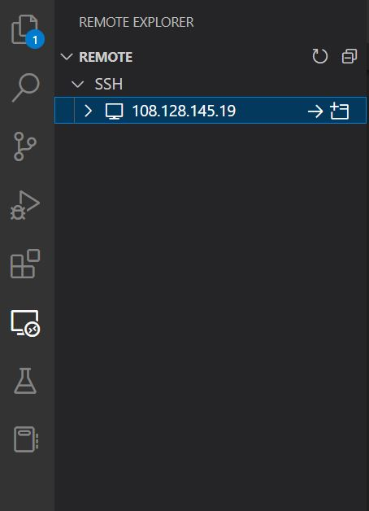
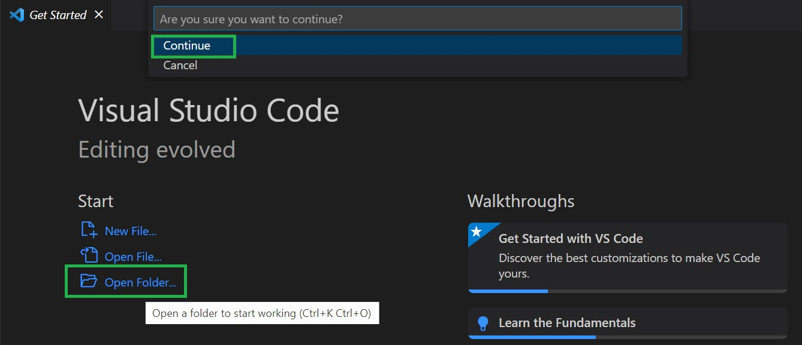
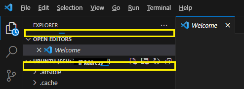
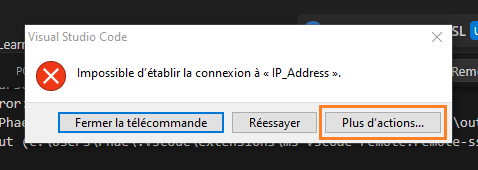

# Visual Studio Code (VS Code)

# Introduction

Dans les précédentes sections de ce cours, vous avez appris comment vous connecter à la machine virtuelle de deux manières différentes :

- **via le Webshell :** une interface web simple et accessible, mais qui offre un accès limité aux fonctionnalités de la machine virtuelle.
- **via une invite de commande :** une méthode plus puissante, mais qui nécessite une certaine connaissance des commandes Linux.

Dans cette partie, nous allons voir comment vous connecter à la machine virtuelle à l'aide de Visual Studio Code, un éditeur de code puissant et complet. Visual Studio Code offre une interface utilisateur intuitive et une expérience de développement riche, ce qui en fait un excellent choix pour travailler sur des machines virtuelles.

**_Objectifs de cette partie_**

À la fin de cette partie, vous serez en mesure de :

- Comprendre les avantages de l'utilisation de Visual Studio Code pour se connecter à une machine virtuelle.
- Installer Visual Studio Code et les extensions nécessaires pour se connecter à la machine virtuelle.
- Effectuer la première connexion à la machine virtuelle via Visual Studio Code.
- Se reconnecter à la machine virtuelle via Visual Studio Code.
- Diagnostiquer et résoudre les erreurs les plus courantes rencontrées lors de la connexion à la machine virtuelle via Visual Studio Code.

**_Plan de la partie_**

Cette partie est divisée en six sections :

1. Qu'est-ce que Visual Studio Code ?
2. Installation de Visual Studio Code
3. Installation des extensions nécessaires
4. Première connexion à la machine virtuelle
5. Reconnexion à la machine virtuelle avec VS Code
6. Télécharger un fichier avec Visual Studio Code
7. Résolution des erreurs

  

# 1. Qu'est-ce que Visual Studio Code ?

Visual Studio Code est un éditeur de code très puissant développé par Microsoft. Il est disponible pour Windows, MacOS et Linux. Visual Studio Code offre une large gamme de fonctionnalités qui en font un outil puissant et polyvalent pour les développeurs.

Voici quelques avantages de VS Code :

- **Une interface graphique agréable et intuitive**  
    L'interface graphique de VS Code vous simplifiera la navigation dans les fichiers et les dossiers, grâce à une disposition claire, des menus bien organisés et une personnalisation facile.
- **Une compatibilité avec les principaux systèmes d'exploitation**  
    La compatibilité avec les principaux systèmes d'exploitation vous permet d'utiliser VS Code quel que soit votre système d'exploitation (Windows, Mac OS, Linux, etc.).
- **Une prise en charge d'un large éventail de langages de programmation**  
    La prise en charge d'un large éventail de langages de programmation, notamment : Python, JavaScript, C++, Java, Scala, et bien d'autres, que vous explorerez dans vos cours.
- **Un système d'extensions riche et extensible**  
    Le système d'extensions de VS Code vous permet d'ajouter des fonctionnalités supplémentaires à l'éditeur, telles que la coloration syntaxique, la mise en forme du code, le débogage et l'intégration avec des frameworks spécifiques. Il est notamment facile de l'intégrer avec des outils populaires tels que Git pour la gestion de versions de code et les terminaux intégrés.
- **Des fonctionnalités de débogage puissantes**  
    Les fonctionnalités de débogage puissantes de VS Code vous aideront à identifier et à résoudre les problèmes plus rapidement.
- **Des fonctionnalités d'assistance au codage qui accélèrent le flux de travail de développement**  
    Les fonctionnalités d'assistance au codage de VS Code telles que l'autocomplétion, la mise en surbrillance des erreurs, la suggestion de code, la documentation intégrée et les paramètres de formatage automatique, vous aideront à écrire du code plus rapidement et efficacement.

  

# 2. Installation de Visual Studio Code

Vous l'avez compris, VS Code est un excellent outil à connaître car il présente de nombreux avantages.

Pour l'installer sur votre machine personnelle, procédez comme suit :

1. Accédez au site Web de Visual Studio Code à l'adresse [https://code.visualstudio.com/download](https://code.visualstudio.com/download).
2. Cliquez sur le bouton "_Télécharger_".
3. Sélectionnez le système d'exploitation de votre machine.
4. Cliquez sur le bouton "_Télécharger_".

Une fois le téléchargement terminé, exécutez le fichier d'installation. Suivez les instructions de l'installateur pour terminer l'installation de Visual Studio Code.

  

# 3. Installation des extensions nécessaires

Pour vous connecter à la machine virtuelle vous aurez besoin des extensions **Remote SSH** et **Remote Explorer**. Suivez ces instructions pour installer ces extensions dans VS Code :

1. Ouvrez VSCode.
2. Cliquez sur **"_Fichier_"** en haut de l'application, puis sur **"_Préférences_"** et ensuite **"_Extensions_"**.
3. Cherchez les extensions dans le champ de recherche, puis cliquez sur **"_Installer_"**.
4. Un menu devrait apparaître à gauche de la fenêtre une fois avoir fermé puis rouvert VS Code.


_Bonus :_ Vous pouvez installer également l’extension Python de Microsoft pour vous aider avec l'autocomplétion et le formatage du code.

  

# 4. Première connexion à la machine virtuelle via Visual Studio Code

Maintenant que l'environnement est configuré, nous pouvons effectuer notre première connexion :

**Attention :** N'oubliez pas d'allumer votre VM sur [learn.datascientest.com](https://learn.datascientest.com/).

  
1. Cliquez sur le nouveau bouton "**_Exploreur Distant_**" présent dans le bandeau à gauche.

  
2. Cliquez sur le "**_+_**" pour créer une nouvelle connexion SSH.


  
3. Entrez votre chaîne de connexion puis appuyez sur entrée.

Rappel du format de la chaine de caractères :

```shell
ssh -i "chemin/vers/votre/cle/data_enginering_machine.pem" ubuntu@X.X.X.X
```

**Attention :** La connexion SSH doit être préalablement établie à partir d'un terminal Windows, Linux ou Mac. En effet, lors de la première connexion, la clé est automatiquement enregistrée dans le répertoire `/.ssh`.  
Si vous ne l'avez pas fait, revenez à la partie *"Première connexion à la machine virtuelle via le Webshell"*.

**Rappel :** Pour minimiser les erreurs, nous vous recommandons de laisser votre clé dans le dossier *"Téléchargements"* de votre machine hôte. Les exemples qui vont suivre se baseront sur une clé stockée dans ce dossier.

**Rappel :** En fonction de votre système d'exploitation, la déclaration du chemin de votre clé changera légèrement. Sur Windows, la séparation des dossiers se fait avec `\` au lieu de `/` comme sur Mac/Linux.  
  
_Exemple :_  
Si ma clé est dans le dossier "_Téléchargement_" :

- sur Windows je déclare le chemin relatif : `Downloads\data_enginering_machine.pem`.
- sur Mac/Linux le chemin relatif sera : `Downloads/data_enginering_machine.pem`.

**Revenez sur les parties précédentes de ce cours si vous rencontrez des difficultés pour écrire le bon chemin vers la clé.**


  

4. Cliquez sur le lien qui finit par `.ssh\config`.
    
    

  

5. Rafraîchissez les connexions SSH. Vous verrez apparaître votre connexion. 


**Important :** Nous venons de créer une nouvelle connexion SSH. Il ne sera pas nécessaire de refaire toutes ces manipulations lorsque nous voudrons nous reconnecter à la machine virtuelle puisse que les informations sont sauvegardées (dans le fichier .ssh/config).

  

6. Sur le volet de gauche, placez le curseur de votre souris sur la connexion récemment ajoutée et cliquez sur la flèche pour vous connecter dans cette fenêtre ; ou sur la fenêtre avec un "+" pour ouvrir une nouvelle fenêtre VS Code, connectée à la machine virtuelle.


  

7. Vous arrivez sur la fenêtre d'acceuil de VScode. Un menu en haut de la fenêtre vous demande de sélectionner l'environnement de la VM. **Cliquez sur `Linux` et la connexion s’établit.**

  

**_Vous êtes maintenant connecté à la machine virtuelle avec Visual Studio Code !_**

  
Ci-après, nous allons vous expliquer comment profiter de cet environnement pour visualiser l'arborescence de fichiers.

1. Cliquez sur **"Ouvrir un dossier"**, puis sur "Continue". 

    
2. Choisissez le répertoire courant de la machine virtuelle : `/home/ubuntu`
    
3. Faites `CTRL + ù` pour ouvrir le terminal. Vous pouvez également l'ouvrir depuis le menu "_Terminal_" > "_Nouveau Terminal_".

Vous avez maintenant accès à l'arborescence de fichiers qui vous permettra d'avoir une meilleure vue sur la structure de vos dossiers et fichiers sur votre VM.

  

# 5. Reconnexion à la machine virtuelle avec Visual Studio Code

Comme préciser pendant le tutoriel de première connexion à Visual Studio Code, vous n'avez pas besoin de refaire toutes ces étapes lorsque vous souhaitez vous reconnecter à la machine virtuelle avec Visual Studio Code.

En effet, il n'est pas nécessaire d'ajouter une nouvelle connexion SSH.

Néanmoins, comme déjà mentionné dans les parties précédentes de ce cours, **les machines virtuelles DataScientest possèdent des adresses IP publiques et dynamiques.** Lorsque vous rallumez votre machine virtuelle, son adresse IP aura donc changé, et il faudra mettre à jour cette information sur la connexion SSH. Pour cela :

1. Ouvrez VSCode après avoir allumé votre VM.
2. Allez dans l'explorateur distant, et passer votre souris sur le menu "SSH" pour faire apparaître une roue crantée et un "+".
3. Cette fois-ci, cliquez sur la roue crantée.
4. Sélectionnez le lien qui ressemble à `C:\Users\<votre_nom_utilisateur>\.ssh` sur Windows et `/home/<votre_nom_utilisateur>/.ssh` sur Mac et Linux.

Vous accédez au fichier `config` dans lequel les informations des connexions SSH sont stockées.

Les informations d'une connexion SSH sont regroupées sur plusieurs lignes :

```shell
Host xx.xx.xx.xx
  HostName xx.xx.xx.xx
  IdentityFile Downloads\data_enginering_machine.pem
  User ubuntu
```

_Explications :_

- `Host` et `Hostname` : contiennent l'adresse IP publique renseignée de votre machine virtuelle.
- `IdentityFile` : contient le chemin du fichier `data_enginering_machine.pem`, la clé de la connexion SSH.
- `User` : le nom de la session utilisateur utilisée sur la machine virtuelle.

5. Vous devez remplacer l'adresse IP renseignée par la nouvelle adresse IP publique de votre machine virtuelle, celle qui s'affiche lorsque vous allumez la machine virtuelle.
6. Une fois ces informations mises à jour, sauvegardez vos modifications.
7. Dans le menu de gauche, passez votre souris sur le menu "Télécommandes (TUNNELS/SSH)", et cliquez sur la flèche ronde pour rafraîchir les connexions SSH.


8. Vous constatez que l'adresse IP affichée a changé. Cliquez sur la connexion mise à jour pour vous connecter à votre machine virtuelle.

**_Félicitations, vous vous êtes reconnecté à la machine virtuelle !_**

  

# 6. Télécharger un fichier avec Visual Studio Code

Grâce à l'arborescence de votre machine virtuelle visible dans Visual Studio Code, vous avez accès à plusieurs options.

Comme expliqué précédemment, vous pouvez créer et manager vos dossiers et fichiers plus facilement. Vous pouvez également télécharger plus facilement vos fichiers depuis la machine virtuelle sur votre ordinateur. Pour cela, lorsque vous êtes connecté à la machine virtuelle :

- Afficher l'arborescence de fichier dans le menu de gauche.
- Faites un clic droit sur le dossier ou fichier que vous souhaitez télécharger
- Choisissez où vous souhaitez le recevoir sur votre ordinateur
- Valider et téléchargez-le.


Le téléchargement est terminé quand vous ne voyez plus les "traits bleus" défilés au-dessus des menus.



**Attention :** En fonction de la taille et du nombre de fichiers, le téléchargement peut prendre plus ou moins de temps. Patientez jusqu'à ce qu'il soit terminé avant de fermer Visual Studio Code ou d'éteindre votre machine virtuelle.

  

# 7. Résolution des erreurs

**En cas de problème :** Observez la sortie du terminal après avoir fermé la pop-up indiquant une erreur.


Vous pouvez cliquer sur "_Plus d'action_" pour faire disparaître la pop-up et accéder à la sortie (l'onglet à côté de Terminal).


  

Inspecter ce qui est écrit pour trouver des indices sur l'erreur rencontrée. Intéressez-vous particulièrement à la fin du message où vous devriez retrouver les erreurs que nous avons précédemment étudiées.


  
Vous pouvez vous reporter à la partie précédente de ce cours pour comprendre comment résoudre ces erreurs.

Si vous n'y arrivez pas, vous pouvez :

- Supprimer le contenu du répertoire `.ssh` **sur votre ordinateur**. C'est dans ce dossier que se trouve la configuration SSH pour se connecter à la machine :
    
    - Pour Windows le chemin est `C:\Users\%USERNAME%\.ssh`
    - Pour Linux et MAC le chemin est `/home/your-username/.ssh`
- Puis vérifier le chemin vers votre clé. Assurez-vous que le chemin renseigné soit correct.
    
- Ensuite, vous connecter avec la CMD (pas celle de VSCode, mais celle de votre système) pour régénérer les fichiers.
    
- Et enfin, recommencer les étapes de premières connexions avec VS Code.
    

  

# Conclusion

Nous avons exploré la connexion à un IDE puissant tel que VS Code pour simplifier l'utilisation de la machine virtuelle. Dans la section suivante, nous aborderons divers outils, tels que les environnements virtuels et conda, qui peuvent considérablement vous faciliter la tâche tout au long de votre formation ou lors du développement de projets.

Il est important de noter que la maîtrise de ces outils n'est pas nécessaire pour votre formation, et il n'y a pas d'exercice à valider à ce sujet. Nous vous présentons ces ressources à titre informatif, mettant en lumière la richesse et la puissance qu'elles apportent au processus de développement. L'objectif est de vous familiariser avec ces outils afin que vous puissiez les explorer davantage selon vos besoins et vos projets spécifiques.
