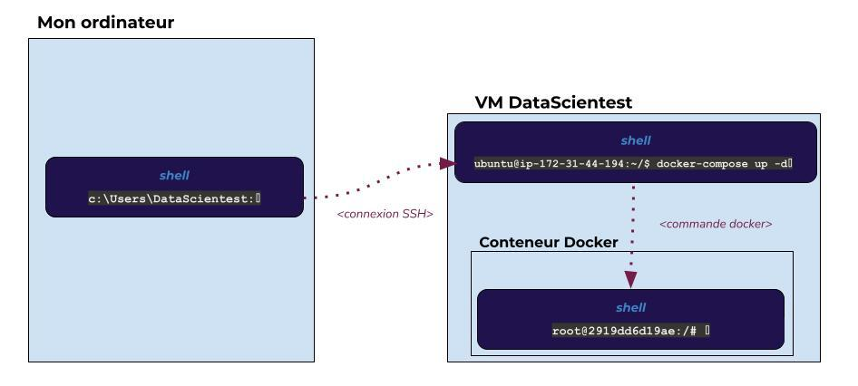
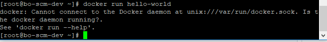

# Utilisation de Docker dans les cours Engineering

---

# Introduction

**Important :** Cette partie n'est pas obligatoire. Elle est présent pour vous donner un complément d'information et d'outils qui pourront s'avérer utiles pendant votre formation.

Une partie des cours de votre formation, notamment pour les Data Engineer, comportent de nombreux concepts abordés qui ne peuvent pas être étudiés sous le format de notebook comme cela était fait jusqu'à maintenant.

Dans certains de ces cours, nous utilisons Docker pour garantir la configuration des services étudiés, comme par exemple, une base de données (MongoDB, Neo4j, Hbase, etc.), et nous vous initions aux conteneurs, une technologie aujourd'hui incontournable dans le monde informatique.

Lorsqu'on ne connaît pas vraiment les conteneurs et de manière générale, la virtualisation, il peut être assez difficile de comprendre et de manipuler ces outils. Cette partie du cours est réservée aux apprenants qui seront amenés au cours de leurs formations à utiliser des conteneurs Docker pour étudier un concept ou un service.

**_Plan :_**

- Qu'est-ce que Docker ?
- Comprendre dans quelle invite de commande on se trouve
- Les bonnes pratiques
- Commandes utiles
- Les erreurs que vous pouvez rencontrer

  

# Qu'est-ce que Docker ?

Docker est un outil de virtualisation d'environnement qui ne diffère pas beaucoup d'une machine virtuelle. Il permet lui aussi de faire tourner un système d'exploitation avec ses propres dépendances. Il possède 3 concepts fondamentaux :

- les **images** qui listent les instructions qui permettent de créer un **conteneur**.
- les **conteneurs** qui représentent l'environnement virtualisé construit à partir de ces **images**.
- les **volumes** qui sont des espaces de stockage sur votre machine assurant la persistance des données de vos **conteneurs**.

Docker est un outil puissant qui peut être utilisé pour de nombreuses applications, notamment :

- Le développement d'applications web et mobiles
- Le déploiement d'applications en production
- La création d'environnements de test

Nous n'avons pas besoin de rentrer plus dans les détails sur ce qu'est Docker. Pour approfondir le sujet, vous pouvez suivre le cours sur "_Docker_".

  

# Comprendre dans quelle invite de commande on se trouve

Voyez cependant les conteneurs Docker comme une petite boîte dans laquelle vous ferez tourner un service ou une application que vous étudierez dans votre formation.

Comme lorsque vous lancez votre VM, vous pouvez communiquer avec elle grâce à un terminal connecté ; lorsque vous lancez un conteneur sur votre VM, vous pouvez, depuis votre VM, communiquer avec ce conteneur grâce à certaines commandes entrées dans le terminal (connecté à votre VM).

Lorsqu'elles sont nécessaires, ces commandes vous sont données dans le cours, vous n'avez donc pas besoin de comprendre tout de suite leur fonctionnement en profondeur.

Néanmoins, il est important que vous vous souveniez de la structure dans laquelle vous êtes : **un conteneur lancé depuis un Terminal connecté à ma VM.** _Autrement dit pour schématiser : une boîte, mon ordinateur, avec lequel j'accède à la boîte "ma VM" en me connectant, et depuis ma VM je lance une boîte "mon conteneur" pour étudier un concept ou une technologie particulière._



C'est une structure complexe et qui peut amener de la confusion. Il est fréquent d'être perdu et de ne pas savoir dans quelle "_boîte_" nous nous trouvons.

Pour le comprendre, il faut comprendre la structure de notre environnement et ce que nous avons fait jusque-là. Dans le cours, il vous sera précisé, quand est-ce que vous devez être "_dans le conteneur_", ou "_sur la VM_". Ne ratez pas ces informations importantes, prenez le temps dont vous avez besoin pour les assimiler.

Vous pouvez identifier où vous vous trouvez dans votre terminal grâce au début de l'invite de commande :

- **Si vous êtes sur Windows** :

```shell
C:\Users\username>
```


Vous vous trouvez dans l'invite de commandes de votre ordinateur. Vous le reconnaissez parce qu'il commence par le chemin dans lequel vous vous trouvez ; à savoir : le dossier de base de votre session utilisateur. L'invite de commandes se termine par un chevron `>`.

**Les commandes que vous entrez ici s'adressent à votre ordinateur.**

  

- **Si vous êtes sur Mac Os** :


```shell
username@macbookname ~ % 
```

Vous vous trouvez dans l'invite de commandes de votre ordinateur. Vous reconnaissez le nom de votre session utilisateur au début de l'invite de commandes. Après `~`, vous verrez le chemin du dossier courant. L'invite de commande se termine par `%`.

**Les commandes que vous entrez ici s'adressent à votre ordinateur.**

  

- **Si vous êtes sur Linux** :


```shell
username@pcname:~$
```

Vous vous trouvez dans l'invite de commandes de votre ordinateur. Vous reconnaissez le nom de votre session utilisateur au début de l'invite de commandes. Après `:~`, vous verrez le chemin du dossier courant. L'invite de commande se termine par `$`.

**Les commandes que vous entrez ici s'adressent à votre ordinateur.**

  

- **Si vous êtes sur la VM** :

```shell
ubuntu@ip-xx-xx-xx-xx:~my/folder$ 
```

Vous êtes connecté à votre VM. Vous reconnaissez le nom de la session utilisateur `ubuntu`. Après le `@`, vous retrouvez l'adresse IP privée de la VM. Après les `:` vous verrez également le chemin du dossier dans lequel vous vous trouvez. L'invite de commande se termine par un `$`.

**Les commandes que vous entrez ici s'adressent à la VM.**

  

- **Si vous êtes dans le conteneur** :

```shell
root@2919dd6d19ae:/# █ 
```

Vous êtes connecté au conteneur que vous avez lancé. Vous pouvez voir la session utilisateur `root`, et après le `@`, au lieu de l'adresse IP, vous voyez l'identifiant du conteneur. Après les `:` vous verrez le chemin du dossier dans lequel vous vous trouvez dans votre conteneur. Ici, nous nous trouvons à la racine `/`. L'invite de commande se termine par `#`.

**Les commandes que vous entrez ici s'adressent au conteneur.**

  

# Les bonnes pratiques

Pour éviter de saturer votre machine, voici quelques conseils :

- lorsque vous avez fini votre session de travail, pensez à arrêter votre conteneur.
- lorsque vous avez fini un cours qui utilisait des conteneurs, supprimez le conteneur, ses images et ses volumes.

Ci-après, nous vous présentons des commandes qui vous seront utiles pour gérer vos conteneurs, en fonction des 3 concepts présentés en introduction.

  

# Commandes utiles

### **Les conteneurs**

Lorsque vous démarrez un conteneur, ce dernier s'arrête s'il a fini sa tâche ou bien s'il n'a pas de tâche définit, il continue de tourner indéfiniment. Dans nos modules, les conteneurs sont la plupart du temps configurés pour tourner indéfiniment. **Vous devez les arrêter manuellement.**

- **Pour afficher les conteneurs** qui tournent et leurs identifiants :

```shell
docker ps
```

  

- **Pour arrêter un conteneur** (vous aurez besoin de son identifiant) :

```shell
docker stop <CONTAINER ID>
```

  

- **Pour arrêter tous les conteneurs** en cours de lancement :

```shell
docker stop $(docker ps -q)
```

  

- **Pour afficher tous vos conteneurs et leur taille** :

```shell
docker ps -a -s
```

  

- **Pour supprimer un conteneur** (vous aurez besoin de son identifiant, et qu'il soit arrêté) :

```shell
docker rm <CONTAINER ID>
```

  

- **Pour supprimer tous vos conteneurs** (vous aurez besoin qu'ils soient tous arrêtés) :

```shell
docker rm $(docker ps -a -q)
```

  

### **Les images**

- **Pour vérifier la liste des images présentes sur votre VM** :

```shell
docker images
```

Vous y trouvez l'identifiant de l'image ainsi que la taille de celle-ci.

  

- **Pour supprimer une image en particulier** :

```shell
docker rmi <IMAGE ID>
```

  

- **Pour supprimer toutes les images** :

```shell
docker rmi $(docker images -q)
```

  

### **Les volumes**

Parfois vous allez lier un espace de stockage de votre machine à l'espace de stockage d'un conteneur. Ainsi, vous utilisez des volumes et ces derniers peuvent polluer votre espace de stockage si vous n'en avez plus l'utilité.

- **Pour lister vos volumes** :

```shell
docker volume ls
```

  

- **Pour supprimer tous vos volumes** :

```shell
docker volume rm $(docker volume ls -q)
```

  

# Les erreurs rencontrées avec Docker

### Erreur 1. `docker: Cannot connect to Docker daemon`



Ce problème arrive généralement lorsque vous avez saturé l'espace mémoire de votre machine virtuelle. Docker ne peut plus se lancer et met ce message d'erreur lorsque vous le sollicitez.

**_Solution_**  
Vous devez libérer de l'espace. Pour cela, vous pouvez supprimer des fichiers et/ou supprimer des instances, images et volumes docker non utilisés.

Si ce n'est pas suffisant, vous pouvez réinitialiser la machine virtuelle.

  

# Conclusion

Avec l'achèvement de ce cours, vous avez désormais toutes les compétences nécessaires pour comprendre le fonctionnement de la machine virtuelle et l'utiliser de manière judicieuse. Cet outil puissant est mis à votre disposition, et nous sommes confiants qu'il vous sera d'une grande utilité tout au long de votre formation.

Ce cours a couvert divers points et concepts essentiels, visant à vous fournir une base solide dans l'utilisation de la machine virtuelle. Nous vous encourageons vivement à revisiter ces notions régulièrement pour renforcer vos connaissances.

