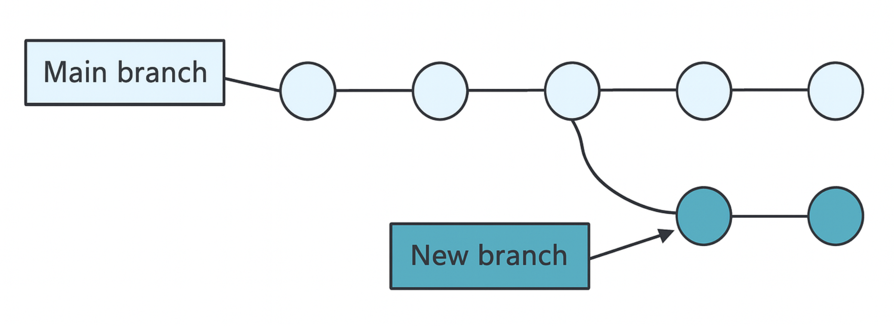
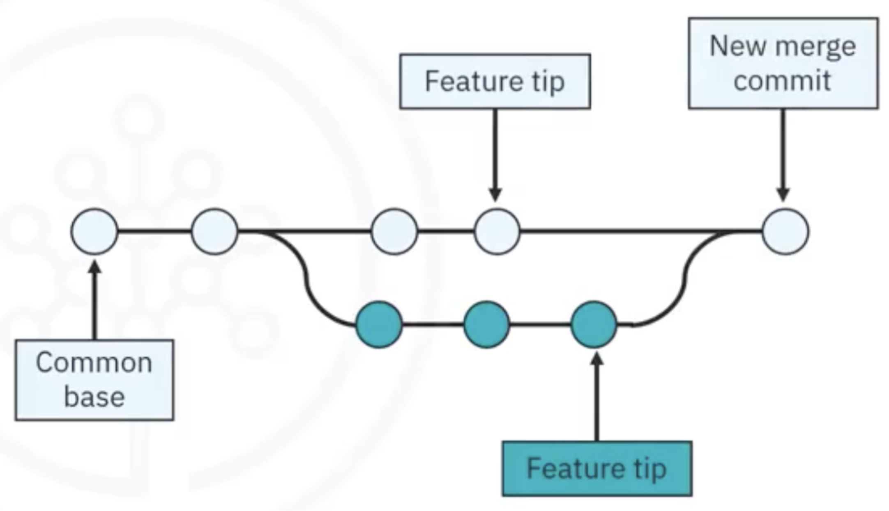

<h1>GitHub Branches Overview, Workflow, and Best Practices</h1>

<h2>Table of Contents</h2>
<div class="alert alert-block alert-info" style="margin-top: 20px">
  <ul>
    <li><a href="#what-is-a-branch">What are Branches?</a></li>
    <li><a href="#create-a-new-branch">Create a New Branch</a></li>
    <li><a href="#edit-and-commit-in-a-branch">Edit and Commit in a Branch</a></li>
    <li><a href="#best-practices">Best Practices</a></li>
    <li><a href="#pull-requests">Pull Requests</a></li>
    <li><a href="#review-process">Review Process</a></li>
    <li><a href="#clean-up">Clean Up</a></li>
  </ul>
</div>

<h2 id="what-is-a-branch">1. What Are Branches?</h2>

- **Definition**: Branches in GitHub let you work on code changes in isolation without affecting the **main (deployable)** version of your project.
    
- **Main branch** (often called main): contains the **production-ready** code.
    
- **New branches**: are created for:
    
    - Developing features
        
    - Fixing bugs
        
    - Running experiments
        
    


**Example:**

```
Main branch: v1.0 released to users
New branch: feature-login-form → work on new login UI
```


<h2 id="create-a-new-branch">2. 🌱 Create a New Branch</h2>

  
**How to:**

1. Navigate to your GitHub repository.
    
2. Click the branch dropdown (usually says main).
    
3. Type a new branch name, e.g., feature-login-form
    
4. Click **Create Branch**
    

**Result**: A copy of the main branch is created under the new name.


<h2 id="edit-and-commit-in-a-branch">3. Edit and Commit in a Branch</h2>

**How to:**

1. Navigate to a file → Click the pencil icon
    
2. Make your changes
    
3. Scroll to **Commit changes**
    
4. Fill in:
    
    - Commit message (≤ 50 characters)
        
    - Optional detailed description
        
    
5. Choose:
    
    - “Commit directly to this branch”
        
    - or create a **new branch** if needed
        
    
6. Click **Commit changes**
    


<h2 id="best-practices">4. Best Practices for Commit Messages:</h2>

|**Do**|**Don’t**|
|---|---|
|Use active voice: Fix broken layout|Avoid passive: Layout was fixed|
|Be short: Add signup form validation|Avoid vague: Changes made|
|Avoid period at end|No punctuation needed|
|Describe “why” in extended message|Don’t just describe “what”|

---

<h2 id="pull-requests">5. Pull Requests: Collaborate & Merge</h2>

**What is a Pull Request?**

A **pull request** (PR) asks someone to review changes made on a branch before merging them into main.

  

**How to Create a Pull Request:**

1. Click the **“Pull requests”** tab
    
2. Click **“New pull request”**
    
3. Select the compare branch (e.g., feature-login-form)
    
4. View the changes below
    
5. Add:
    
    - A **title**: Add login validation
        
    - A **description**: e.g., “Implemented client-side checks for email and password length”
        
    
6. Click **“Create pull request”**
    


<h2 id="review-process">6. Review Process:</h2>

- You (or teammates) review the changes.
    
- If everything is okay → click **Merge pull request** → then **Confirm merge**.
    

  
---

<h2 id="clean-up">7. Clean Up: Delete the Branch</h2>

- Once merged, **delete the feature branch** to keep the repo clean.
    
- Deleting a branch **does not delete** its merged code in main.
    
