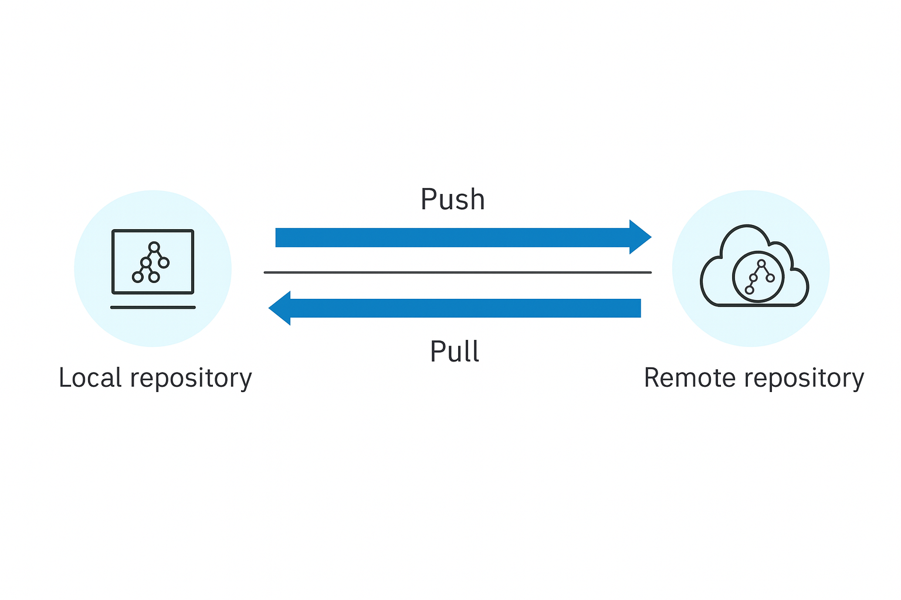
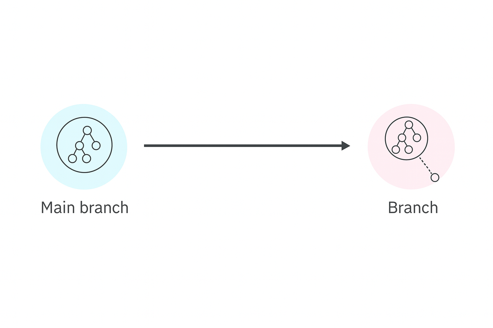
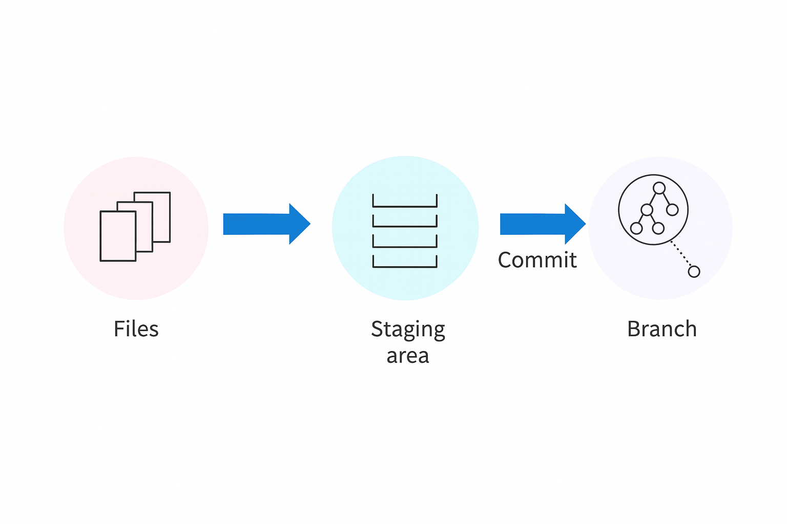
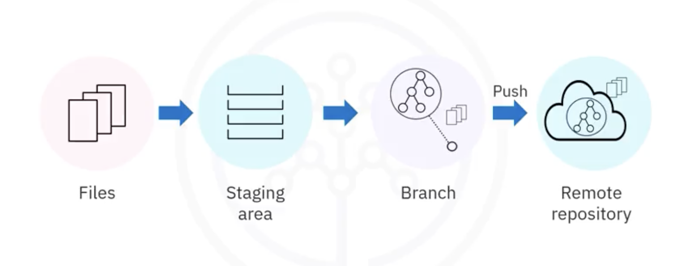
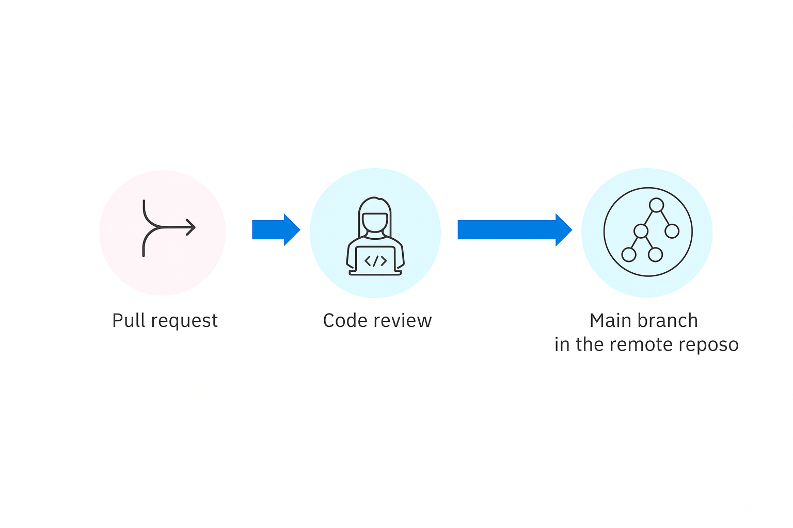
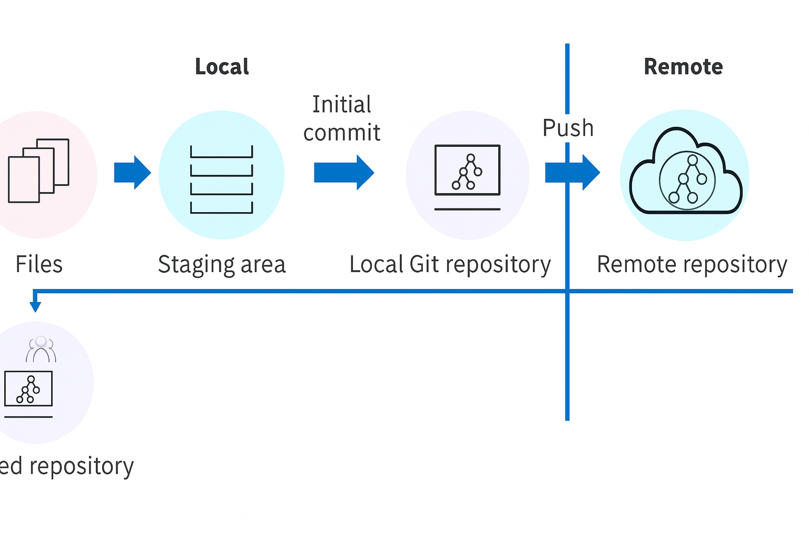

<h1>GitHub Workflow Overview</h1>

<h2>Table of Contents</h2>

    <a href="#join-existing-project">Joining an Existing Project: Step-by-Step Workflow</a> 
        <ul>
            <li><a href="#cloning-repository">1. Cloning a Repository</a></li>
            <li><a href="#creating-branch">2. Creating a Branch</a></li>
            <li><a href="#updating-local-files">3. Updating Local Files</a></li>
            <li><a href="#staging-changes">4. Staging Changes</a></li>
            <li><a href="#committing-changes">5. Committing Changes</a></li>
            <li><a href="#pushing-to-remote-repository">6. Pushing to the Remote Repository</a></li>
            <li><a href="#creating-pull-request">7. Creating a Pull Request (PR)</a></li>
        </ul>
    <a href="#starting-new-project">Starting a New Project: Step-by-Step Workflow</a> 
        <ul>
            <li><a href="#initializing-local-repository">1. Initializing a Local Repository</a></li>
            <li><a href="#staging-and-committing">2. Staging and Committing</a></li>
            <li><a href="#creating-and-linking-remote-repository">3. Creating and Linking a Remote Repository</a></li>
            <li><a href="#pushing-changes">4. Pushing Changes</a></li>
        </ul>
    <a href="#real-life-scenario">Real-Life Scenario: Git Workflow in Practice</a> 
    <a href="#conclusion">Conclusion</a>

<h2>Introduction</h2>

- Git is a distributed version control system that facilitates collaboration among development teams. 
- A **Git workflow** defines the structured sequence of steps developers follow to contribute code, manage changes, and collaborate effectively—especially in environments using GitHub for source code hosting and review.

  

<h2 id="join-existing-project">Joining an Existing Project: Step-by-Step Workflow</h2>

<h3 id="cloning-repository">1. Cloning a Repository</h3>

The first step in joining an existing development project is to **clone the remote repository** from GitHub.

Cloning:

- Downloads a **local copy** of the project code.
    
- Preserves the **entire version history**.
    
- Establishes a connection between the **local and remote repositories**, allowing future synchronization (push/pull).
    

  

<h3 id="creating-branch">2. Creating a Branch</h3>

Once cloned, developers avoid working directly on the main branch. Instead, they create a **new branch** to isolate their work.

A **Git branch** is an independent line of development that allows experimentation without affecting the main codebase.

  

  

<h3 id="updating-local-files">3. Updating Local Files</h3>

Developers then implement new features or enhancements by editing files within the local repository.

<h3 id="staging-changes">4. Staging Changes</h3>

Before committing, selected modified files must be **moved to the staging area**, a temporary zone where changes are reviewed and prepared for inclusion in the repository.

  

<h3 id="committing-changes">5. Committing Changes</h3>

  

A **commit**:

- Records the staged changes to the local repository.
    
- Must include a **meaningful commit message** to document the purpose (e.g., "Implemented product recommendation feature").
    
 
  

<h3 id="pushing-to-remote-repository">6. Pushing to the Remote Repository</h3>

  

Once committed locally, the new branch and its changes are **pushed** to the remote repository on GitHub, making them available for team review and integration.

 
  

<h3 id="creating-pull-request">7. Creating a Pull Request (PR)</h3>

  

To merge a branch into the main branch:

- The developer opens a **pull request (PR)** on GitHub.
    
- The **maintainer or repository owner** reviews the changes and approves the merge.
    
- Upon approval, the feature branch is merged into main, and the changes become part of the shared codebase.
    

  

If the contributor has maintainer access, they may also receive and review pull requests submitted by other developers.

 

<h2 id="starting-new-project">Starting a New Project: Step-by-Step Workflow</h2>

<h3 id="initializing-local-repository">1. Initializing a Local Repository</h3>

  

To begin a new project:

- The developer initializes a **local Git repository** in the working directory.
    
- This step allows Git to **track file changes** and maintain version history.
    

  

<h3 id="staging-and-committing">2. Staging and Committing</h3>

  

Next:

- Project files are **added to the staging area**.
    
- An **initial commit** is made to record the base state of the code.
    

  

<h3 id="creating-and-linking-remote-repository">3. Creating and Linking a Remote Repository</h3>

  

The developer then:

- Creates a **blank remote repository** on a platform such as GitHub.
    
- Establishes a link between the **local and remote repositories** (via git remote add).
    
- Pushes all files and commits from the local repository to the remote repository.
    

  

Other contributors may then **clone** this remote repository and follow the standard workflow described above.

 

<h2 id="real-life-scenario">Real-Life Scenario: Git Workflow in Practice</h2>

  

Consider a real-world team working on a new web application. The team consists of developers, testers, and a product manager.

1. **Project Setup**
    
    Anne, the lead developer, initializes the Git repository, stages project files, performs the first commit, and pushes it to a newly created remote repository.
    
2. **Team Collaboration**
    
    - All developers **clone** the repository and begin work in **individual branches**.
        
    - John, a team member, creates a User Auth branch to implement user authentication.
        
    - He commits his changes after development and testing, then **pushes** the branch and submits a **pull request**.
        
    - Anne reviews and **merges** the pull request into main.
        
    
3. **Release Preparation**
    
    - Once all features are implemented, Anne creates a Release 1.0 branch from main.
        
    - The team synchronizes with the remote repository and performs:
        
        - Final testing
            
        - Bug fixes
            
        - Documentation updates
            
        
    - After verification, the changes are committed and pushed.
        
    - A pull request is submitted, reviewed, and merged into main.
        
    - The release is **tagged** as Release 1.0.
        
    

<h2 id="conclusion">Conclusion</h2>

This Git workflow ensures effective team collaboration, version tracking, and release management. The key steps include:

- **For existing projects**:
    
    - Clone the repository
        
    - Create a new branch
        
    - Stage, commit, and push changes
        
    - Submit a pull request for review and merge
        
    
- **For new projects**:
    
    - Initialize a local Git repository
        
    - Stage and commit initial files
        
    - Create and link a remote repository
        
    - Push changes to enable collaboration
        
