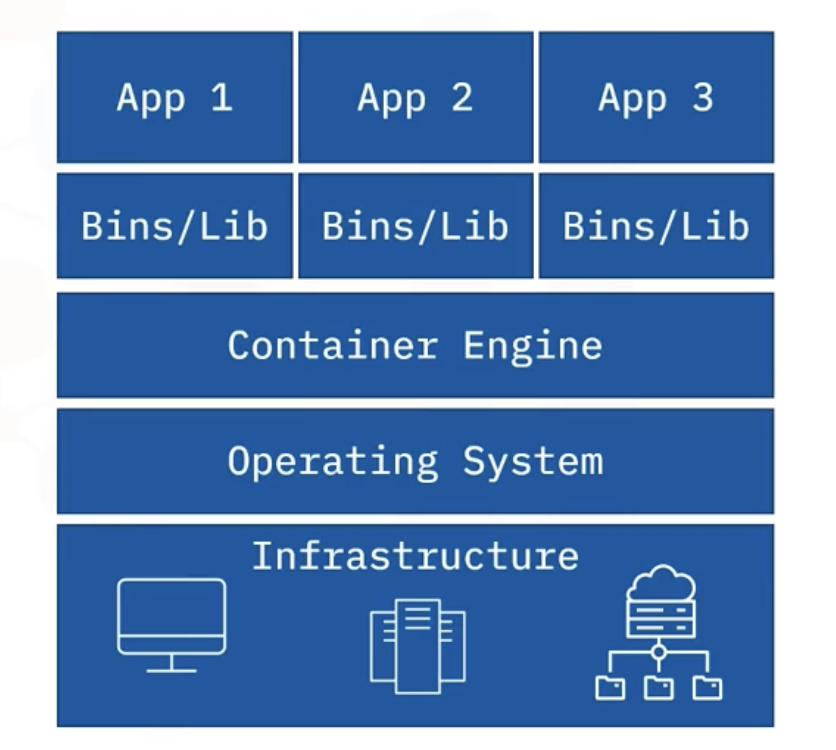
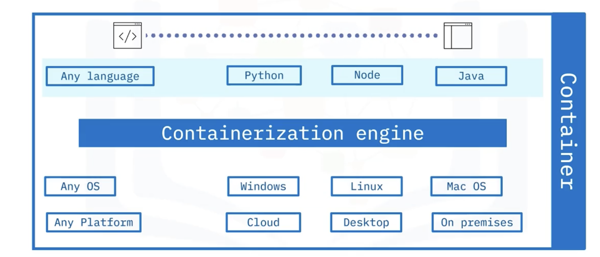

# Introduction to Containers

## Table of Contents

    <ul>
        <li><a href="#traditional-computing-challenges">Traditional Computing Challenges</a></li>
        <li><a href="#container-technology-and-characteristics">Container Technology and Characteristics</a></li>
        <li><a href="#benefits-and-challenges-of-containers">Benefits and Challenges of Containers</a></li>
        <li><a href="#popular-container-vendors">Popular Container Vendors</a></li>
    </ul>

### Introduction

The adoption of **container technology** has revolutionized how software is developed, deployed, and managed. Containers address long-standing challenges in traditional computing environments, enabling more efficient, scalable, and portable application delivery. In this course, we will explore the concept of containers, their advantages, challenges, and popular vendors.

## <h2 id="traditional-computing-challenges">Traditional Computing Challenges</h2>

Before containerization, software deployment and management faced several obstacles:

### **1. Lack of Isolation**

In traditional environments, applications **run directly on physical servers**, often **sharing resources** such as memory and storage. This lack of isolation can cause **conflicts**, especially when running multiple applications on the same machine.

### **2. Resource Utilization Issues**

Physical servers are often **underutilized or overutilized**, leading to inefficiencies. Proper allocation of resources like CPU and memory is crucial for maximizing performance, but traditional computing environments often fail in this regard.

### **3. Scalability Limitations**

Scaling applications in traditional environments requires complex provisioning and can lead to expensive and slow processes. Physical hardware has **finite capacity**, which can restrict the growth of applications during **peak workloads**.

### **4. Lack of Portability**

Applications developed in traditional computing environments are often **tied to specific platforms and operating systems**, making it difficult to move them across different environments (e.g., development, testing, production).

### **5. Complex Automation**

Automating software deployment and distribution across multiple environments is a challenge in traditional setups, often requiring **manual intervention and significantly increasing time and costs**.

---

## <h2 id="container-technology-and-characteristics">Container Technology and Characteristics</h2>

Containers provide an innovative solution to many of the challenges faced by traditional computing environments. A **container** is a lightweight, stand-alone, executable software package that includes everything needed to run a piece of software: **the code, runtime, libraries, environment variables, and configuration files**.

### **What is a Container?**

A container encapsulates an **application and its dependencies into a single unit**, ensuring the application runs reliably across different computing environments. It operates independently of the underlying infrastructure, making it highly portable and flexible.

### **Characteristics of Containers**

1. **Lightweight**: Containers are small, often only **tens of megabytes in size**, which makes them fast to deploy and less resource-intensive compared to traditional virtual machines.

2. **Isolation**: Each container runs in its **own environment, isolated from other containers**. This prevents conflicts between applications running on the same system.

3. **Portability**: Containers can run on **various platforms** (cloud, desktop, on-premises) and **operating systems** (Windows, Linux, Mac OS), ensuring that software can be moved seamlessly between environments.

4. **Efficiency**: Containers use fewer resources compared to virtual machines because they share the host operating system's kernel and run as isolated processes. This leads to better resource utilization and reduced overhead.

5. **Scalability**: Containers can be easily scaled up or down based on the workload. This makes them ideal for modern applications that need to respond quickly to changing demands.

---

## <h2 id="benefits-and-challenges-of-containers">Benefits and Challenges of Containers</h2>

### **Benefits of Using Containers**

1. **Improved Resource Utilization**: Containers run on **shared resources**, minimizing hardware wastage. Multiple containers can run on a single machine, leading to efficient use of CPU and memory.

2. **Portability**: Containers can be moved between **different environments** without modification, ensuring that applications run consistently across development, testing, and production stages.

3. **Faster Deployment**: Containers are designed to be deployed **quickly**. This results in reduced deployment times and costs, enabling rapid updates and faster time-to-market.

4. **Support for Microservices**: Containers are perfect for microservices architectures, where applications are divided into smaller, independent services. This approach enables better scalability and easier management of complex applications.

5. **Automation**: Containers make automation simpler by providing a standardized environment for deploying and managing applications. This leads to **easier integration into CI/CD pipelines and other automation tools**.

### **Challenges of Using Containers**

1. **Security Concerns**: If the underlying host operating system is compromised, all containers running on that host could be at risk. Proper container security practices must be followed to mitigate this risk.

2. **Management Overhead**: Managing thousands of containers can become overwhelming for developers, especially when dealing with large-scale environments. Tools like Kubernetes have been developed to help manage container clusters efficiently.

3. **Migration Complexity**: Converting legacy monolithic applications into **microservices** or **containerized applications** can be complex and time-consuming.

4. **Right-sizing Containers**: Determining the correct size and resource allocation for each container can be challenging, especially for applications with fluctuating resource needs.

---

## <h2 id="popular-container-vendors">Popular Container Vendors</h2>

Several companies provide tools and platforms to facilitate the use of containers. Some of the most popular container vendors include:

### **1. Docker**

Docker is the most widely used container platform today. It offers a complete suite of tools for building, shipping, and running containerized applications.

### **2. Podman**

Podman is a daemon-less container engine that is more secure than Docker. It is compatible with Docker commands, making it easy to switch between the two.

### **3. LXC (Linux Containers)**

LXC is often preferred for data-intensive applications that require a more extensive environment. It provides an OS-level virtualization solution for Linux.

### **4. Vagrant**

Vagrant focuses on providing high levels of isolation for applications running on physical machines. It is often used in development and testing environments where consistency is crucial.

