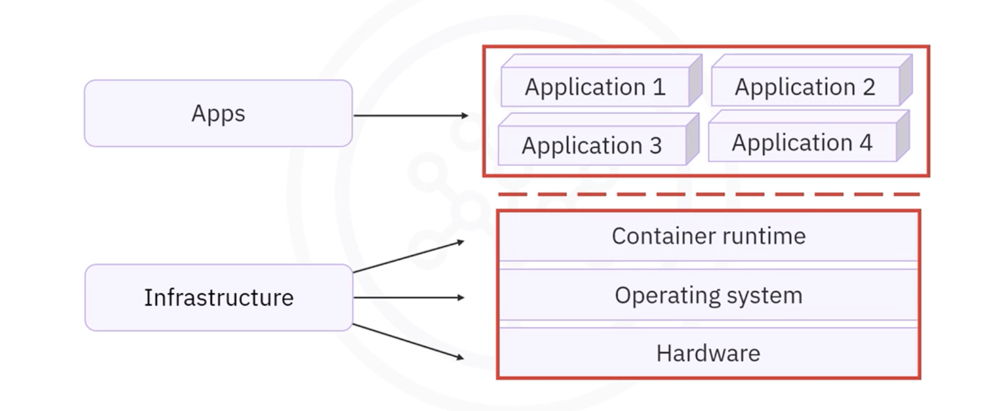

# Introduction to Docker

## Table of Contents

    <ul>
        <li><a href="#what-is-docker">What is Docker?</a></li>
        <li><a href="#docker-process-and-technology">Docker Process and Technology</a></li>
        <li><a href="#benefits-of-docker">Benefits of Docker</a></li>
        <li><a href="#challenges-of-docker">Challenges of Docker</a></li>
    </ul>

### Introduction

Docker has emerged as one of the most popular platforms for developing, shipping, and running applications in containers. Since its introduction in 2013, Docker has revolutionized the way developers create and deploy applications, offering a simple and scalable solution for application containerization.

## <h2 id="what-is-docker">What is Docker?</h2>

Docker is an **open platform** that allows developers to **build, ship, and run applications inside containers**. 
A container is a lightweight, stand-alone, executable package that includes everything needed to run an application, such as the code, runtime, libraries, system tools, and settings.

### **Docker's Role**

Docker **isolates applications** from the underlying infrastructure—whether that be hardware, the operating system, or the container runtime. 

This isolation enables **consistent** application behavior across different environments, making Docker containers portable, scalable, and efficient.

### **Docker's Appeal**

Docker gained popularity because of its simplicity and ease of use. It offers a powerful and efficient method to deploy applications across multiple platforms, environments, and locations without worrying about the compatibility issues that often arise in traditional computing environments.

## <h2 id="docker-process-and-technology">Docker Process and Technology</h2>

Docker relies on several key technologies to deliver its functionality, including:

### **1. Linux Kernel Features**

Docker uses features of the **Linux kernel**, including **namespaces** and **control groups**, to deliver **isolated environments for containers**. The kernel allows containers to **run on top of a shared operating system** without interfering with each other.

### **2. Namespaces**

Docker uses **namespaces** to provide an **isolated workspace for each container**. These namespaces ensure that each container operates in a **separate environment**, with access to only the resources and processes within that container.

* **Network namespace**: Each container gets its own networking stack.
* **PID namespace**: Isolates the process IDs.
* **Filesystem namespace**: Ensures each container has its own file system.

### **3. Container Creation and Isolation**

Docker creates a **set of namespaces for every container**. Each aspect of the container runs within its own isolated namespace, and access is **limited to the resources** defined by that namespace. This ensures that containers remain **isolated from each other and from the host system**, improving security and preventing conflicts between applications.

### **4. Docker Tools and Complementary Technologies**

Docker's architecture has led to the creation of complementary tools and technologies that enhance its functionality, such as:

* **Docker CLI**: The command-line interface for interacting with Docker.
* **Docker Compose**: A tool for defining and running multi-container Docker applications.
* **Prometheus**: A tool for monitoring and alerting based on Docker containers' metrics.
* **Orchestration tools like Docker Swarm and Kubernetes**: These allow for the management and scaling of containerized applications.
* **Microservices and Serverless Development**: Docker aligns with modern software architectures like microservices, enabling better scalability and maintainability.

## <h2 id="benefits-of-docker">Benefits of Docker</h2>

Docker offers numerous advantages to developers, making it a go-to solution for modern application development and deployment:

### **1. Consistent and Isolated Environments**

Docker containers ensure that the application **runs the same way in every environment**, from development to testing to production. This consistency eliminates issues that arise when an application behaves differently on different systems.

### **2. Speed of Deployment**

Docker significantly **reduces deployment times**. Containers can be spun up in seconds, allowing developers to deploy applications and updates faster than traditional methods.

### **3. Small and Reusable Images**

Docker images are **lightweight and reusable**. Once an image is created, it can be reused multiple times, making the development process more efficient and reducing the need to recreate environments for each deployment.

### **4. Automation Capabilities**

Docker’s automation features help **streamline the development and deployment process**. By automating the creation and management of containers, Docker **minimizes human error and simplifies the maintenance cycle**.

### **5. Support for Agile and CI/CD**

Docker integrates seamlessly with **Agile practices and CI/CD pipelines**. It enables **rapid iteration and testing**, allowing teams to continuously integrate, test, and deploy code with minimal friction.

### **6. Platform Independence**

Docker containers are **platform-agnostic**. They can run on a variety of environments, including **on-premises, private and public clouds**, and on various operating systems like **Linux, Windows, and macOS**.

### **7. Segmentation for Easier Management**

Docker’s containerization allows for **easier management of applications**, making it simple to refresh, clean up, or repair specific parts of the application without affecting the rest of the system.

## <h2 id="challenges-of-docker">Challenges of Docker</h2>

While Docker provides significant advantages, there are challenges that developers need to consider when adopting Docker:

### **1. Not Ideal for High-Performance Applications**

Docker containers may not be the best solution for applications that require **extremely high performance or low latency**. While Docker is efficient, certain performance-sensitive applications may need more specialized environments.

### **2. Security Concerns**

Since containers share **the same host OS kernel, a vulnerability in the host OS could potentially affect all containers**. Proper security practices and configurations are essential to mitigate risks.

### **3. Monolithic Applications**

Docker is well-suited for microservices and distributed architectures, but converting **monolithic applications** to a containerized environment can be a complex and time-consuming process.

### **4. Complexity in Large-Scale Management**

As organizations scale, managing thousands of containers can become challenging. Tools like Kubernetes can help with orchestration, but container management at large scales still requires careful planning and resources.

