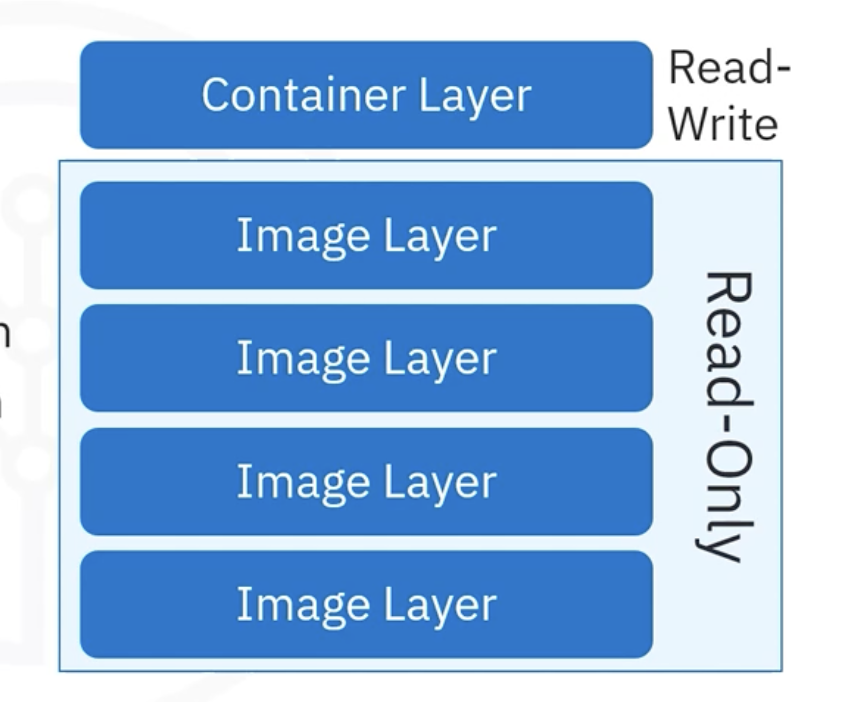

# Introduction to Docker Objects

## Table of Contents

<div class="alert alert-block alert-info" style="margin-top: 20px">
    <ul>
        <li><a href="#docker-objects">Docker Objects</a></li>
        <li><a href="#essential-docker-file-commands">Essential Docker File Commands</a></li>
        <li><a href="#container-image-naming">Container Image Naming</a></li>
        <li><a href="#docker-networks-storage-plugins">Docker Networks, Storage, and Plugins</a></li>
    </ul>
</div>

<hr>

### Introduction

In this course, we will explore the core Docker objects, such as Dockerfiles, images, containers, networks, and storage volumes. Understanding these objects is essential for effective Docker containerization and application management. You will also learn the important Docker commands used for building and running containers, how Docker names container images, and how it manages network and storage.


## <h2 id="docker-objects">Docker Objects</h2>

Docker is made up of several essential objects that work together to facilitate the creation, deployment, and management of containers. These objects include **Dockerfiles**, **images**, **containers**, **networks**, **volumes**, and **plugins**.

### **1. Dockerfile**

A **Dockerfile** is a text file that contains the instructions required to create a Docker image. It defines the environment, application dependencies, and commands needed to build the container image.

* **Creating a Dockerfile**: You can use any text editor or the terminal to create a Dockerfile. The file contains specific instructions like `FROM`, `RUN`, and `CMD` that Docker uses to build the image.

### **2. Docker Image**

A **Docker image** is a read-only template with instructions for creating a Docker container. It is built based on a **Dockerfile** and consists of several layers. Each instruction in the Dockerfile creates a new layer in the image.

* When a Docker image is updated, only the layers that have changed are rebuilt, making the process more efficient.
* **Images are immutable**, meaning that once created, they cannot be modified. However, when running a container from an image, a writable layer is added to enable changes during the container’s lifecycle.




### **3. Docker Container**

A **Docker container** is a running instance of an image. While images are immutable, containers are not, as they can execute commands and modify their writable layers.

* You can **start**, **stop**, **delete**, or **restart** containers using the Docker CLI or API.
* Containers can be connected to multiple **networks**, attached to **storage**, or even turned into new images based on their current state.


## <h2 id="essential-docker-file-commands">Essential Docker File Commands</h2>

Dockerfiles use several key commands to define how images are built. Below are some essential commands in a Dockerfile:

### **1. `FROM`**

* **Purpose**: Specifies the base image for the Docker image. It is the first instruction in any Dockerfile.
* **Example**:

  ```Dockerfile
  FROM ubuntu:18.04
  ```

### **2. `RUN`**

* **Purpose**: Executes commands inside the container during the image build process. It is commonly used to install dependencies or configure the container.
* **Example**:

  ```Dockerfile
  RUN apt-get update && apt-get install -y curl
  ```

### **3. `CMD`**

* **Purpose**: Defines the default command to be executed when a container is started from the image. Only one `CMD` instruction can exist in a Dockerfile. If multiple `CMD` instructions are specified, only the last one will take effect.
* **Example**:

  ```Dockerfile
  CMD ["echo", "Hello World"]
  ```

---

## <h2 id="container-image-naming">Container Image Naming</h2>

Docker images are named using a specific format that consists of three parts: **host name**, **repository**, and **tag**. This naming convention helps identify the image, its registry, and its version.


### **Image Name Format**

The typical format for an image name is:

```
hostname/repository:tag
```

#### Example: `docker.io/ubuntu:18.04`

* **Hostname**: `docker.io` refers to the Docker Hub registry. You can omit this if you're pulling from Docker Hub, as it is the default.
* **Repository**: `ubuntu` is the name of the image repository.
* **Tag**: `18.04` represents the version of the image (in this case, the version of Ubuntu).

The repository organizes images into groups, while the tag identifies a specific version or variant of the image.


## <h2 id="docker-networks-storage-plugins">Docker Networks, Storage, and Plugins</h2>

Docker provides several features for networking, data storage, and external integrations through plugins. These features ensure that containers can communicate, persist data, and integrate with other platforms.

### **1. Docker Networks**

Docker networks allow containers to communicate with each other and with external systems. By default, containers are isolated, and networks are used to enable communication between them.

* **Default Network**: Docker creates a default network, but you can define custom networks for different applications to isolate container communication.
* **Network Types**: Docker supports different network types, including **bridge**, **host**, and **overlay**, depending on the communication requirements.

### **2. Docker Volumes**

**Docker volumes** are used to persist data even after a container is stopped or deleted. Unlike the container’s writable layer, volumes are managed outside the container and can be shared across containers.

* **Bind Mounts vs Volumes**: Bind mounts link a container’s filesystem to a host system directory, while volumes are managed by Docker itself and are generally recommended for persistent data storage.

### **3. Docker Plugins**

Docker plugins extend the capabilities of Docker by adding additional features, such as storage integration or monitoring. For example, **storage plugins** allow Docker to connect to external storage platforms.

