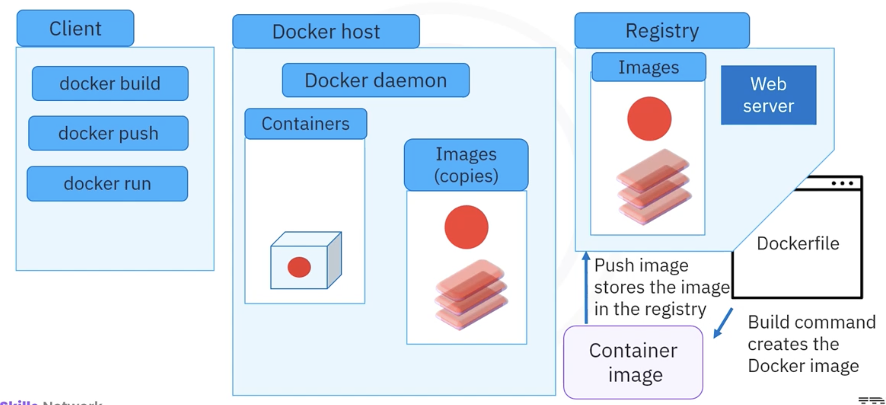

# Docker Architecture

## Table of Contents

    <ul>
        <li><a href="#docker-components">Docker Components</a></li>
        <li><a href="#docker-client-server-architecture">Docker Client-Server Architecture</a></li>
        <li><a href="#docker-registry">Docker Registry</a></li>
        <li><a href="#containerization-process">Containerization Process with Docker</a></li>
    </ul>

### Introduction

In this course, we will dive into **Docker Architecture**, examining the key components that make up the system, how they work together, and the process of containerization using Docker. Docker's client-server architecture provides a complete environment for application development, deployment, and management.

## <h2 id="docker-components">Docker Components</h2>

Docker is made up of three key components:

1. **Docker Client**
2. **Docker Host**
3. **Docker Registry**

Let’s explore each component in detail.

### **1. Docker Client**

The **Docker client** is used to send instructions to the Docker daemon (server). It provides both a **command-line interface (CLI)** and **REST APIs** that allow users to interact with Docker. The client sends commands like `docker run`, `docker build`, and others to the Docker host. These commands are then processed by the Docker daemon (server).

* **Local or Remote Access**: You can run the Docker client and daemon on the same machine or configure the client to interact with a remote Docker daemon, allowing flexibility in managing Docker instances across different environments.

### **2. Docker Host**

The **Docker host** refers to the **machine (physical or virtual) where the Docker daemon, containers, and images are stored**. The **Docker daemon** (also known as `dockerd`) is responsible for the heavy lifting, such as building, running, and distributing containers.

* **Docker Daemon**: The daemon listens for API requests or commands (e.g., `docker run`) and processes them to manage the containers.
* **Container Management**: The host also manages images, containers, namespaces, networks, storage plugins, and add-ons.

### **3. Docker Registry**

The **Docker registry** is a repository where Docker images are stored. Docker images are the building blocks for containers and can be either pulled or pushed to/from the registry.

* **Public Registry**: Docker Hub is the default public registry, accessible by anyone.
* **Private Registry**: Organizations often use private registries for enhanced security. These can be hosted by third-party providers or self-hosted in private data centers or the cloud.

## <h2 id="docker-client-server-architecture">Docker Client-Server Architecture</h2>

Docker’s architecture is based on the client-server model, where:

1. The **Docker client** sends instructions to the **Docker host** via commands or APIs.
2. The **Docker daemon** on the host processes these commands and manages containers.
3. The **Docker registry** stores and manages Docker images.

### **How Docker Works:**

1. **Docker Client to Host**: You interact with Docker using the command-line interface or REST APIs. You can use commands like `docker build`, `docker run`, or `docker push` to interact with the Docker daemon.
2. **Docker Daemon**: Once the client sends a command, the Docker daemon on the host processes the request, managing containers and images.
3. **Registry**: The Docker daemon stores images in a registry, either public (e.g., Docker Hub) or private, allowing you to share and distribute your application images.

This architecture enables Docker to manage application environments efficiently, allowing you to run containers across different environments, from local systems to the cloud.

## <h2 id="docker-registry">Docker Registry</h2>

A **Docker registry** is where Docker images are stored, making it an essential part of Docker's architecture.

### **Registry Types**

* **Public Registry**: Docker Hub is a public registry that is accessible by anyone and hosts a vast library of pre-built images.
* **Private Registry**: For enterprises and organizations that require secure, private storage, Docker allows the creation of private registries. These can be hosted on platforms like **AWS**, or internally within an organization's data centers.

### **Storing and Distributing Images**

* **Push and Pull Process**:

  1. Developers **push** their images to the registry after building them (via automation or build pipelines).
  2. Other systems or environments can **pull** those images from the registry, making it easy to deploy the same image across different locations or machines.

## <h2 id="containerization-process">Containerization Process with Docker</h2>

Containerization is the process of building, storing, and running applications inside containers. Below is an overview of how Docker handles this process:

### **1. Building a Container Image**

To create a container image:

1. **Base Image or Dockerfile**: Start with an existing base image or define a custom image using a **Dockerfile**.
2. **Build Command**: Issue the `docker build` command to create an image with a given name.

### **2. Pushing the Image to the Registry**

Once the image is created, it is pushed to the Docker registry:

* **Push Command**: Use the `docker push` command to upload the image to a public or private registry.

### **3. Pulling the Image from the Registry**

If the Docker host does not have the image available locally, the Docker client will:

1. **Check Local Image**: The Docker host checks if the requested image is already present locally.
2. **Pull from Registry**: If the image is not found, the Docker client connects to the registry and pulls the image to the host.

### **4. Running the Container**

Once the image is available, Docker can run the container:

* **Run Command**: Use the `docker run` command to create and start the container based on the image.
* **Container Creation**: The Docker daemon takes care of running the container, handling resources, and ensuring proper isolation for the application.

