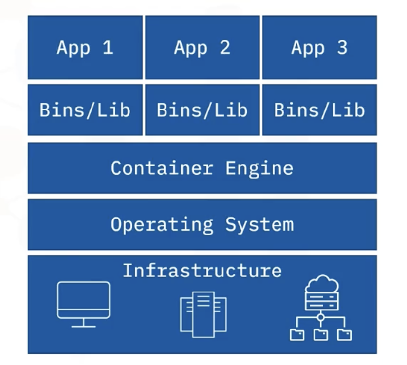

In this part of the course, we’ll focus on two main topics:

1. **Container architecture**
2. **The high-level benefits of containers**

At this stage, you can think of **containers** and **Docker** as essentially the same thing.
A Docker container is just one type of container, and the differences only matter when we go much deeper into the technology.


## 1. Recap: Virtual Machine Architecture

In a **VM architecture**, we have:

* **Physical hardware** – called the **VM host**.
* On top of that, either:

  * A **hypervisor** running directly on the hardware, or
  * A **host operating system** first, and then the hypervisor on top.

Example:

* **VirtualBox** runs **on** an OS.
* **VMware ESXi** runs **directly** on the hardware.

Then, on top of the hypervisor, we have **virtual machines**:

* Each VM runs its **own guest operating system**.
* The OS could be the same across VMs (e.g., all Debian) or completely different.
* Inside each guest OS are the **applications**, their **libraries**, and any **runtime environments** they require.


### Downsides of VMs:

* Running multiple guest OS copies consumes **a lot of resources**.
* If you have many identical OS instances, this leads to **massive duplication**.
* Each VM needs to **boot its own OS**, which adds startup and restart overhead (although still less than physical servers).

## 2. Traditional Computing Challenges

Before containerization, software deployment and management faced several obstacles:

### **1. Lack of Isolation**

In traditional environments, applications **run directly on physical servers**, often **sharing resources** such as memory and storage. This lack of isolation can cause **conflicts**, especially when running multiple applications on the same machine.

### **2. Resource Utilization Issues**

Physical servers are often **underutilized or overutilized**, leading to inefficiencies. Proper allocation of resources like CPU and memory is crucial for maximizing performance, but traditional computing environments often fail in this regard.

### **3. Scalability Limitations**

Scaling applications in traditional environments requires complex provisioning and can lead to expensive and slow processes. Physical hardware has **finite capacity**, which can restrict the growth of applications during **peak workloads**.

### **4. Lack of Portability**

Applications developed in traditional computing environments are often **tied to specific platforms and operating systems**, making it difficult to move them across different environments (e.g., development, testing, production).

### **5. Complex Automation**

Automating software deployment and distribution across multiple environments is a challenge in traditional setups, often requiring **manual intervention and significantly increasing time and costs**.

## 3. Container Technology and Characteristics

A **container** is a **lightweight, stand-alone** software package that **encapsulates an application and all its dependencies** (code, runtime, libraries, environment variables, and configuration files) into a single unit. This ensures the application runs reliably across different computing environments, independent of the underlying infrastructure, making it highly **portable and flexible**.

### **Characteristics of Containers**

1. **Lightweight**: Containers are small, often only **tens of megabytes in size**, which makes them fast to deploy and less resource-intensive **compared to traditional virtual machines**.

    * You can run **more containers** on the same hardware compared to VMs.
    * You can use a **smaller host** to run the same workloads.
    * This leads to **better utilization** and **more value** for a business.

2. **Isolation**: Each container runs in its **own environment, isolated from other containers**. This prevents conflicts between applications running on the same system.

3. **Portability**: Containers can run on **various platforms** (cloud, desktop, on-premises) and **operating systems** (Windows, Linux, Mac OS), ensuring that software can be moved seamlessly between environments.

4. **Efficiency**: Containers use fewer resources compared to virtual machines because they share the host operating system's kernel and run as isolated processes. This leads to better resource utilization and reduced overhead.

5. **Scalability**: Containers can be easily scaled up or down based on the workload. This makes them ideal for modern applications that need to respond quickly to changing demands.

## 4. Benefits and Challenges of Containers

### **Benefits of Using Containers**

1. **Improved Resource Utilization**: Containers run on **shared resources**, minimizing hardware wastage. Multiple containers can run on a single machine, leading to efficient use of CPU and memory.



2. **Portability**: Containers can be moved between **different environments** without modification, ensuring that applications run consistently across development, testing, and production stages.


3. **Faster Deployment**: Containers are designed to be deployed **quickly**. This results in reduced deployment times and costs, enabling rapid updates and faster time-to-market.

4. **Support for Microservices**: Containers are perfect for microservices architectures, where applications are divided into smaller, independent services. This approach enables better scalability and easier management of complex applications.

5. **Automation**: Containers make automation simpler by providing a standardized environment for deploying and managing applications. This leads to **easier integration into CI/CD pipelines and other automation tools**.


### **Challenges of Using Containers**

1. **Security Concerns**: If the underlying host operating system is compromised, all containers running on that host could be at risk. Proper container security practices must be followed to mitigate this risk.

2. **Management Overhead**: Managing thousands of containers can become overwhelming for developers, especially when dealing with large-scale environments. Tools like Kubernetes have been developed to help manage container clusters efficiently.

3. **Migration Complexity**: Converting legacy monolithic applications into **microservices** or **containerized applications** can be complex and time-consuming.

4. **Right-sizing Containers**: Determining the correct size and resource allocation for each container can be challenging, especially for applications with fluctuating resource needs.


## 5. Container Architecture

With **containers**, we start with the same physical hardware, but this time we call it a **Docker host** or **container host**.

The structure is:

1. **Hardware** (the host)
2. **Host operating system**
3. **Container Engine** – in Docker’s case, the **Docker Engine**


### Key Differences from VMs

* The **Container Engine** is **lighter** than a hypervisor because it has fewer responsibilities.
* All containers **share the same host operating system**.
* Each container runs as a **process** on that OS.

Because of this:

* Containers **don’t need their own OS**.
* They only include:

  * The application
  * Its required libraries
  * Any runtime environments
* This makes containers **smaller, faster, and more lightweight** than VMs.


## 6. Performance & Utilization

Since containers are lighter:

* You can run **more containers** on the same hardware compared to VMs.
* You can use a **smaller host** to run the same workloads.
* This leads to **better utilization** and **more value** for a business.


## 7. Summary Points

Let’s highlight the main things you need to remember:

1. Containers run on a **container host** via a **Container Engine** (Docker Engine for Docker).
2. Containers include only the **application**, **libraries**, and **runtime environments** – no OS inside the container.
3. Each container is just a **process** on the host OS.
4. Containers are **lightweight**, start quickly, and can be densely packed on a host.
5. Not starting a separate OS for each container removes a lot of overhead.


## 8. Downsides of Containers

Because containers share the **same OS**, they aren’t as **isolated** as VMs:

* A “noisy” container (using excessive CPU or memory) can impact others.
* Even though modern container engines can limit resource usage, it’s not as strict as VM isolation.

Think of it like living in an apartment building:

* If a neighbor plays loud music at 2 AM, you’ll hear it.
* Similarly, if one container hogs resources, other containers may suffer.


## 9. Why Containers Exist

The best explanation I’ve heard is this:

* Containers were designed to solve an **application deployment problem**:

  > “It works on my computer” … but not in production.
* Containers are like **shipping your entire working environment** with the application.
* They bundle the app and everything it needs — including **specific, tested versions of libraries** — so that if it works once, it will work anywhere that container runs.

## 10. Run a Container


```bash
docker run -d -p 80:80 docker/getting-started
```


### 1️. **`docker run`**

* Starts a **new container** from a Docker image.
* If the image (`docker/getting-started`) is not already on your system, Docker will **pull it from Docker Hub** first.


### 2. **`-d`** (*detached mode*)

* Runs the container **in the background**.
* The terminal immediately returns control to you and shows only the **container ID**.


### 3. **`-p 80:80`** (*port mapping*)

* Maps **port 80** on the host machine to **port 80** inside the container.
* In detail:

  * `80` before the colon → port on the **host** (your machine).
  * `80` after the colon → port **inside the container**.
* This makes the container’s web application accessible at `http://localhost` in your browser.


### 4. **`docker/getting-started`**

* This is the **name of the image**.
* It’s the official Docker “Getting Started” image, which contains a small tutorial website running on a web server that listens on port 80.


```
GUEGUEN@mac tech-learning-template % docker run -d -p 80:80 docker/getting-started
Unable to find image 'docker/getting-started:latest' locally
latest: Pulling from docker/getting-started
14f901bbf056: Pull complete 
261da4162673: Pull complete 
a879581b8e12: Pull complete 
2f61404bb4b8: Pull complete 
a60aada4c44a: Pull complete 
476bb2a1cc22: Pull complete 
d0193f05f10f: Pull complete 
fa3f58a317be: Pull complete 
33a28b928e89: Pull complete 
Digest: sha256:d79336f4812b6547a53e735480dde67f8f8f7071b414fbd9297609ffb989abc1
Status: Downloaded newer image for docker/getting-started:latest
202644b557bc71df39beee27a443a66026b297fd23759fde1205d9aa5cef87fa
```


### 1. **Docker couldn’t find the image locally**

```
Unable to find image 'docker/getting-started:latest' locally
```

* Your computer didn’t have the `docker/getting-started` image in its local cache.
* By default, `docker run` tries to use the `latest` tag if no version is specified.


### 2. **Docker pulled the image from Docker Hub**

```
latest: Pulling from docker/getting-started
14f901bbf056: Pull complete
...
33a28b928e89: Pull complete
```

* Docker downloaded all the image layers from Docker Hub.
* Each hash (e.g., `14f901bbf056`) is a **layer** of the image.
* `Pull complete` means each layer was successfully downloaded and stored locally.


### 3. **Docker verified the image**

```
Digest: sha256:d79336f4812b6547a53e735480dde67f8f8f7071b414fbd9297609ffb989abc1
```

* This is a cryptographic checksum to ensure the image you downloaded matches the official one and hasn’t been tampered with.


### 4. **Docker confirmed it now has the image locally**

```
Status: Downloaded newer image for docker/getting-started:latest
```

* The image is ready to be used for container creation.


### 5. **The container was created and started in detached mode**

```
202644b557bc71df39beee27a443a66026b297fd23759fde1205d9aa5cef87fa
```

* This long string is the **container ID**.
* Since you used `-d`, Docker started it in the background without attaching your terminal to it.


✅ **Next steps**
Your container is now running and serving the “Getting Started” tutorial on port **80**.

* In your browser, go to **[http://localhost](http://localhost)** to view it.


## 11. `docker`command

```bash
docker
```

```
GUEGUEN@mac tech-learning-template % docker
Usage:  docker [OPTIONS] COMMAND

A self-sufficient runtime for containers

Common Commands:
  run         Create and run a new container from an image
  exec        Execute a command in a running container
  ps          List containers
  build       Build an image from a Dockerfile
  pull        Download an image from a registry
  push        Upload an image to a registry
  images      List images
  login       Authenticate to a registry
  logout      Log out from a registry
  search      Search Docker Hub for images
  version     Show the Docker version information
  info        Display system-wide information

Management Commands:
  ai*         Docker AI Agent - Ask Gordon
  builder     Manage builds
  buildx*     Docker Buildx
  compose*    Docker Compose
  container   Manage containers
  context     Manage contexts
  debug*      Get a shell into any image or container
  desktop*    Docker Desktop commands (Beta)
  dev*        Docker Dev Environments
  extension*  Manages Docker extensions
  feedback*   Provide feedback, right in your terminal!
  image       Manage images
  init*       Creates Docker-related starter files for your project
  manifest    Manage Docker image manifests and manifest lists
  network     Manage networks
  plugin      Manage plugins
  sbom*       View the packaged-based Software Bill Of Materials (SBOM) for an image
  scout*      Docker Scout
  system      Manage Docker
  trust       Manage trust on Docker images
  volume      Manage volumes

Swarm Commands:
  swarm       Manage Swarm

Commands:
  attach      Attach local standard input, output, and error streams to a running container
  commit      Create a new image from a container's changes
  cp          Copy files/folders between a container and the local filesystem
  create      Create a new container
  diff        Inspect changes to files or directories on a container's filesystem
  events      Get real time events from the server
  export      Export a container's filesystem as a tar archive
  history     Show the history of an image
  import      Import the contents from a tarball to create a filesystem image
  inspect     Return low-level information on Docker objects
  kill        Kill one or more running containers
  load        Load an image from a tar archive or STDIN
  logs        Fetch the logs of a container
  pause       Pause all processes within one or more containers
  port        List port mappings or a specific mapping for the container
  rename      Rename a container
  restart     Restart one or more containers
  rm          Remove one or more containers
  rmi         Remove one or more images
  save        Save one or more images to a tar archive (streamed to STDOUT by default)
  start       Start one or more stopped containers
  stats       Display a live stream of container(s) resource usage statistics
  stop        Stop one or more running containers
  tag         Create a tag TARGET_IMAGE that refers to SOURCE_IMAGE
  top         Display the running processes of a container
  unpause     Unpause all processes within one or more containers
  update      Update configuration of one or more containers
  wait        Block until one or more containers stop, then print their exit codes

Global Options:
      --config string      Location of client config files (default "/Users/GUEGUEN/.docker")
  -c, --context string     Name of the context to use to connect to the daemon (overrides DOCKER_HOST env var and
                           default context set with "docker context use")
  -D, --debug              Enable debug mode
  -H, --host list          Daemon socket to connect to
  -l, --log-level string   Set the logging level ("debug", "info", "warn", "error", "fatal") (default "info")
      --tls                Use TLS; implied by --tlsverify
      --tlscacert string   Trust certs signed only by this CA (default "/Users/GUEGUEN/.docker/ca.pem")
      --tlscert string     Path to TLS certificate file (default "/Users/GUEGUEN/.docker/cert.pem")
      --tlskey string      Path to TLS key file (default "/Users/GUEGUEN/.docker/key.pem")
      --tlsverify          Use TLS and verify the remote
  -v, --version            Print version information and quit

Run 'docker COMMAND --help' for more information on a command.

For more help on how to use Docker, head to https://docs.docker.com/go/guides/
GUEGUEN@mac tech-learning-template % 
```

## 12. `docker version`

```bash
docker version
```

```
GUEGUEN@mac tech-learning-template % docker version

Client:
 Version:           28.0.1
 API version:       1.48
 Go version:        go1.23.6
 Git commit:        068a01e
 Built:             Wed Feb 26 10:38:16 2025
 OS/Arch:           darwin/arm64
 Context:           desktop-linux

Server: Docker Desktop 4.39.0 (184744)
 Engine:
  Version:          28.0.1
  API version:      1.48 (minimum version 1.24)
  Go version:       go1.23.6
  Git commit:       bbd0a17
  Built:            Wed Feb 26 10:40:57 2025
  OS/Arch:          linux/arm64
  Experimental:     false
 containerd:
  Version:          1.7.25
  GitCommit:        bcc810d6b9066471b0b6fa75f557a15a1cbf31bb
 runc:
  Version:          1.2.4
  GitCommit:        v1.2.4-0-g6c52b3f
 docker-init:
  Version:          0.19.0
  GitCommit:        de40ad0
GUEGUEN@mac tech-learning-template % 
```


## 13. Popular Container Vendors

Several companies provide tools and platforms to facilitate the use of containers. Some of the most popular container vendors include:

### **1. Docker**

Docker is the most widely used container platform today. It offers a complete suite of tools for building, shipping, and running containerized applications.

### **2. Podman**

Podman is a daemon-less container engine that is more secure than Docker. It is compatible with Docker commands, making it easy to switch between the two.

### **3. LXC (Linux Containers)**

LXC is often preferred for data-intensive applications that require a more extensive environment. It provides an OS-level virtualization solution for Linux.

### **4. Vagrant**

Vagrant focuses on providing high levels of isolation for applications running on physical machines. It is often used in development and testing environments where consistency is crucial.


