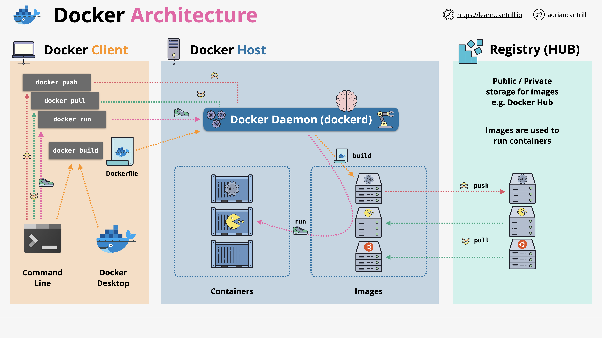

## 1. **High-Level Overview**

I’m keeping this part **high-level**—just an introduction.
We’ll explore each element in depth and use them in practice later in the course.

When you hear **“Docker”** or **“Docker Engine”**, think of it as a **client-server application**.

## 2. **Docker Host and Docker Daemon**

* We begin with the **Docker Host**.
* It’s called a Docker Host because it runs the **Docker Daemon**—the **brain** of the Docker platform.
* This is the **server** part of Docker’s client-server architecture.

The Docker Daemon:

* Is a **long-running service**
* Provides **API access** so clients can interact with it

## 3. **Docker Clients**

The **client** is the other side of Docker Engine:

* Could be the **Docker CLI** (command-line interface)
* Could be **Docker Desktop**
* Could also be **applications** written to interact directly with the Docker Daemon via its API

## 4. **Main Elements on the Docker Host**

Under the control of the Docker Daemon, a Docker Host contains:

* **Containers**
* **Container images**

Other elements like **storage** and **networking** exist, but we’ll cover those in detail later.

## 5. **Docker Registry / Hub**

A **registry** (or “hub”) is a **public or private store** for Docker images.

* **Images** are required to run containers.
* An image contains:

  * The application
  * Its libraries and dependencies
  * Any runtime environment it needs

Examples:

* A base **Linux** image
* An image for a **game server**

## 6. **Getting Images**

To run a container, the image must be available **on the Docker Host**.
Two ways to get images:

1. **Download them**

   * Use `docker pull` from the client
   * Client talks to the Daemon
   * Daemon pulls the image from the registry into the Docker Host

2. **Create them**

   * Use `docker build` from the client
   * Requires a **Dockerfile** (a list of instructions for building an image)
   * The Daemon processes the Dockerfile to produce an image

## 7. **Running Containers**

* Once images are on the Docker Host, use `docker run` to start containers.
* A **container** is like an image, but with an added **read/write layer** so it can store data and run.
* Containers can be **started** and **stopped** as needed.

## 8. **Pushing Images**

You can also **push images** to a registry:

* Use `docker push`
* Sends an image from the Docker Host to a registry (public or private)

## 9. **High-Level Architecture Recap**

Whether you have:

* 1 host or 100
* 1 image or 1,000
* 1 container or many

…the high-level Docker architecture stays the same.

