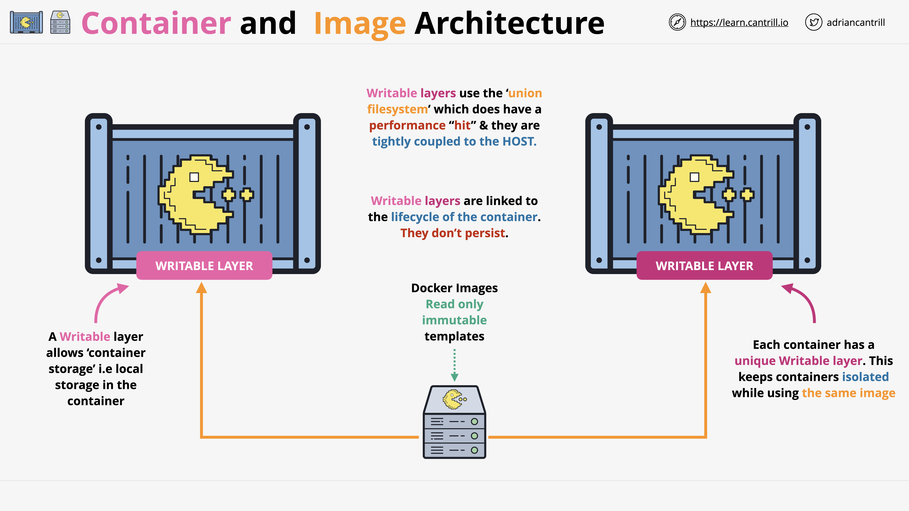
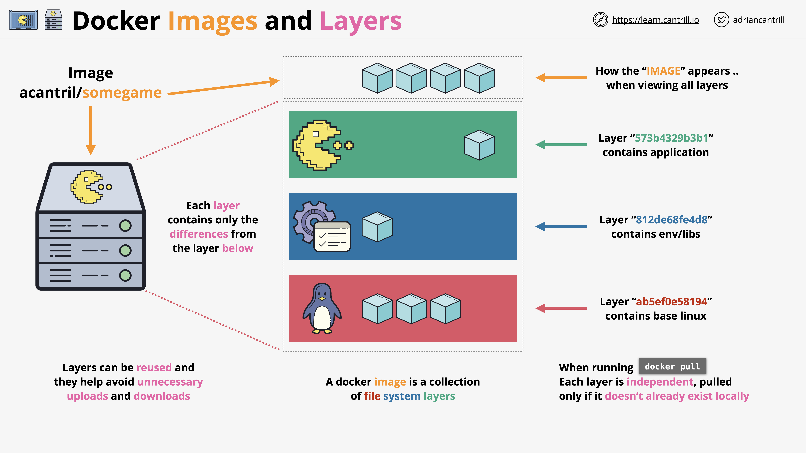

## 1. **High-Level Relationship**

A **container image** (or Docker image) should be thought of as a **read-only, immutable template**:

* Once created, it **does not change**.
* If you modify it, you’re actually creating a **new image**.

Container images are used to run **containers**, but containers also need **storage**.

## 2. **Writable Layer in Containers**

Here’s what happens when you launch, say, a **game server** from a container image:

* Docker adds a **writable layer** on top of the read-only image.
* Any data written inside the container is stored in this **writable layer**—the image itself remains unchanged.

This writable layer:

* Makes each container **unique**, even if they come from the same image.
* Exists only for the **lifecycle of the container**—it doesn’t persist once the container is removed.
* Can’t be used to share data between containers.

Writable layers use a **union file system driver** to combine the base image’s read-only data with any changes in the writable layer.

* This approach has a small performance cost.
* Data in these layers is tightly coupled to the **host**, so it’s not easily moved.

If you need to share or persist data, Docker offers **more advanced storage options** (covered later in the course).

## 3. **Docker Images Are Layered**

Images aren’t monolithic—they’re made up of **independent filesystem layers**.

* Each layer is **differential**—it contains **only the changes** from the layer below.

Example for a game server image:

1. **Base layer** – A Linux filesystem with everything needed to boot a Linux container.
2. **Middle layer** – Runtime environment and libraries needed by the application.
3. **Top layer** – The application’s files themselves.

From a container’s perspective:

* These layers are merged into a **single, unified filesystem**.
* But under the hood, Docker is reading from **separate layers**.

## 4. **Reusing Layers**

Because layers are stored individually:

* They can be **reused** across different images.
* Pulling (`docker pull`) or pushing (`docker push`) only transfers **layers that you don’t already have**.

This greatly reduces unnecessary downloads and uploads.

## 5. **Key Takeaways**

* **Images** are **read-only** and **immutable**.
* Each image is built from **multiple filesystem layers**.
* Containers get a **unique writable layer** on top of the image.
* Layers are **independent** and can be **reused** to save storage and bandwidth.

For now, you just need to remember:

* Image = read-only layers
* Container = image + writable layer

