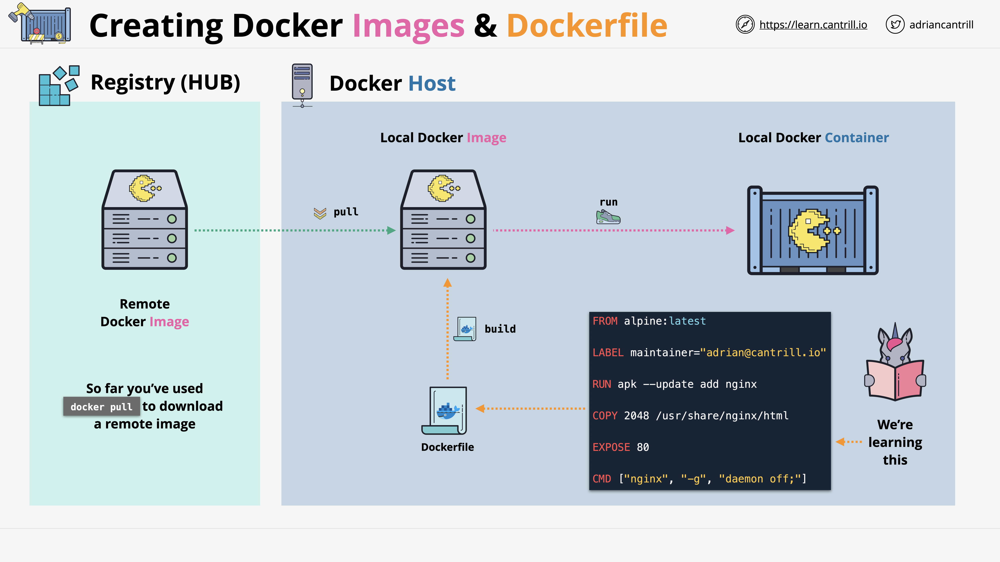

## 1. **From Using Images to Creating Them**

So far, you’ve worked with images pulled from a public registry like **Docker Hub**:

* You downloaded (or “pulled”) them to your local Docker host.
* You ran them to launch containers.

Now, we’ll flip that process—**creating your own image from scratch**.

---

## 2. **What Is a Dockerfile?**

A **Dockerfile** is:

* A plain-text file containing **steps, instructions, or directives**.
* Used by the `docker build` command to **create a Docker image**.

Just like any other image, the one you build can then be used to run containers.

## 3. **Dockerfile Structure**

**General format:**

* **Comments** start with `#`
* Each non-comment line has:

  * An **instruction** (in ALL CAPS by convention)
  * One or more **arguments**

## 4. **Common Dockerfile Instructions**

### **FROM** *(required)*

* Specifies the **base image** for your new image.
* Example: `FROM alpine:latest` — Alpine is a lightweight Linux distribution (\~5MB) ideal for Docker.

### **LABEL**

* Adds **metadata** to an image.
* Examples: description, maintainer name, or contact.

### **RUN** *(creates a new layer)*

* Executes commands during build.
* Used to install packages, set up configurations, run tests, etc.
* Output is stored in a new **image layer**.

### **COPY** & **ADD** *(each creates a new layer)*

* Copy files from your build context (local directory) into the image.
* Difference:

  * `ADD` can also fetch from remote URLs and automatically extract compressed files.
  * Otherwise, both are functionally similar.

💡 **Efficiency Tip**:
Each `RUN`, `COPY`, and `ADD` creates **a new image layer**. Fewer layers can mean smaller, more efficient images—though layer optimization is an advanced topic.

## 5. **Instructions for How the Image Runs**

### **CMD**

* Defines the **default command** to run when a container starts.
* Example: launching a web server or script.
* Can be **overridden** when running the container.

### **ENTRYPOINT**

* Also specifies the main command to run.
* Unlike `CMD`, it **can’t be overridden in the same way**.
* Often used for **single-purpose** images.
* Can be combined with `CMD` to supply default arguments to the `ENTRYPOINT` command.

### **EXPOSE**

* Documents which **port(s)** the containerized application listens on.
* Example: `EXPOSE 80` for a web server.
* **Note:** This does not configure networking—it’s purely informational.

## 6. **Summary**

* **Dockerfiles** are the blueprint for creating Docker images.
* Common steps: choose a base image, add metadata, install dependencies, copy files, and define how the container should run.
* Each build step creates a **layer**, and layers can impact image size and efficiency.
* Instructions like `CMD`, `ENTRYPOINT`, and `EXPOSE` determine how the image behaves when run as a container.

https://docs.docker.com/reference/dockerfile/

