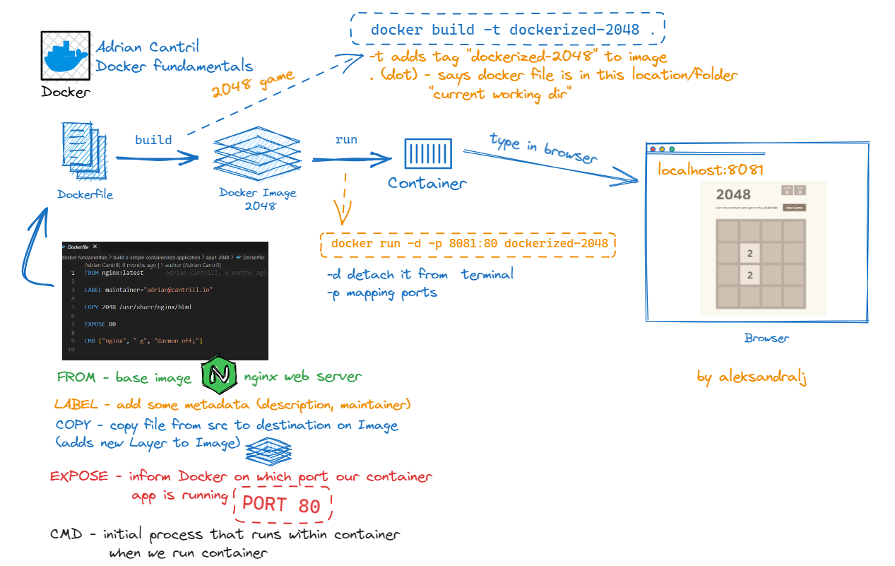

In this demo, you’ll get hands-on experience creating your own **Docker images**—in fact, two of them:

1. **A web-based game** called **2048**
2. **A “Container of Cats”** web application that displays cat images



## 1. **Setup**

Before starting:

* Make sure you’ve **cloned or downloaded** the course GitHub repository.
* Inside the repository folder, open:

  ```
  build-a-simple-containerized-application 
  ```

  This contains:

  * `app1-2048`
  * `app2-containerofcats`
  * A detailed instructions document with all commands used in this demo


## 2. **First Image – 2048 Game**

Navigate to:

```
app1-2048
```

Inside, you’ll find:

* A `2048` folder containing `index.html`, JavaScript, and CSS files.
* A **Dockerfile** that we’ll use to build the image.


### **Dockerfile Review**

The Dockerfile contains 5 key instructions:

1. `FROM nginx:latest`
    - Base image: Uses official Nginx web server
    - `nginx`: Name of the image
    - `:latest`: Most recent version tag
    - Nginx: Lightweight, pre-configured web server

2. `LABEL maintainer="email@example.com"`
    - Adds metadata to the image
    - `maintainer`: Who maintains this image
    - Optional but good practice
    - Can add multiple labels

3. `COPY 2048 /usr/share/nginx/html`
    - Copies files from source to destination
    - `2048`: Source folder on your computer
    - `/usr/share/nginx/html`: Nginx's web root directory
    - All game files will be served by Nginx

4. `EXPOSE 80`
    - Documents that the app uses port 80
    - Port 80: Standard HTTP web port
    - Note: This is documentation only
    - Doesn’t actually open the port

5. `CMD ["nginx", "-g", "daemon off;"]`
    - Command to run when container starts
    - `nginx`: The web server program
    - `-g`: Pass global configuration
    - `daemon off`: Run in foreground
    - Keeps container running


### **Building the Image**

From inside `app1-2048`, run:

```
docker build -t dockerized-2048 .
```

Command breakdown:
* `docker`: Base command to interact with Docker
* `build`: Create a new image from a Dockerfile
* `-t dockerized-2048`: Tag (name) the image
    - `-t`: Tag flag
    - `dockerized-2048`: Image name
    - Could add version like `dockerized-2048:v1`
* `.`: Build context (current directory)
    - Tells Docker where to find files
    - `.` means "look right here"

Docker will:
* Check for existing Nginx base image
* Pull it if not found locally
* Copy your game files into image
* Create new image layers for each step
* Tag final image as `dockerized-2048`

### **Running the Container**

```
docker run -d -p 8081:80 dockerized-2048
```

Command breakdown:
* `docker`: Base command to interact with Docker
* `run`: Run a new container from an image
* `-d`: Detached mode (runs in background)
* `-p 8081:80`: Maps host port 8081 to container port 80
* `dockerized-2048`: Image name

Verify it’s running:

```
docker ps
docker port <container_id>
```

```
# docker ps
CONTAINER ID   IMAGE             COMMAND                  CREATED              STATUS              PORTS                  NAMES
6d2db5a975a7   dockerized-2048   "/docker-entrypoint.…"   About a minute ago   Up About a minute   0.0.0.0:8081->80/tcp   quizzical_gauss

# docker port 6d2db5a975a7
80/tcp -> 0.0.0.0:8081
```

Open a browser and go to:

```
http://localhost:8081
```

You’ll see the 2048 game running inside your container.

---

### **Cleanup**

Stop and remove the container:

```
docker stop <container_id>
docker rm <container_id>
```


## 3. **Second Image – Container of Cats**

Navigate to:

```
app2-containerofcats
```

Inside, you’ll find:

* `index.html`
* Cat image assets
* A **Dockerfile**


### **Dockerfile Review**

```dockerfile
FROM redhat/ubi8

LABEL maintainer="Animals4life"

RUN yum -y install httpd

COPY index.html /var/www/html/

COPY containerandcat*.jpg /var/www/html/

ENTRYPOINT ["/usr/sbin/httpd", "-D", "FOREGROUND"]

EXPOSE 80
```

Let's break down each instruction:

1. `FROM redhat/ubi8`
    - Base image: Red Hat Universal Base Image 8
    - A minimal Linux system from Red Hat
    - More general-purpose than nginx
    - Larger but more flexible

2. `LABEL maintainer="Animals4life"`
    - Adds metadata to the image
    - `maintainer`: Who maintains this image
    - Good practice for documentation
    - Helps with image organization

3. `RUN yum -y install httpd`
    - Executes command during build
    - `yum`: Package manager for Red Hat
    - `-y`: Automatically answer "yes" to prompts
    - `httpd`: Apache web server package
    - Creates a new layer with Apache installed

4. `COPY index.html /var/www/html/`
    - Copies website's main page
    - Source: `index.html` from build context
    - Destination: Apache's web root directory
    - Creates a new layer

5. `COPY containerandcat*.jpg /var/www/html/`
    - Copies all cat images at once
    - `*`: Wildcard for all matching files
    - Same destination as index.html
    - Creates another layer

6. `ENTRYPOINT ["/usr/sbin/httpd", "-D", "FOREGROUND"]`
    - Command that MUST run when container starts
    - Cannot be overridden (unlike CMD)
    - `/usr/sbin/httpd`: Apache binary
    - `-D FOREGROUND`: Run Apache in foreground
    - Keeps container running

7. `EXPOSE 80`
    - Documents that Apache uses port 80
    - Standard HTTP web port
    - Documentation only, doesn't open ports
    - Helps with container orchestration

This approach:
* Creates **more layers** (4 total)
* Is **less efficient** and slower to build than using a lean, specific base image like `nginx:latest`


### **Building the Image**

```
docker build -t containerofcats .
```

* Downloads the larger Red Hat base image
* Installs Apache (adds build time)
* Copies HTML and image files in separate steps (adds layers)

### **Running the Container**

```
docker run -d -p 8081:80 containerofcats
```

Check with:

```
docker ps
```

```
CONTAINER ID   IMAGE             COMMAND                  CREATED         STATUS         PORTS                  NAMES
76aebe6dfa63   containerofcats   "/usr/sbin/httpd -D …"   4 seconds ago   Up 3 seconds   0.0.0.0:8081->80/tcp   strange_goodall
```

Open in browser:

```
http://localhost:8081
```

You’ll see the Container of Cats app: “If it fits, I sits in a container, in a container.”


### **Cleanup**

```
docker stop <container_id>
docker rm <container_id>
```


## 4. **What You’ve Done**

* Built **two custom Docker images** from **two Dockerfiles**:

  1. **Efficient**: Nginx + static files (2048 game)
  2. **Less efficient**: General-purpose Red Hat UBI + manual Apache install (Container of Cats)
* Learned how **base image choice** affects build size, speed, and efficiency
* Ran and tested each image in a container
* Stopped and removed containers when finished

