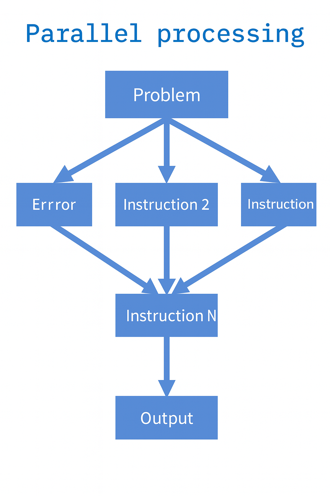

<h1>Parallel Processing and Scalability in Big Data Systems</h1>

<h2>Table of Contents</h2>

  <ul>
    <li><a href="#introduction-the-challenge-of-big-data">Introduction: The Challenge of Big Data</a></li>
    <li><a href="#linear-vs-parallel-processing">Linear vs. Parallel Processing</a></li>
	<ul>
		<li><a href="#linear-processing">Linear Processing</a></li>
		<li><a href="#parallel-processing">Parallel Processing</a></li>
	</ul>
    <li><a href="#horizontal-scaling-the-case-for-scale-out-architectures">Horizontal Scaling: The Case for Scale-out Architectures</a></li>
    <li><a href="#embarrassingly-parallel-workloads">Embarrassingly Parallel Workloads</a></li>
    <li><a href="#coordination-and-complexity-in-distributed-systems">Coordination and Complexity in Distributed Systems</a></li>
    <li><a href="#fault-tolerance-in-distributed-computing">Fault Tolerance in Distributed Computing</a></li>
    <li><a href="#design-philosophy-bringing-compute-to-the-data">Design Philosophy: Bringing Compute to the Data</a></li>
  </ul>

<h2 id="introduction-the-challenge-of-big-data">Introduction: The Challenge of Big Data</h2>

In a standard analytics cycle, a computer performs a set of operations by transferring data from storage to compute resources (e.g., memory and CPU), performing computations, and returning the results to storage. However, when data volumes exceed the storage and processing capabilities of a single machine—a hallmark of Big Data—this traditional, linear processing model becomes insufficient.

To address these challenges, parallel processing becomes essential, enabling simultaneous computation across multiple processing units.

<h2 id="linear-vs-parallel-processing">Linear vs. Parallel Processing</h2>

<h3 id="linear-processing">Linear Processing</h3>

Linear (or sequential) processing is the conventional computing approach in which tasks are executed one instruction at a time in a predetermined order. If an error occurs at any point, the entire process must typically restart from the beginning once the issue is resolved.

<figure style="text-align: center;">
    
    <figcaption>Linear Processing</figcaption>
</figure>

Limitations:
- Inefficient for large-scale data processing
- High memory and compute requirements
- Poor fault isolation

<h3 id="parallel-processing">Parallel Processing</h3>

In contrast, parallel processing decomposes a task into multiple instructions, distributing them across independent processing nodes. These instructions are executed concurrently, often resulting in substantial performance improvements.

<figure style="text-align: center;">
    
    <figcaption>Parallel Processing</figcaption>
</figure>

Advantages:
- Reduced processing time due to simultaneous execution
- Lower resource demand per node
- Elastic scalability, allowing nodes to be dynamically added or removed
- Improved fault isolation, as failures on one node do not disrupt others

Parallelism is particularly well-suited for Big Data scenarios, where datasets can be split into partitions and processed simultaneously across a computing cluster.

<h2 id="horizontal-scaling-the-case-for-scale-out-architectures">Horizontal Scaling: The Case for Scale-Out Architectures</h2>

As data volumes continue to grow exponentially, increasing the capacity of a single machine—known as vertical scaling (scaling up, increase the size of the servers = more RAM, more powerful CPUs, more disk space, etc.) becomes economically and technically unsustainable. Instead, horizontal scaling (scaling out, increase the number of servers) is preferred, involving the addition of multiple, equally capable nodes to form a distributed compute cluster.

<figure style="text-align: center;">
    
    <figcaption>Horizontal Scaling</figcaption>
</figure>

Each node processes a segment of the data independently, enabling the system to:
- Maintain performance under increasing workloads
- Minimize costs by using commodity hardware
- Scale modularly with minimal downtime

<h2 id="embarrassingly-parallel-workloads">Embarrassingly Parallel Workloads</h2>

A task is considered embarrassingly parallel if it can be divided into subtasks that require no inter-process communication during execution. Such workloads are ideal for distributed systems, as each subtask can be assigned to a different node and executed independently.

<figure style="text-align: center;">
    
    <figcaption>Embarrassingly Parallel Workloads</figcaption>
</figure>

Example: Converting date formats in a large dataset that has been partitioned across multiple nodes. Since each operation is independent of others, failures in one process do not affect the rest and can be re-executed without issue.

These types of tasks represent the majority of computational workloads in enterprise-level Big Data applications and guide the design of modern data processing frameworks like Hadoop and Apache Spark.

<h2 id="coordination-and-complexity-in-distributed-systems">Coordination and Complexity in Distributed Systems</h2>

While many computations are easily parallelizable, others—such as global sorting or aggregations across partitions—introduce inter-node dependencies. These require:
- Synchronization across processes,
- Communication via messaging or shared file systems,
- Careful orchestration to ensure consistency and completeness.

Such tasks increase system complexity by requiring the entire cluster to behave as a single logical unit.

<h2 id="fault-tolerance-in-distributed-computing">Fault Tolerance in Distributed Computing</h2>

Given the inevitability of hardware failures in large-scale distributed environments, fault tolerance is a critical system design principle. It refers to the system’s ability to continue operating despite component failures.

Mechanisms for fault tolerance include:
- Data replication: Each data partition (e.g., P1, P2, P3) is stored on multiple nodes.
- Node recovery: If a node fails, its data can be reconstructed from redundant copies stored elsewhere in the cluster.
- Automatic reallocation: Failed computations are reassigned to other functioning nodes.

<figure style="text-align: center;">
    
    <figcaption>Fault Tolerance in Distributed Computing</figcaption>
</figure>

Frameworks such as Hadoop Distributed File System (HDFS) are engineered for high availability and can maintain uptime at five-nines reliability (99.999%).

<h2 id="design-philosophy-bringing-compute-to-the-data">Design Philosophy: Bringing Compute to the Data</h2>

A key architectural principle in systems like Hadoop is data locality—executing computation directly where the data resides. This approach minimizes data movement across the network, reduces latency, and improves overall throughput.

By aligning computational tasks with the physical location of data partitions, systems avoid the costly overhead of transferring large datasets between nodes.

